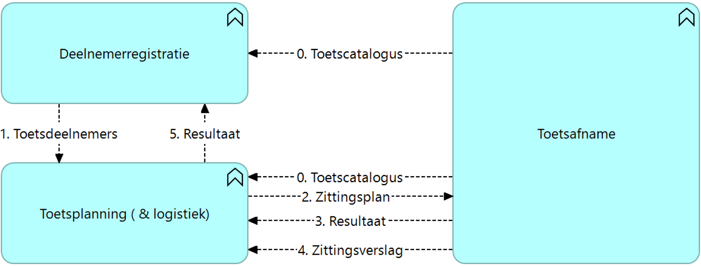

# NED-OOAPI

MBO standard to organise tests and exams based on OOAPI

## Note: Legal status of the specifications in this repository
 > All information in this repository is draft. No rigths can be claimed based on this information
 > The standards can change without notice until they are finalised and approved

## Abstract

A typical school uses a broad range of exam and testing tools..... bla bla babble.

- [flow 0 : Test catalogue from Toetsafname to Deelnemerregistratie and Toetsplanning](doc/diagrams/flow0.md)
- flow 1 : Deelnemerregistratie data for planning exams and tests sent to Toetsplanning
- [flow 2 : Planned exam/test is sent to Toetsafname](doc/diagrams/flow2.md)
- [flow 3 : Test results are returned to Toetsplanning](doc/diagrams/flow3.md)
- [flow 4 : Test sesion report (Procesverbaal and irregularities) back to Toetsplanning](doc/diagrams/flow4.md)
- flow 5 : Test results to Deelnemerregistratie

## Structure of this repository

This repository consists of the following elements:
- [Big Picture](big-picture.md) which explains all the concepts within the ecosystem in more detail.
- [Technical reference](doc/technical-reference.md) with information about the architecture, used standards and links to the reference files.
- [Glossary](glossary.md) describing all terms and definitions used within the ecosystem.
- [Party directory](Party-Directory.md) with all Parties that are currently active in the ecosystem.

# Working Documents
- [uitwerking terugkomdag 23 mei 2022](doc/documents/Examinering%20mbo%20-%20terugkomdag%2023mei%20-%20verwerkt.pdf)
- [uitwerking terugkomdag 24 juni 2022](doc/documents/Examinering%20mbo%20-%202e%20terugkomdag%2Baantekeningen.pptx)

## Version history

| Version | Date | Status | Author | Comment |
|---|---|---|---|---|
| 0.1 | 1-31 mei 2022 | DRAFT | [@mcginkel](https://github.com/mcginkel) | |

This repository is an initiative of the MBO Digitaal and NED.

## Contributors

This standard is developed by members from schools, software partners and NED. The contributors are:

| Name | Organization | contact |
|---|---|---|
| Henk Knevelbaard |Alfa-college	|	h.knevelbaard@alfa-college.nl|
| Hans Swart | Alfa-college - NED |jg.swart@alfa-college.nl |
| Jonas de Graaff |Caci (Osiris)| jonas.de.graaff@caci.nl |
| Youri van Pinxteren| Caci (Osiris) |youri.van.pinxteren@caci.nl |
| Erik Degen | Coöperatie Examens MBO|Erik.degen@examensmbo.nl |
| Jeroen van Waes |Examenservices| jvanwaes@webedu.nl |
| Kees van Ginkel | Iddink (EduArte)  | [@mcginkel](https://github.com/mcginkel) -  kees@vanginkels.com |
| Ton Weenk| Iddink (EduArte)| ton.weenk@iddinkgroup.nl|
| John Schols | Iddink (EduArte)|john.schols@iddinkgroup.nl|
| Jos van der Arend | Kennisnet | J.vanderArend@kennisnet.nl |
| Rob Vos | NED | r.vos@mbodigitaal.nl |
| Nelleke Lafeber | NED | n.lafeber@mboraad.nl |
| Roan Boer Rookhuiszen |Paragin | roan@paragin.nl |
| Ellen Kieviet – Hoegen Dijkhof |ROC Amersfoort/NED|hgf@mboamersfoort.nl|
| Mark Leummens |ROC van Amsterdam | m.leummens@rocva.nl|	
| Marga Schoneveld - Kerkhof	|ROC van Amsterdam |m.schoneveldkerkhof@rocva.nl|
| Joost van der Velden|ROC Midden Nederland|joost.vandervelden@rocmn.nl|
| Annemieke Gijsberts|ROC Midden Nederland|a.gijsberts@rocmn.nl|
| David Vermeulen|ROC Midden Nederland|d.vermeulen@rocmn.nl|
| Michiel Rotteveel | SPL |M.Rotteveel@stichtingpraktijkleren.nl|
| Ellen Zoegaard | SPL |E.Zoegard@stichtingpraktijkleren.nl|
| Sjoerd Zonneveld | SPL |szonneveld@bitpatroon.nl|	
| Werner Richelle|Summa College|w.richelle@summacollege.nl|
| Ronald Ham | Surf	/ R4Arhictecture|	Ronald.ham@r4architecture.nl |
| Rene Rutte | Xebic | rrutte@xebic.com |

