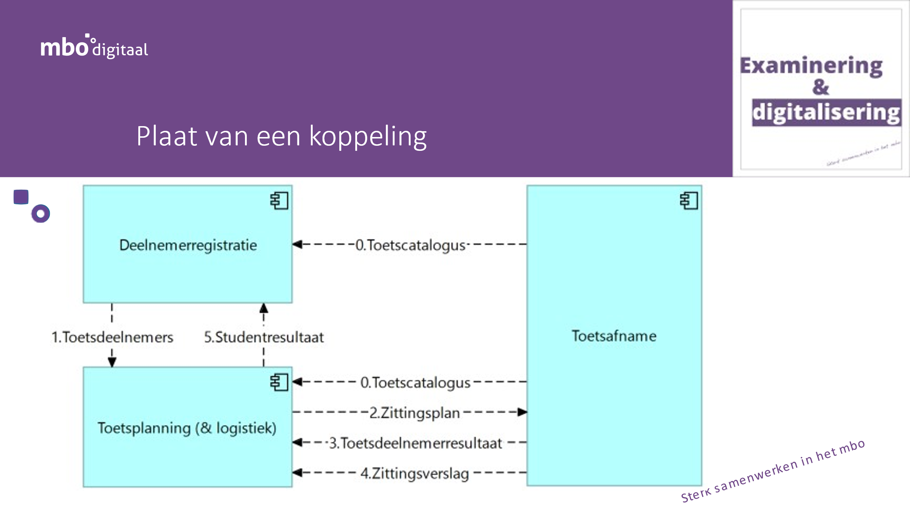

# NED-OOAPI
MBO standard to organise tests and exams based on OOAPI

## Note: Legal status of the specifications in this repository
 > All information in this repository is draft. No rigths can be claimed based on this information
 > The standards can change without notice until they are finalised and approved

## Abstract

A typical school uses a broad range of exam and testing tools..... bla bla babble.

## Structure of this repository

This repository consists of the following elements:
- [Big Picture](big-picture.md) which explains all the concepts within the ecosystem in more detail.
- [Technical reference](doc/technical-reference.md) with information about the architecture, used standards and links to the reference files.
- [API documentation](https://nedooapi.stoplight.io/docs/ecosystem) can be found on stoplight.
- [Implementation Guide](doc/implementation-guide.md) with practical advice for new parties.
- [Glossary](glossary.md) describing all terms and definitions used within the ecosystem.
- [Party directory](Party-Directory.md) with all Parties that are currently active in the ecosystem.

This repository is an initiative of the MBO Digitaal and NED.

