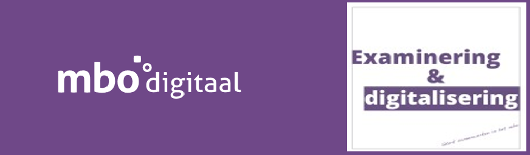
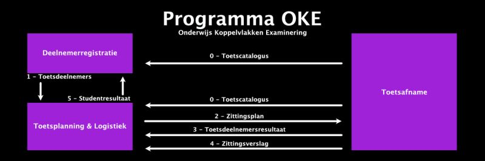

=====

# NED-OOAPI - Programma OKE - MBO standard to organise tests and exams based on OOAPI

## Note: Legal status of the specifications in this repository
 > All information in this repository is draft. No rigths can be claimed based on this information
 > The standards can change without notice until they are finalised and approved

## Abstract

A typical school uses a broad range of exam and testing tools. The aim of this specification is to abstract these tools and focus on the messages that are interchanged between these tools. An over all example can be found in the folowing image.

- [flow 0 : Test catalogue from Toetsafname to Deelnemerregistratie and Toetsplanning](doc/flow0.md)
- [flow 1 : Deelnemerregistratie data for planning exams and tests sent to Toetsplanning](doc/flow1.md)
- [flow 2 : Planned exam/test is sent to Toetsafname](doc/flow2.md)
- [flow 3 : Test results are returned to Toetsplanning](doc/flow3.md)
- [flow 4 : Test session report (Procesverbaal and irregularities) back to Toetsplanning](doc/flow4.md)
- [flow 5 : Test results to Deelnemerregistratie](doc/flow5.md)
- [flow 6 : Analyse information](doc/flow6.md)

- [All flows - Authentication and scopes, error handling](doc/ErrorHandling.md)

## Structure of this repository

This repository consists of the following elements:
- [Technical reference](doc/technical-reference.md) with information about the architecture, used standards and links to the reference files.
- [OOAPI Specification relevant to this project](specification/v5/docs.html)
- [Implementation documentation](doc/documents/OKE%20MBO-toetsafname%20specs%20v1.0_20240918(definitief).pdf ) current version of the documentation.

The specification and the relevant information can be found in the link: [OOAPI Specification relevant to this project](specification/v5/docs.html)
An adapted and shortend version of the yaml file for the MBO-OKE can be found [here](specification/ooapiv5_MBO.yaml)

# Working Documents
- [All working documents can be found in the documents folder](doc/documents/)

## Version history

| Version | Date | Status | Author | Comment |
|---|---|---|---|---|
| 0.1 | 1-31 may 2022 | DRAFT | [@mcginkel](https://github.com/mcginkel) | |
| 0.2 | 14 jul 2022 | DRAFT | [@mcginkel](https://github.com/mcginkel) and many others | flow 0,2,3,4 defined |
| 0.3 | 13 sep 2022 | DRAFT | [@mcginkel](https://github.com/mcginkel) and many others | flow 6 added, technical refrence added |
| 0.4 | 12 jan 2023 | DRAFT | [@JosVanDerArend](https://github.com/JosVanderArend) and many others | details added and review comments solved |
| [0.5](https://github.com/NetwerkExamineringDigitalisering/NED-OOAPI/blob/v0.9.3/doc/documents/MBO-toetsafname%20specs%20v0.5%20-%2020230329%20met%20kleurmarkeringen.pdf) | 29 mar 2023 | DRAFT | [@JosVanDerArend](https://github.com/JosVanderArend) and many others | details added and review comments solved for pilot 1 |
| 0.8 | 10 jul 2023 | DRAFT | [@JosVanDerArend](https://github.com/JosVanderArend) and many others | flow 1 and 5 added for pilots 2 and 3 |
| 0.9 | 24 aug 2023 | DRAFT | [@JosVanDerArend](https://github.com/JosVanderArend) and many others | details added and review comments solved for pilots 2 and 3 |
| 0.9.1 | 22 sep 2023 | DRAFT | [@JosVanDerArend](https://github.com/JosVanderArend) and many others | details added and review comments solved for pilots 2 and 3 |
| [0.9.2](https://github.com/NetwerkExamineringDigitalisering/NED-OOAPI/blob/v0.9.3/doc/documents/MBO-toetsafname%20specs%20v0.9.2_20231114(reviewversie).pdf) | 14 nov 2023 | DRAFT RELEASE | [@JosVanDerArend](https://github.com/JosVanderArend) and many others | details added and review comments solved |
| [0.9.3](https://github.com/NetwerkExamineringDigitalisering/NED-OOAPI/blob/main/doc/documents/MBO-toetsafname%20specs%20v0.9.3_20240223(reviewversie).pdf) | 10 jan 2024 | DRAFT RELEASE | [@JosVanDerArend](https://github.com/JosVanderArend) and many others | groupmembers added for ad-hoc tests|
| [0.9.4](https://github.com/NetwerkExamineringDigitalisering/NED-OOAPI/blob/main/doc/documents/OKE%20MBO-toetsafname%20specs%20v0.9.4_20240906(reviewversie).pdf) | 6 september 2024 | DRAFT RELEASE | [@JosVanDerArend](https://github.com/JosVanderArend) and many others | final corrections and clarifications|
| [1.0](https://github.com/NetwerkExamineringDigitalisering/NED-OOAPI/blob/main/doc/documents/OKE%20MBO-toetsafname%20specs%20v1.0_20240918(definitief).pdf) | 18 september 2024 | FINAL RELEASE | [@JosVanDerArend](https://github.com/JosVanderArend) and many others | final corrections and clarifications|
| [1.1](https://github.com/NetwerkExamineringDigitalisering/NED-OOAPI/blob/v1.1/doc/documents/OKE%20MBO-toetsafname%20specs%20v1.1_20241104(review).pdf) | 4 november 2024 | DRAFT RELEASE | [@JosVanDerArend](https://github.com/JosVanderArend) and many others | final corrections and clarifications|

This repository is an initiative of the MBO Digitaal and NED.

## Contributors

This standard is developed by members from schools, software partners and NED. The contributors are:

| Name | Organization | contact |
|---|---|---|
| Henk Knevelbaard |Alfa-college	|	h.knevelbaard@alfa-college.nl|
| Hans Swart | Alfa-college - NED |jg.swart@alfa-college.nl |
| Jonas de Graaff |Caci (Osiris)| jonas.de.graaff@caci.nl |
| Youri van Pinxteren| Caci (Osiris) |youri.van.pinxteren@caci.nl |
| Erik Degen | Coöperatie Examens MBO|Erik.degen@examensmbo.nl |
| Jeroen van Waes |Examenservices| jvanwaes@webedu.nl |
| Kees van Ginkel | Topicus (EduArte)  | [@mcginkel](https://github.com/mcginkel) -  kees@vanginkels.com |
| Ton Weenk| Topicus (EduArte)| ton.weenk@Topicus.nl|
| John Schols | Topicus (EduArte)|john.schols@Topicus.nl|
| Jos van der Arend | Kennisnet | J.vanderArend@kennisnet.nl |
| Rob Vos | NED | r.vos@mbodigitaal.nl |
| Nelleke Lafeber | NED | n.lafeber@mboraad.nl |
| Roan Boer Rookhuiszen |Paragin | roan@paragin.nl |
| Ellen Kieviet – Hoegen Dijkhof |ROC Amersfoort/NED|hgf@mboamersfoort.nl|
| Mark Leummens |ROC van Amsterdam | m.leummens@rocva.nl|	
| Marga Schoneveld - Kerkhof	|ROC van Amsterdam |m.schoneveldkerkhof@rocva.nl|
| Joost van der Velden|ROC Midden Nederland|joost.vandervelden@rocmn.nl|
| Annemieke Gijsberts|ROC Midden Nederland|a.gijsberts@rocmn.nl|
| David Vermeulen|ROC Midden Nederland|d.vermeulen@rocmn.nl|
| Michiel Rotteveel | SPL |M.Rotteveel@stichtingpraktijkleren.nl|
| Ellen Zoegaard | SPL |E.Zoegard@stichtingpraktijkleren.nl|
| Sjoerd Zonneveld | SPL |szonneveld@bitpatroon.nl|	
| Werner Richelle|Summa College|w.richelle@summacollege.nl|
| Ronald Ham | Surf	/ R4Arhictecture|	Ronald.ham@r4architecture.nl |
| Rene Rutte | Xebic | rrutte@xebic.com |
