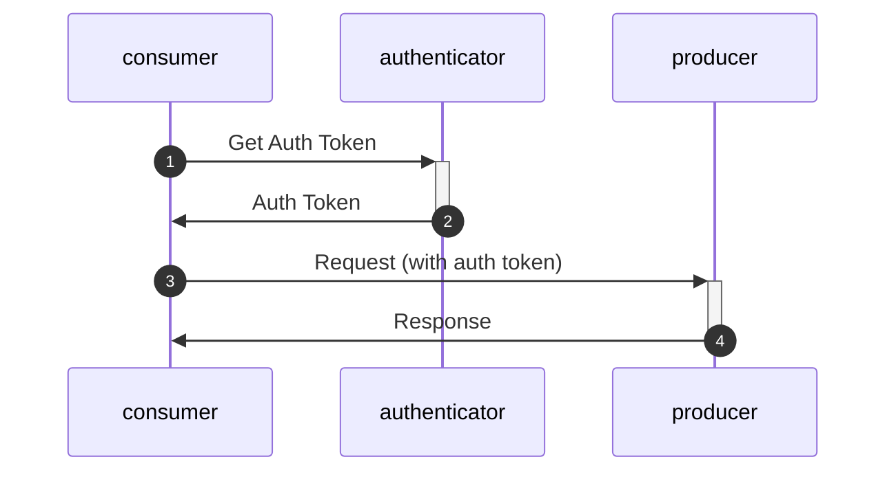

# Authentication and Error Handling

##authentication

For authentication and authorization of the endpoints the oauth protocol is used. This is an industry standard (See https://oauth.net/2/) and is supported by many software languages and frameworks.



## scopes
Each request will need a scope in the auth token. (TO BE DEFINED )
....

## eror handling

every request will use http response codes. 200 for a successful request, 400 for a unsuccesfull request, both with a response in JSON with more details of the warnings or errors.

### SUCCESS:
```
#Bij PUT en PATCH met één object. HTTP status code 200
{
"status": 200"
}
```

### ERROR
```
Bij error : HTTP status 400, but with a json payload:

{
  "status": 6,
  "type": "error",
  "title": "A short, human-readable summary of the problem type, e.g. 'resource not found'",
  "detail": "An optional human-readable explanation specific to this occurrence of the problem."
}
```
