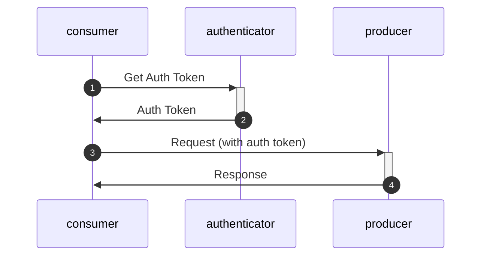

# Authentication en beveiliging

Al het netwerk verkeer word standaard beviligd door minimaal TLS-1.3 encryptie.

Voor authenticatie wordt gebruik gemaakt van oauth2 protocol met client-credentials grant. Dit is een industry standaard (See https://oauth.net/2/) waardoor er standaard ondersteuning is voor veel programmeer talen en frameworks.
Standaarden als nl-gov en edustandaard zijn hier ook op gebaseerd.

Op dit moment worden er geen eisen aan de gebruikte certificaten gesteld anders dan dat ze geldig, herleidbaar naar de leverancier (domainnaam) en een geldig en controleerbaar root-certificaat moeten hebben.
Edustandaard werkt aan een REST profiel, waarbij ook TLS 1.3 en client-credential grant de basis zijn. 

## scopes
Each request will need a scope in the auth token. voor OKE zullen deze beginnen met "nl-test-admin".
de verschillende flows zullen verschillende catagorie scopes krijgen, waardoor er fijnmazig toestemming geven kan worden op niveau een MORA referentie componenten.

zie ook H5 Koppelvlakken in [Implementation documentation](doc/documents/OKE%20MBO-toetsafname%20specs%20v1.0_20240918(definitief).pdf ) en de openapi specificatie [voor OKE](specification/ooapiv5_MBO.yaml)

we onderscheiden de volgende scopes
* nl-test-admin-flow-0  --> voor uitvragen 
* nl-test-admin-flow-1-5 --> communicatie tussen sis en toetsplanner
* nl-test-admin-flow-2-3-4  --> communicatie tussen toetsplanner en toets afname
* nl-test-admin-flow-6  --> analyse flow in de toekomst

## eror handling

every request will use http response codes. 200 for a successful request, xxx for a unsuccesfull request, both with a response in JSON with more details of the warnings or errors.

The OKE will follow the guidelines from OOAPI workgroup en you can find details in : [openAPI spec for OKE](specification/ooapiv5_MBO.yaml)

