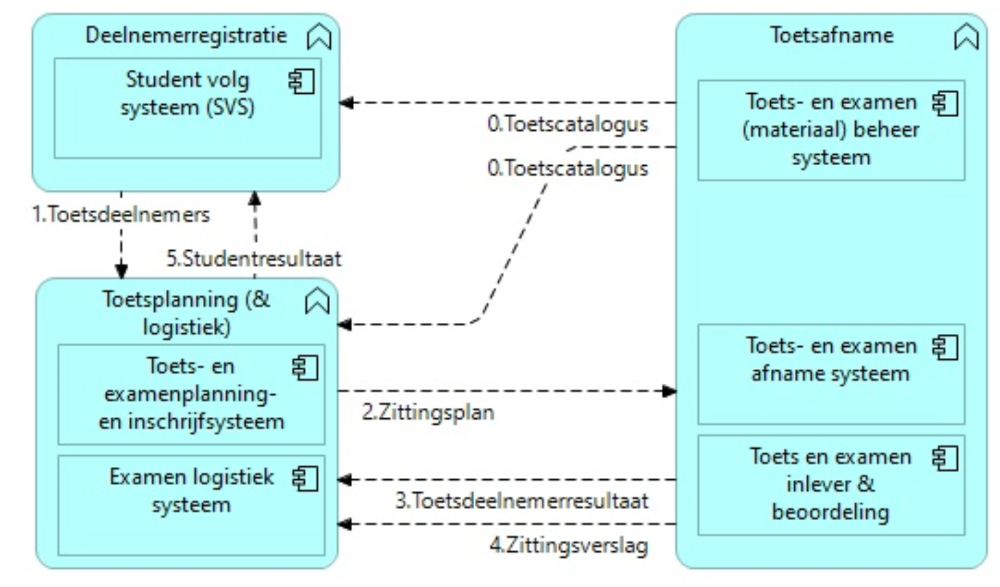

# connection with MORA

For the development of the interfaces, it is important that an interface represents a data exchange between reference components in the MORA. [MORA](https://mora.mbodigitaal.nl/index.php/Hoofdpagina) is the reference architecture for the MBO sector, which clarifies how an MBO school operates. The reference architecture provides insight into processes, applications, and information objects, as well as their interrelations.

The MORA reference components are the applications found in the basic [application and application services model](https://mora.mbodigitaal.nl/index.php/Applicaties_en_applicatieservices); the application services refer to the functionalities and services used within processes.

Ideally, each interface should also define which information objects from the MORA information model are involved in each flow. However, the relationship between OOAPI and MORA is currently not yet fully developed.

The connection between OKE functionalities and the MORA reference components is as follows (see the diagram below for a schematic representation):
- Deelnemerregistratie (DR/SIS) includes the reference components:
	- Student Volg Systeem (SVS)
- Toets Planning & Logistiek (TPL) includes the reference components:
    - Toets- en examenplanning- en inschrijfsysteem
    - Examen logistiek systeem
- Toetsafname (TA) omvat de referentiecomponenten:
    - Toets- en examen (materiaal) beheer systeem
    - Toets- en examen afname systeem
    - Toets en examen inlever & beoordeling

