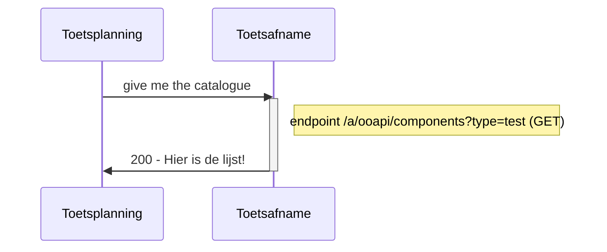
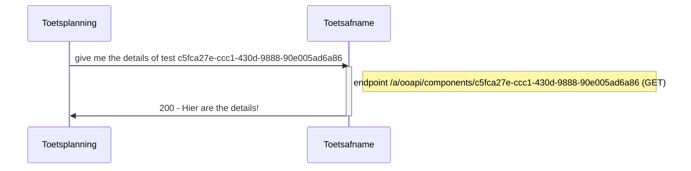

# Flow 0 : request catalogue from toetsafname applicatie

The deelnemer registratie(SIS) and toetsplanning can request to list of available exams/test from the toetsafname applications. This is input for those applications to plan and schedule exams/tests.

## Flow 0.1 Request whole catalogue


### Example of a request/response to read the whole catalogue
```json
#GET/components?type=test

response:
[
  {
     "componentId": "c5fca27e-ccc1-430d-9888-90e005ad6a86",
     "primaryCode": {
        "codeType": "testID",
        "code": "5"
     },
     "componentType": "test",
     "name": [
        {
           "language": "nl-NL",
           "value": "Rekenen 2F voor technische opleidingen"
        }
     ],
     "abbreviation": "REK2F-TECH",
     "modeOfDelivery": [
        "situated"
     ],
     "duration": "PT60M",
     "description": [
        {
           "language": "nl-NL",
           "value": "Rekentest MBO op niveau 2F toegespitst op technische opleidingen zoals procestechniek/machinebouw"
        }
     ],
     "teachingLanguage": "nld",
     "assessment": [
        {
           "language": "nl-NL",
           "value": "Digitale toetsing"
        }
     ],
     "otherCodes": [
        {
           "codeType": "testSystem",
           "code": "Remindo"
        },
        {
           "codeType": "testProvider",
           "code": "CEM"
        }
     ],
     "organization": "452c1a86-a0af-475b-b03f-724878b0f387",
     "consumers": [
        {
           "consumerKey": "MBO-toetsafname", 
           "extraTime": 30,
           #https://www.imsglobal.org/sites/default/files/spec/afa/3p0/information_model/imsafa3p0pnp_v1p0_InfoModel.html
           "availablePersonalNeeds": [
            "extraTime",
            "spoken", 
            "spell-checker-on-screen"
           ],
           "exam": true,
           "resultValueType": "1.0-10.0",
           "passFrom": "5.5",
           "retries": 2,
           "status": "active"
        }
     ],
     "ext": {

     }
  }
  ,{..}
  ]
```

## Flow 0.2 Request details of one test
 

