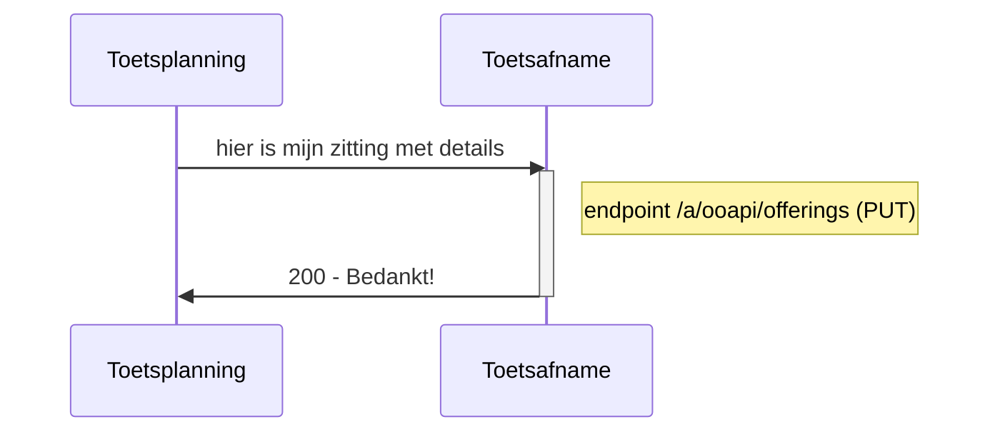
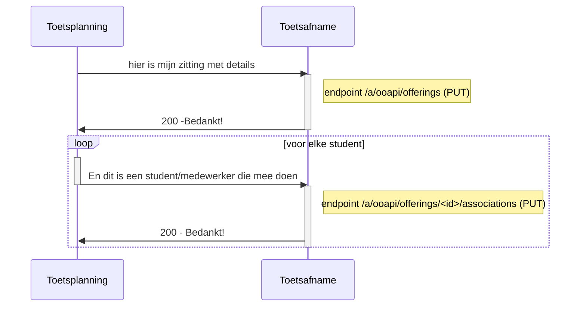
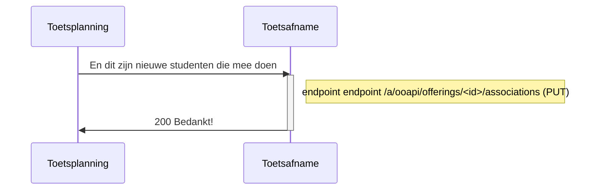
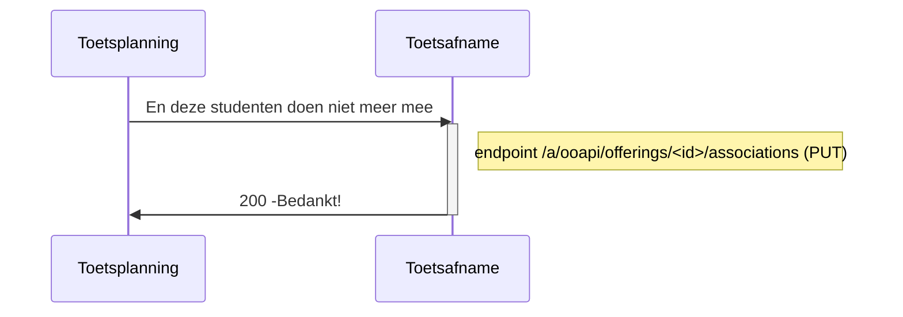
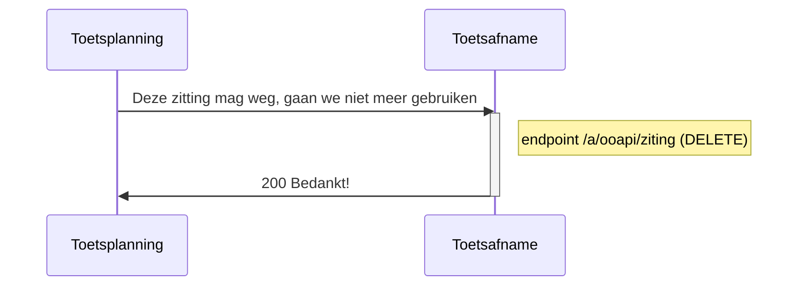

# Flow 2 : registreren van de zitting bij de toetsafname applicatie

## optie 1 : Aanmaken van zitting  zonder studenten

- id worden door sender aangemaakt.
- er moet een post gemaakt worden

## optie 2 : Aanmaken van zitting  met studenten

- bij meerdere associaties : het vervangt de complete lijst
- - 
- voorstel attributen: personid, primaryCode (beter omschrijven - sso), givenName, surName, surnamePrefix, mail
- voor standaard bevrediging : displayname (goed gevuld), activeEnrollment (true) , affilliations (guest)
- gedrag : mag gebruiken om te updaten (geen verplichting ivm provisioning)
 - perosn is zelfde voor alle rollen 
 - 
## optie 3 : toevoegen van studenten aan aan zitting

## optie 4 : verwijderen van studenten aan aan zitting

## optie 5 verwijderen van een zitting

