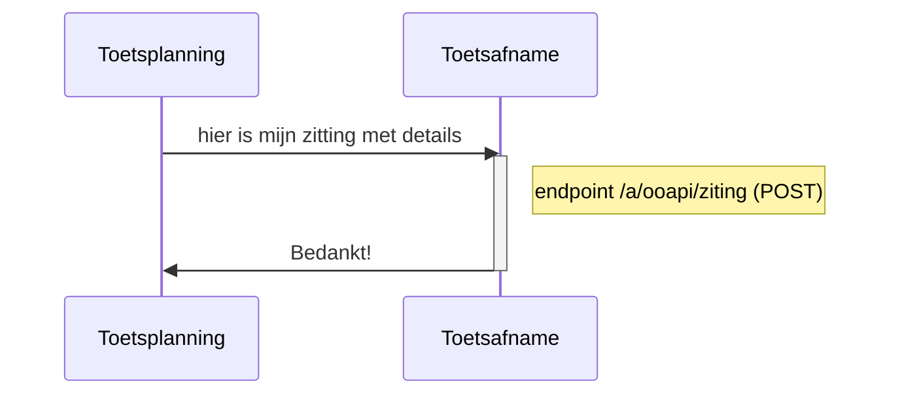
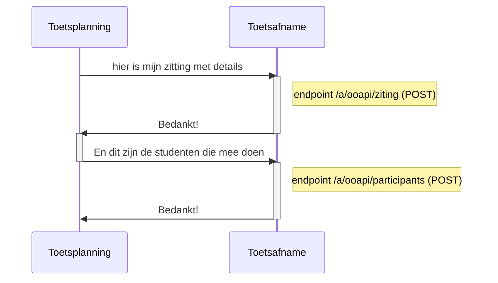
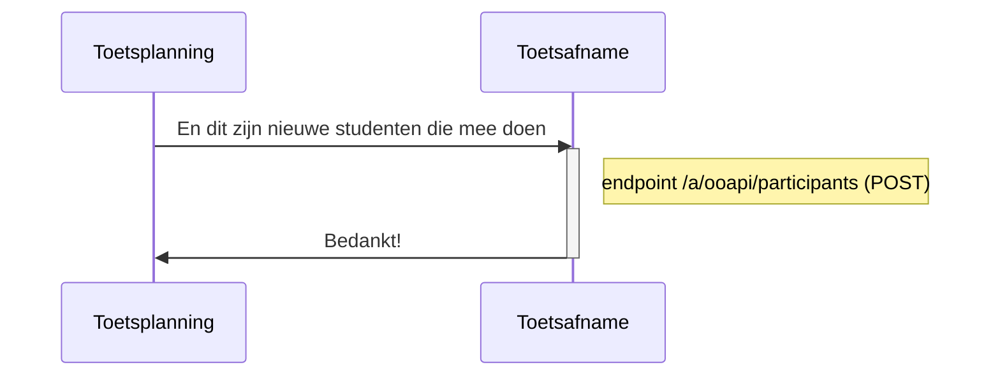
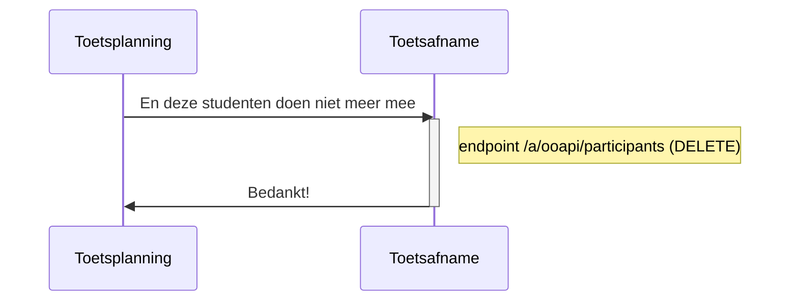
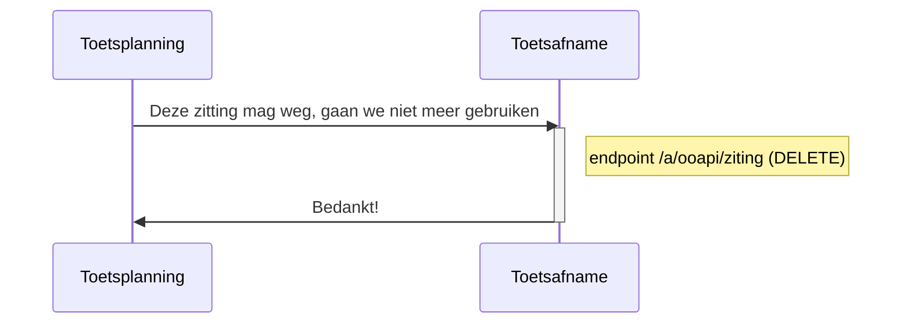

# Flow 2 : registreren van de zitting bij de toetsafname applicatie

## optie 1 : Aanmaken van zitting  met studenten

## optie 2 : Aanmaken van zitting  met studenten

## optie 3 : toevoegen van studenten aan aan zitting

## optie 4 : verwijderen van studenten aan aan zitting

## optie 5 verwijderen van een zitting

