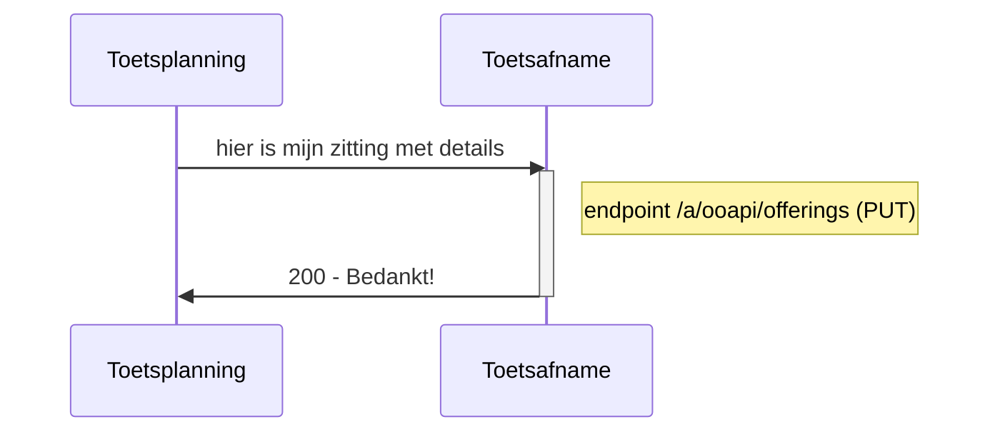
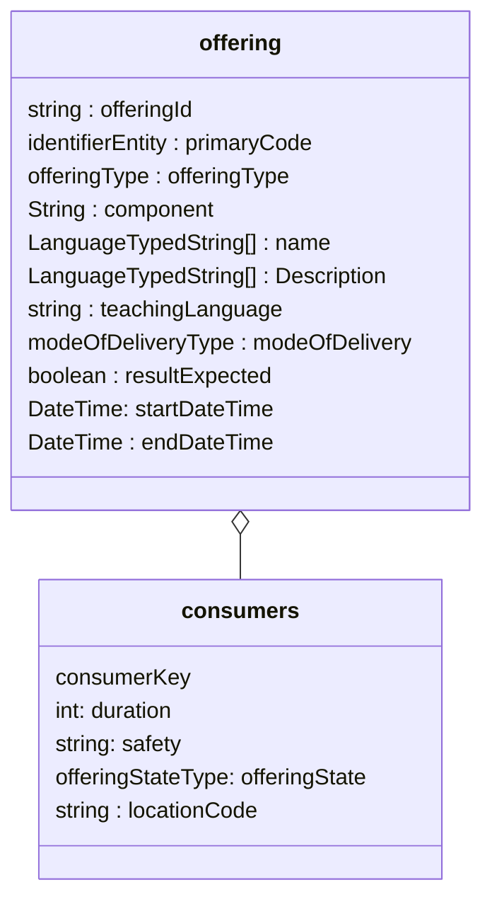
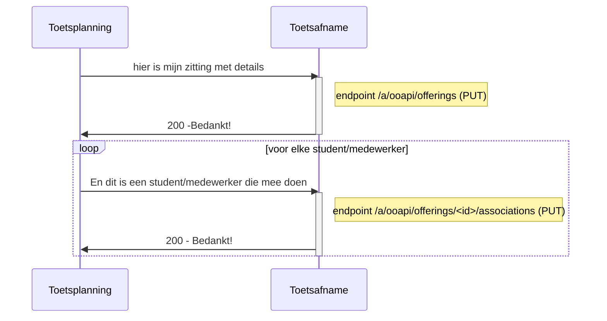
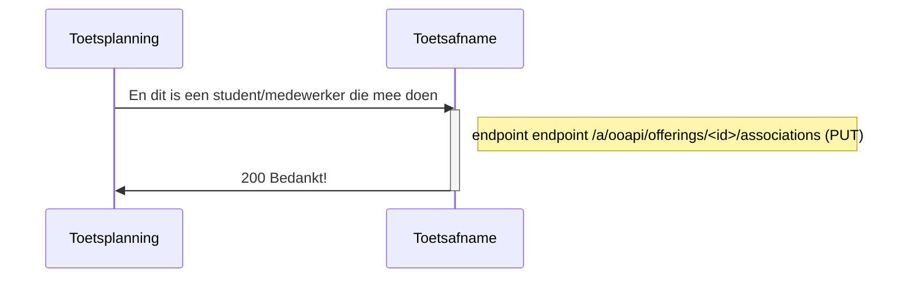
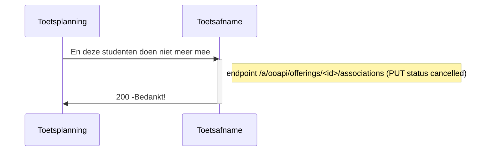
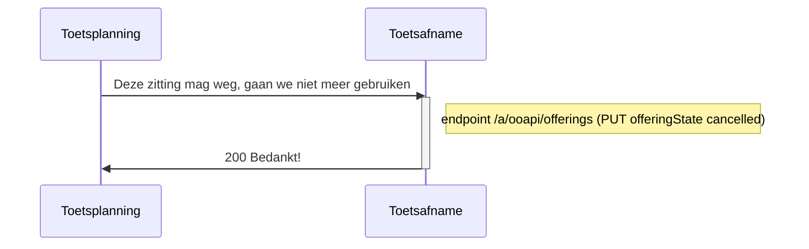
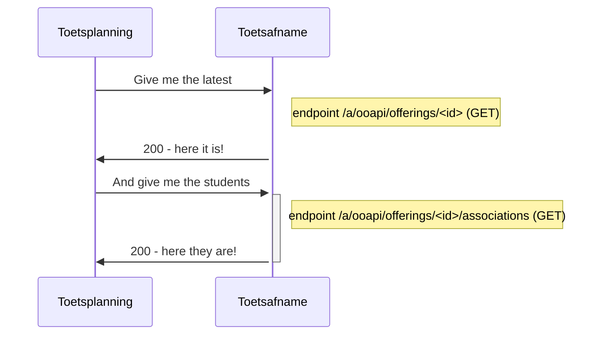

# Flow 2 : registreren van de zitting bij de toetsafname applicatie

## Flow 2.1 : Aanmaken van zitting  zonder studenten



For the zitting the following entities and attributes are used:


### Remarks
- id worden door sender aangemaakt.
- er moet een put endpoint gemaakt worden
- offering has no state, so we add it in the consumer extention. we support "active", "cancelled"
- velden: 
	- primaryCode-codeType ? hoeft niet unqiue zijn, moet herkenbaar zijn voor afname leider
	- For LanguageTypedString : nl-nl word ondersteund , rest word genegeerd
	- primarycode, naam en description (not used) zijn allemaal verplicht (afhankelijk van afname systeem wat ze er mee doen)
	- teachingLanguage (must be hardcoded NLD, not used)
	- modeOfDelivery : we only support :situated, online, oncampus (beter omschrijving)
	- resultExpected verplicht op true
	- offeringState: we only support cancelled, active
- consumers:
	- add one of type "consumerKey": "MBO-toetsafname"
	- duration: <to be decided>
	- safety : <to be defined>
	- offeringState : we support "active", "cancelled"
	- locationCode : string met indicatie van locatie (voor herkenbaarheid, we will not use the location structure from OOAPI)

### example of request	
```
PUT /a/ooapi/offerings

{
   "offeringId": "123e4567-e89b-12d3-a456-134564174000",
   "primaryCode": {
      "codeType": "offeringCode",
      "code": "Remindo_rekenen_MBO-3_op_woendag_middag_21-jun-22_om_13:00_in_lokaal_13"
   },
   "offeringType": "component",
   "component":"112-333-mooieguid-999-888",
   "name": [
      {
         "language": "nl-NL",
         "value": "20220621-12:45-Remindo rekenen MBO-3"
      }
   ],
   "description": [
      {
         "language": "nl-NL",
         "value": "20220621-12:45-Remindo rekenen MBO-3"
      }
   ],
   "teachingLanguage": "nld",
   "modeOfDelivery": [
      "situated"
   ],
   "resultExpected": true,
   "consumers": [
      {
         	"consumerKey": "MBO-toetsafname",
		"duration": 60,  #je hebt duration nodig als je flexibele periodes hebt.
		"safety": "schoolYear",
		"offeringState": "active",
		"locationCode":"A-22"
      }
   ],
   "startDateTime": "2022-06-21T12:45:00",
   "endDateTime": "2022-06-21T13:45:00"
}
```


## Flow 2.2 : Aanmaken van zitting  met studenten



- bij meerdere associaties : het vervangt de complete lijst
- - 
- voorstel attributen: personid, primaryCode (beter omschrijven - sso), givenName, surName, surnamePrefix, mail
- voor standaard bevrediging : displayname (goed gevuld), activeEnrollment (true) , affilliations (guest)
- gedrag : mag gebruiken om te updaten (geen verplichting ivm provisioning)
 - perosn is zelfde voor alle rollen 
 - rollen: student, invilgator, coordinator, assessor (wat als er meerdere rolen zijn?)
- remoteState : zelfde als State
- offeringId is impliciet
- extraTimeInMin en personalNeeds zijn optioneel en alleen by rol student

```
{
   "associationId": "123e4567-e89b-12d3-a456-426614174000",
   "associationType": "componentOfferingAssociation",
   "role": "student",
   "state": "associated",
   "remoteState": "associated",
   "consumers": [
      {
         "consumerKey": "MBO-toetsafname",
				 "userName": "1234321@student.roc.nl",
				 #je hebt extra time nodig om te weten hoeveel extra tijd.
				 "extraTimeInMin": 30,
				 #https://www.imsglobal.org/sites/default/files/spec/afa/3p0/information_model/imsafa3p0pnp_v1p0_InfoModel.html
				 "personalNeeds": [
				 	"extraTime",
					"spoken", 
					"spell-checker-on-screen"
				 ]
      }
   ],
   "person": <expanded>
}
```
## Flow 2.3 : later tijdstip: toevoegen van studenten aan aan zitting



used status van association : associated, cancelled

## Flow 2.4 : later tijdstip: verwijderen van studenten aan aan zitting




## Flow 2.5 later tijdstip: vervallen van een zitting


	
Open Question : Status change van cancelled naar active: blijven studenten dan actief? blijven associaties?

## Flow 2.6 Read current state of the offering
To see the current state of the offering with its assocoations the following endpoint can be used

	

