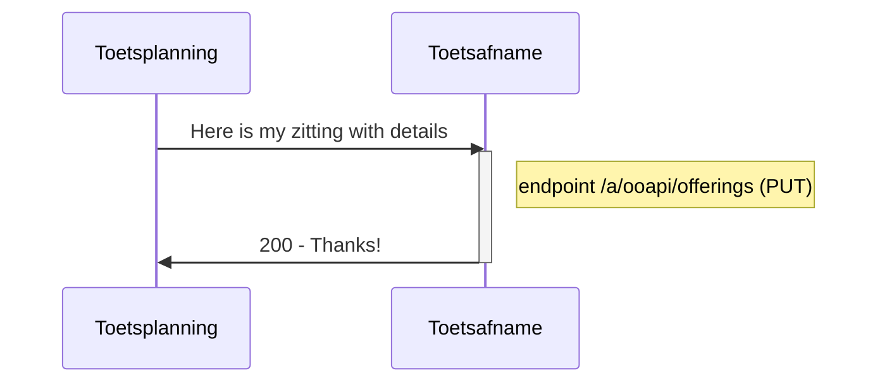
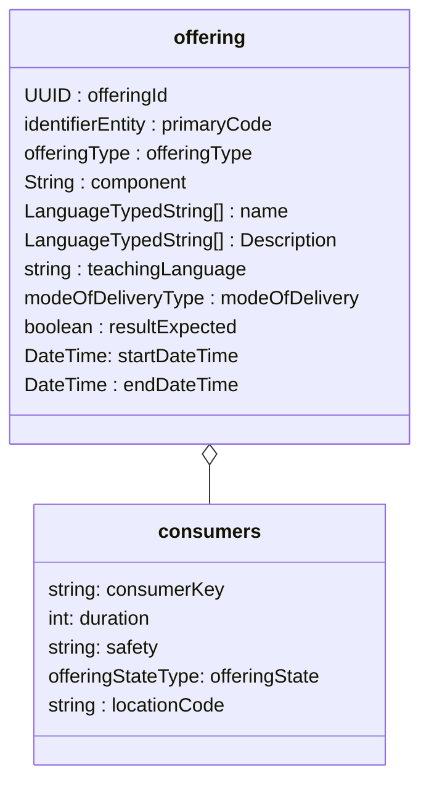
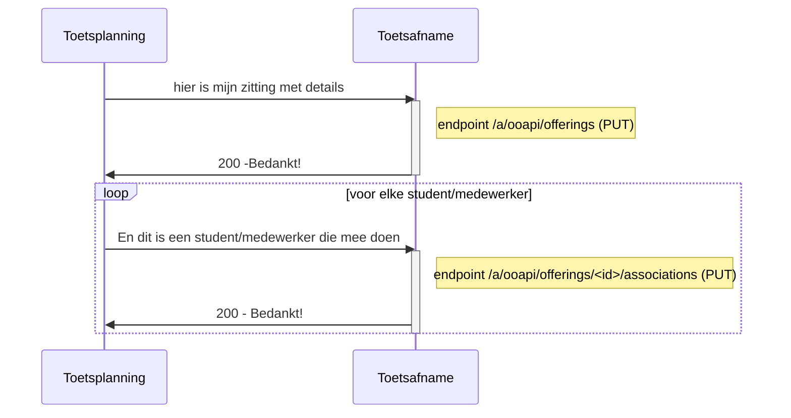
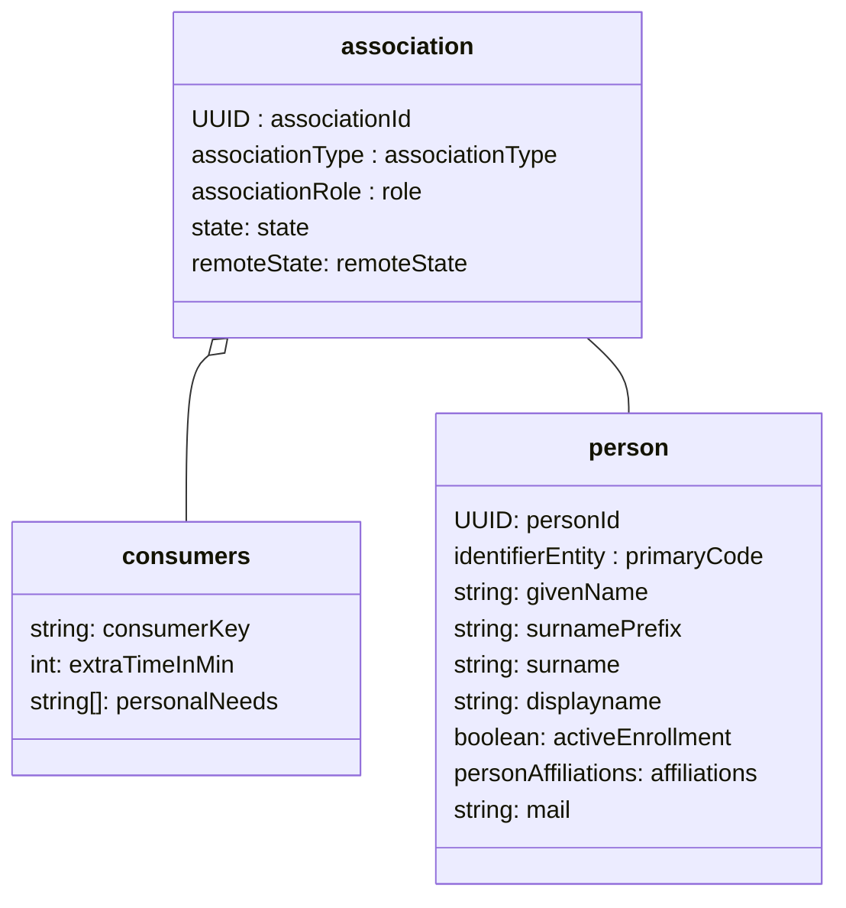
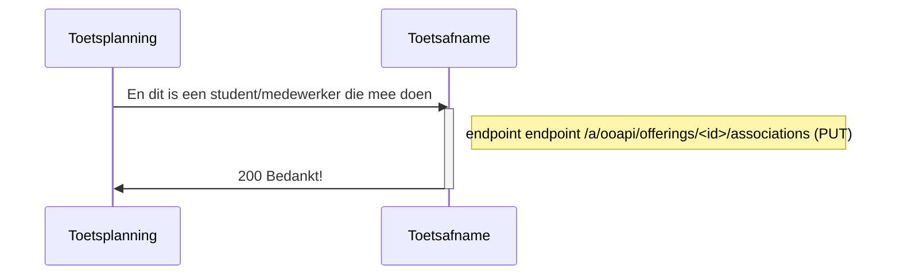
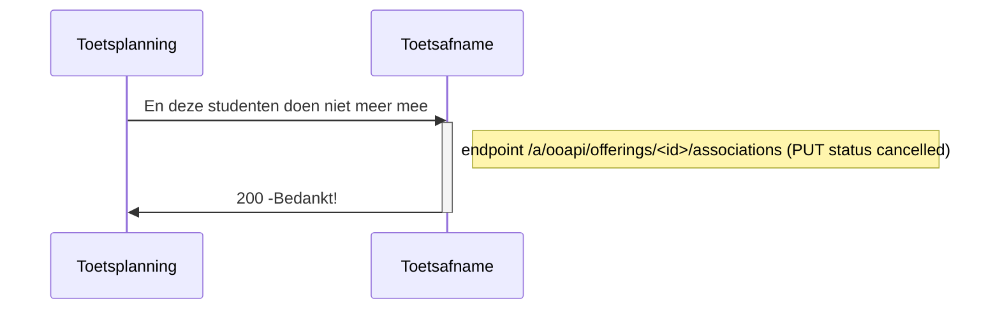
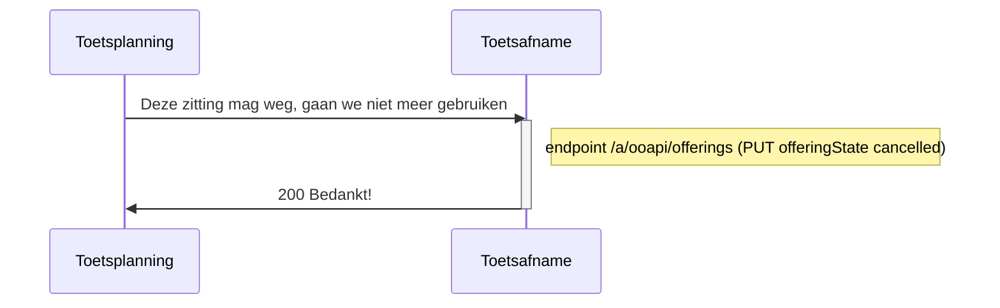
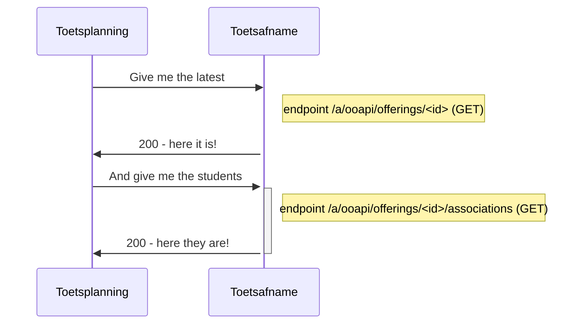

# Flow 2 : Transfer offering (zitting) to Toetsafname

## Flow 2.1 : Create offering (zitting) without students



For the offering (zitting) the following entities and attributes are used:


### Remarks
- id of the offering (zitting) is created by sender (Toetsplanning).
- Toetsafname makes a PUT endpoint available.
- Object Offering has no state, so we add the state in the consumer extention. We support "active", "cancelled"
- attributes: 
	- primaryCode.codeType is "identifier"? primaryCode.code doesn't have to be unqiue, must be recognised by afnameleider.
	- For LanguageTypedString : value nl-nl is valid and supported, all other values will be ignored.
	- To comply to the standard we have mandatory fields :
	 	- primarycode, name and description (not used) are mandatory (depending on Toetsafname system what to do with these data) (TO BE DECIDED)
	 	- resultExpected is mandatory (always true)
		- teachingLanguage (must be hardcoded NLD, not used)
	- modeOfDelivery : we only support :situated, online, oncampus (TO BE DONE: better description of the meaning)
	- offeringState: we only support cancelled and active
- consumers:
	- add one of type "consumerKey": "MBO-toetsafname"
	- duration: < to be decided >
	- safety : < to be defined >
	- offeringState : we support "active", "cancelled" (TO BE DECIDED: "cancelled" [is English] or "canceled" [is American English and in OOAPI])
	- locationCode : string to indicate test room/space  (for recognition, we will not use the location structure from OOAPI)

### example of request	
```
PUT /a/ooapi/offerings

{
   "offeringId": "123e4567-e89b-12d3-a456-134564174000",
   "primaryCode": {
      "codeType": "offeringCode",
      "code": "Remindo_rekenen_MBO-3_op_woendag_middag_21-jun-22_om_13:00_in_lokaal_13"
   },
   "offeringType": "component",
   "component":"112-333-mooieguid-999-888",
   "name": [
      {
         "language": "nl-NL",
         "value": "20220621-12:45-Remindo rekenen MBO-3"
      }
   ],
   "description": [
      {
         "language": "nl-NL",
         "value": "20220621-12:45-Remindo rekenen MBO-3"
      }
   ],
   "teachingLanguage": "nld",
   "modeOfDelivery": [
      "situated"
   ],
   "resultExpected": true,
   "consumers": [
      {
         	"consumerKey": "MBO-toetsafname",
		"duration": 60,  #je hebt duration nodig als je flexibele periodes hebt.
		"safety": "schoolYear",
		"offeringState": "active",
		"locationCode":"A-22"
      }
   ],
   "startDateTime": "2022-06-21T12:45:00",
   "endDateTime": "2022-06-21T13:45:00"
}
```


## Flow 2.2 : Create offering (zitting) with students



For the offering (zitting) the following entities and attributes are used:

### Remarks
- Association
	- supported roles: student, invigilator, coordinator, assessor (If there are multiple roles then multiple associations).
	- remoteState : same as state, but not used. (unfortunatelly: mandatory).
	- offering (componentOffering) is sent before so no need to add all data, just the offeringId is enough.
	- testID (comopnentId) is implicit in offering, so no need to add.
- person
	- Proposed attributes: personId, primaryCode (beter omschrijven - sso), givenName, surname, surnamePrefix, mail (not mandatory filled, avg/gdpr)
	- to comply to the standard we have mandatory fields (which we wont use) : displayname (goed gevuld), activeEnrollment (true) , affiliations (guest)
	- affiliations is not the role in the offering, but the a more generic role. can be ignored for this spec or set to "guest"
	- primaryCode will be used for SSO purpose: uniquely identify a student : nlpersonrealid,eckid etc (details will follow), 
 - consumers
	- add one of type "consumerKey": "MBO-toetsafname".
	- attributesd extraTimeInMin and personalNeeds are optional and used only for student role.
	- personal need should follow https://www.imsglobal.org/sites/default/files/spec/afa/3p0/information_model/imsafa3p0pnp_v1p0_InfoModel.html

### example of request	
```
PUT endpoint /a/ooapi/offerings/<id>/associations

{
   "associationId": "123e4567-e89b-12d3-a456-426614174000",
   "associationType": "componentOfferingAssociation",
   "role": "student",
   "state": "associated",
   "remoteState": "associated",
   "consumers": [
      {
         "consumerKey": "MBO-toetsafname",
				 "userName": "1234321@student.roc.nl",
				 #je hebt extra time nodig om te weten hoeveel extra tijd.
				 "extraTimeInMin": 30,
				 #https://www.imsglobal.org/sites/default/files/spec/afa/3p0/information_model/imsafa3p0pnp_v1p0_InfoModel.html
				 "personalNeeds": [
				 	"extraTime",
					"spoken", 
					"spell-checker-on-screen"
				 ]
      }
   ],
   "person": {
   	"personId":"111-2222-33-4444-222"
	"primaryCode": 
	{
		"codeType": "studentNumber",
		"code": "1234567"
	}
	"givenName": "Maartje",
	"surnamePrefix": "van",
	"surname": "Damme"
	"displayName": "Maartje van Damme",
	"activeEnrollment": true,
	"affiliations": [
		"student"
	],
	"mail": "vandamme.mcw@student.roc.nl",
	"languageOfChoice": [
		"nl-NL"
	]
   }
}
```

## Flow 2.3 : later moment: Add students to offering (zitting)



used status van association : associated, cancelled

## Flow 2.4 : later moment: Delete van students to offering (zitting)




## Flow 2.5 later moment: Delete offering (zitting)


	
Open Question : Status change from cancelledback to active: Will students remain active? Will associations remain?

## Flow 2.6 Read current state of the offering (zitting)
To see/check the current state of the offering (zitting) with its associations the following endpoint can be used at Toetsafname

	

