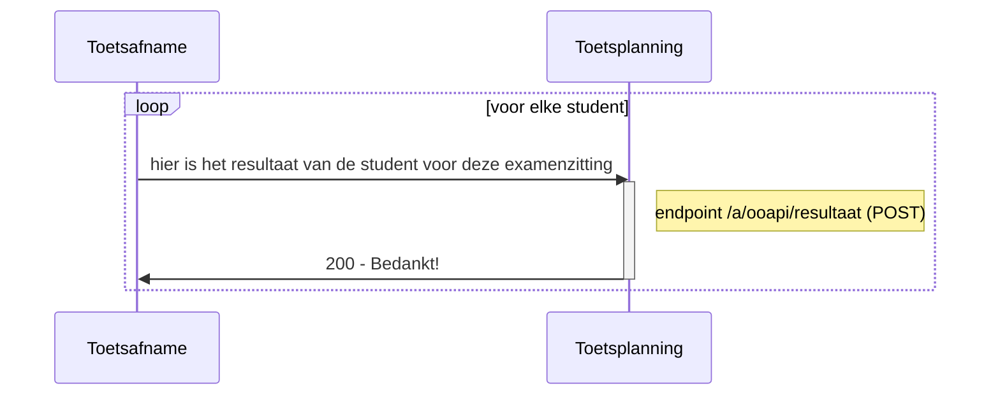
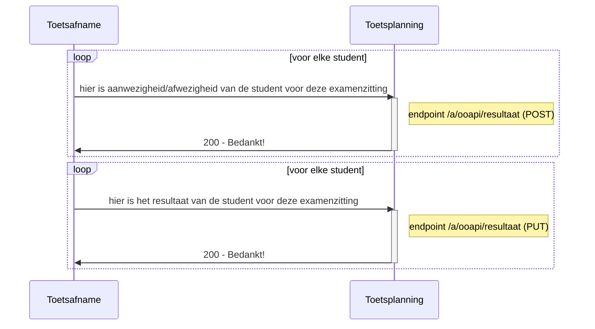

# Flow 3 : Sturen van resultaten when toets/examen is afgenomen

## optie 1 : Sturen van aan/afwezigheid en resultaat

   
## optie 2 : Sturen van aan/afwezigheid als resultaat nog niet bekend is, gevolgd door resultaat

 
