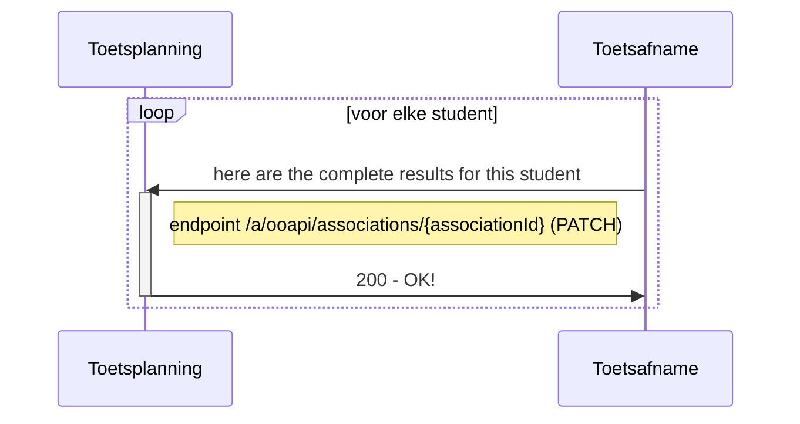
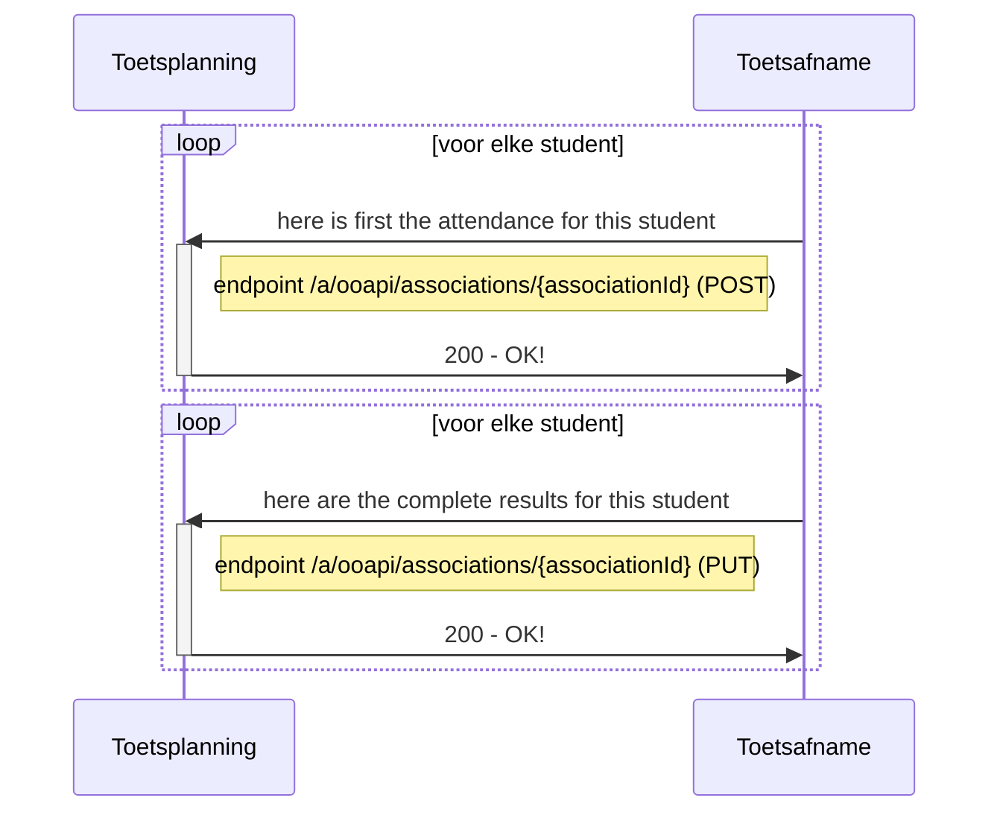
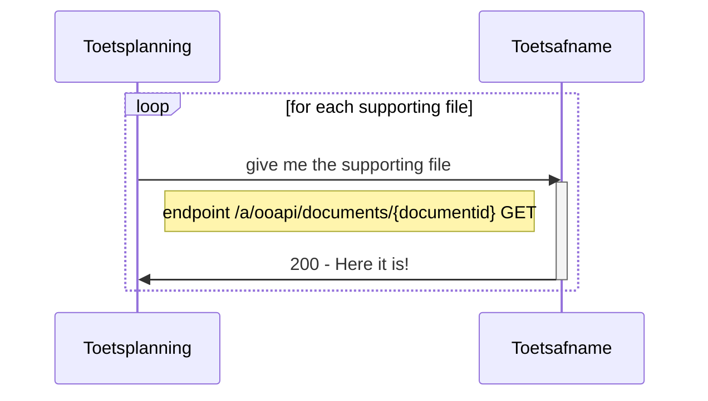
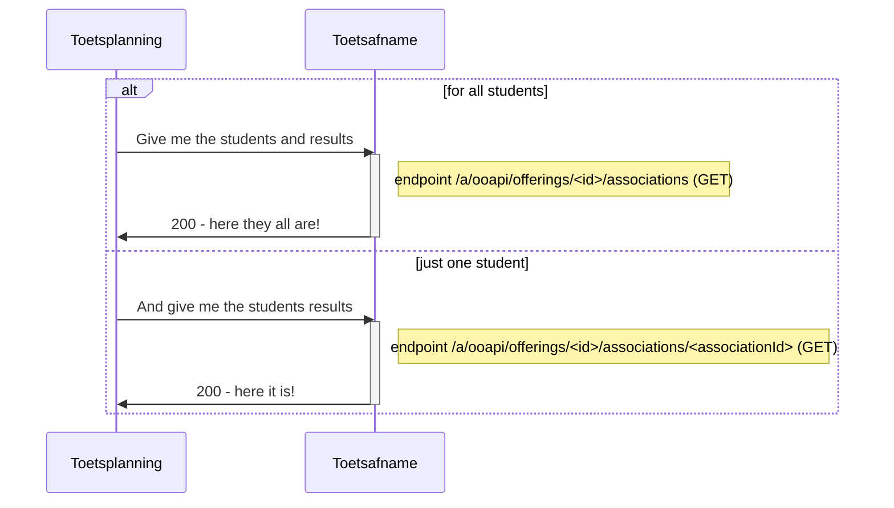

# Flow 3 : Sturen van resultaten when toets/examen is afgenomen

After a test is taken the results for each participant are returned to the plannings application. This can be updated many times, also with partial information. for example : first attendance information, a few weeks later the results.

## Flow 3.1 : Send attendance en resultaat directly (automated scored tests)


   
### example of result message for one student
```
PATCH /associations/{associationId}

{
	
   "consumers": [
     {
        "consumerKey": "MBO-toetsafname",
        "assessorId": "05035972-0619-4d0b-8a09-7bdb6eee5e6d",
        "assessorCode": "JAJE"
         "attendance": "notPresent| notStarted | notFinished | present",
        "documents": [
         {
           "documenitId": "123454"
           "documentType": "assessmentForm",
           "documentUrl": "https://acme.com/f72e34af-f8bc-4a09-bbf5-0cde8c3a656e.pdf",
           "documentName": "Assessment form for Jake Doe.pdf",
           "documentExtension": "pdf"
         }
        ]
      }
   ],
   "result": {
      "state": "completed",
      "pass": "passed",
      "comment": "string",
      "score": "9",
      "resultDate": "2020-09-28T00:00:00.000Z",
      "ext": null,
      "weight": 100
    }
}
```
Remarks:
- officieel hoort het consumers object hier, maar ik zie bij results ook een ext object, dus daar zouden we dit object ook onder kunnen zetten. Het zijn per slot van rekening resultaatgegevens.
- files: always via documents ooAPI endpoint or any place ?
- file type : #Hebben we extra documenteigenschappen nodig zoals hieronder?
- documentExtension: is it better to define a fixed set, so we know how to interpret ? or use mimetypes? (or only support pdf or other)

## Flow 3.2 : Send attendance first, send resultaat later


### example of a message with only attendance information
```json
PATCH /associations/{associationId}

{
   "consumers": [
     {
       "consumerKey": "MBO-toetsafname",
       "attendance": "notPresent| notStarted | notFinished | present",
     }
   ]
}
```
 
## Flow 3.3 : Retrieve supporting results files
when a result message contains a file reference the file can be downloaded


## Flow 3.4 Read current state of the attendance and results
To see the current state of the offering with its assocoations and endpoints the following endpoint can be used

