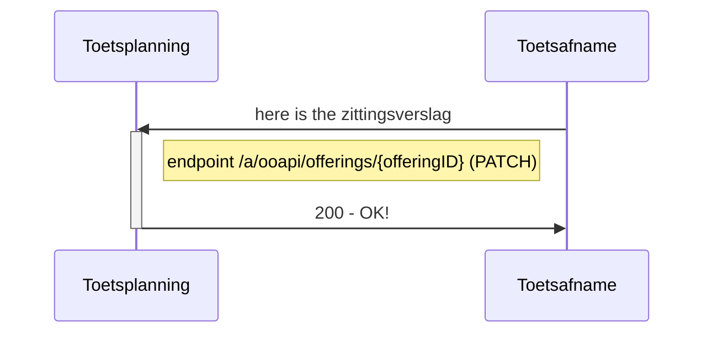
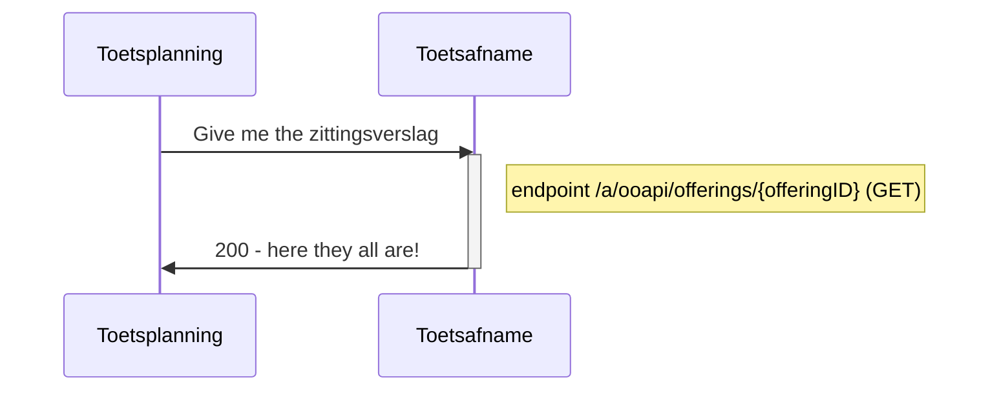

# Flow 4 : Sturen van zittingsverslag when toets/examen is afgenomen

Na afloop van een examen of toets word het zittingsverslag met onrgelmatigheden gestuurd naar de toetsplanning.
Dit is zowel gestructureerde informatie van verloop, als eventueel een geupload processverbaal, met handtekeningen

## Flow 4.1 : Send attendance en resultaat directly (automated scored tests)


   
### example of result message 
```
#PATCH /offerings/{offeringID}
{
   "consumers": [
      {
         "consumerKey": "MBO-toetsafname",
				 "additionalInfo": "There was a lot of noise from the construction site nearby.",
				 "documents": [
				    {
						   "documentType": "sessionReport",
							 "documentUrl": "https://acme.com/12dc31f4-9dfc-4fe5-ae88-4b8f9b0cdc43.pdf",
							 #Hebben we extra documenteigenschappen nodig zoals hieronder?
							 "documentName": "Session report on Session tbd.pdf",
							 "documentExtension": "pdf"
						}
				 ]
      }
   ]
}
```
Remarks:
- moeten we nog ruimte maken voor student informatie: Jantje (UUID 123-4444-66-22) stond op en begon te schreewen en te slaan toen hij de opgave zag.. 
- files: always via documents ooAPI endpoint or any place ?
- file type : #Hebben we extra documenteigenschappen nodig zoals hieronder?
- documentExtension: is it better to define a fixed set, so we know how to interpret ? or use mimetypes? (or only support pdf or other)


## Flow 4.2 Read current state of zittingsverslag
To see the current state of the offering the following endpoint can be used


