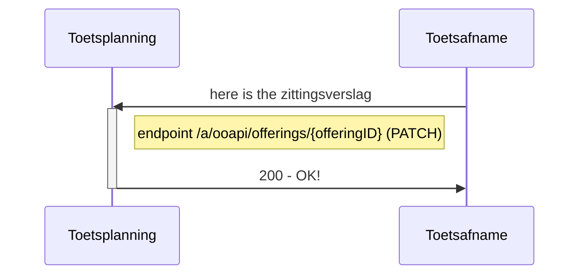
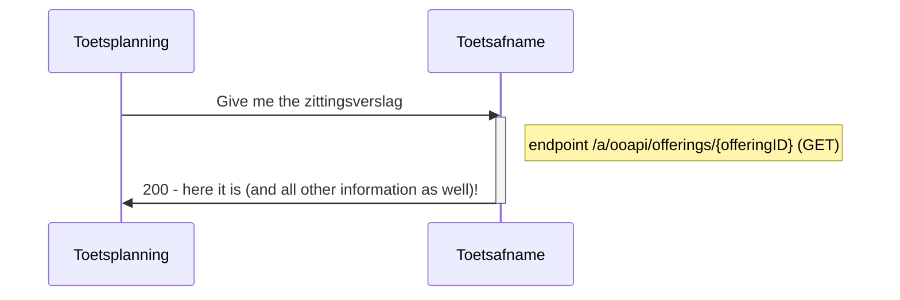

# Flow 4 : Sturen van zittingsverslag when toets/examen is afgenomen

After the exam or test thas finished word het zittingsverslag met onrgelmatigheden gestuurd naar de toetsplanning.
Dit is zowel gestructureerde informatie van verloop, als eventueel een geupload processverbaal, met handtekeningen

## Flow 4.1 : Send attendance en resultaat directly (automated scored tests)


   
### example of result message 
```
#PATCH /offerings/{offeringID}
{
   "consumers": [
      {
        "consumerKey": "MBO-toetsafname",
	"irregularities": "There was a lot of noise from the construction site nearby.",
	"documents": [
	  {
            "documentId": "454566464665355545",
	    "documentType": "sessionReport",
	    "documentName": "Session report on Session tbd.pdf",
	  }
	]
      }
   ]
}
```
Remarks:
- documentTypes: supported : "sessionReport", "attendanceReport", "assessmentModel", "other"

## Flow 4.2 Read current state of zittingsverslag
To see the current state of the offering the following endpoint can be used


