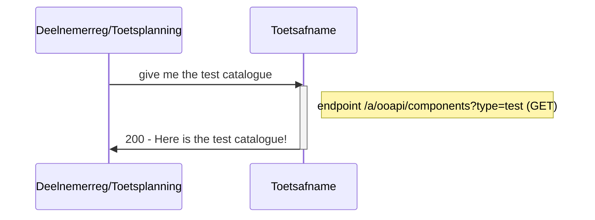
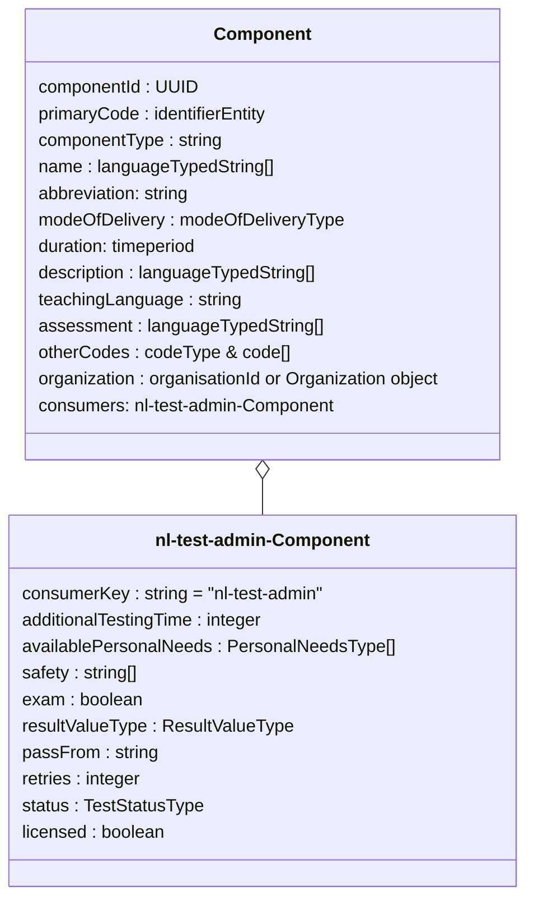
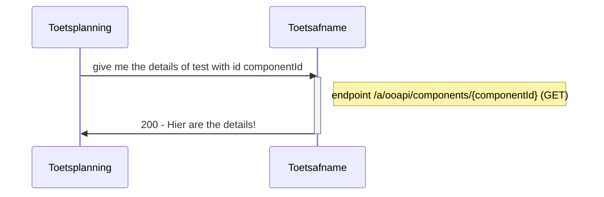

# Flow 0 : request catalogue from toetsafname applicatie

The deelnemer registratie(SIS) and toetsplanning can request to list of available exams/test from the toetsafname applications. This is input for those applications to plan and schedule exams/tests.

## Flow 0.1 Request whole catalogue

### Sequence diagram of Request whole catalogue


### Class diagram of response of Request whole catalogue	
For each component (toets) the following entities and attributes are used:


### Example of response Request whole catalogue
```json
#GET/components?componentType=test

response:
[
  {
     "componentId": "c5fca27e-ccc1-430d-9888-90e005ad6a86",
     "primaryCode": {
        "codeType": "componentCode",
        "code": "5"
     },
     "componentType": "test",
     "name": [
        {
           "language": "nl-NL",
           "value": "Rekenen 2F voor technische opleidingen"
        }
     ],
     "abbreviation": "REK2F-TECH",
     "modeOfDelivery": [
        "situated"
     ],
     "duration": "PT60M",
     "description": [
        {
           "language": "nl-NL",
           "value": "Rekentest MBO op niveau 2F toegespitst op technische opleidingen zoals procestechniek/machinebouw"
        }
     ],
     "teachingLanguage": "nld",
     "assessment": [
        {
           "language": "nl-NL",
           "value": "Digitale toetsing"
        }
     ],
     "otherCodes": [
        {
           "codeType": "testSystem",
           "code": "Remindo"
        },
        {
           "codeType": "testProvider",
           "code": "CEM"
        }
     ],
     "organization": "452c1a86-a0af-475b-b03f-724878b0f387",
     "consumers": [
        {
           "consumerKey": string = "nl-test-admin", 
           "additionalTestingTime": 30,
           #https://www.imsglobal.org/sites/default/files/spec/afa/3p0/information_model/imsafa3p0pnp_v1p0_InfoModel.html
           "availablePersonalNeeds": [ "extraTime", "spoken", "spell-checker-on-screen" ],
           "safety": [ "securedComputer", "fixedLocation", "surveillance"],
           "exam": true,
           "resultValueType": "0.0-10.0",
           "passFrom": "5.5",
           "retries": 2,
           "status": "active"
           "licensed": true
        }
     ],
  }
  ,{..}
  ]
```
### Remarks
- id of the component (toets/examen) is created by owner of the catalogue (Toetsafname).
- Toetsafname makes the GET endpoint available.
- various filters could be used:
	- componentType=test for filtering on components (toets/examens) only
	- q=rekenen for filtering on components (toets/examens) with text "rekenen" in name or description
	- licensed=true for filtering on components (toets/examens) for which the requesting education organisation (or organisational unit) has a valid license
- The ResultValueType is an enumeration with enumeration values:
	- pass-or-fail = Resultvalue is from valuelist {passed, failed}
	- insufficient-satisfactory-good = Resultvalue is from valuelist {insufficient, satisfactory, good}
	- US letter = Resultvalue is a letter from A t/m D en F voor fail as in US
	- UK letter = Resultvalue is a letter from A t/m G en U voor ungraded/unclassified as in UK
	- DE grade = Resultvalue is a letter as used in Germany
	- 0-100 = Resultvalue is a number from range (0,100)
	- 0-10 = Resultvalue is a number from range (0,10)
	- 0.0-10.0 = Resultvalue is a decimal number from range (0.0,10.0)
	- referenceLevelRKTR = Resultvalue is a reference level from the Dutch "Referentiekader Taal en Rekenen" from value set {1F, 1S, 2F, 2S, 3F, 3S, 4F, 4S} and additional values like "Op weg naar 1F"
	- referenceLevelERK = Resultvalue is a reference level from the "Europees Referencekader voor de talen" from value set {A1, A2, B1, B2, C1, C2}


## Flow 0.2 Request details of one test
 
### Sequence diagram of Request details of one test


### Class diagram of response for Request whole catalogue	
(see Class diagram in Flow 0.1)

### Example of response for Request details of one test
```json
#GET/components/{componentId}

response:
{
     "componentId": "c5fca27e-ccc1-430d-9888-90e005ad6a86",
     "primaryCode": {
        "codeType": "componentCode",
        "code": "5"
     },
     "componentType": "test",
     "name": [
        {
           "language": "nl-NL",
           "value": "Rekenen 2F voor technische opleidingen"
        }
     ],
     "abbreviation": "REK2F-TECH",
     "modeOfDelivery": [
        "situated"
     ],
     "duration": "PT60M",
     "description": [
        {
           "language": "nl-NL",
           "value": "Rekentest MBO op niveau 2F toegespitst op technische opleidingen zoals procestechniek/machinebouw"
        }
     ],
     "teachingLanguage": "nld",
     "assessment": [
        {
           "language": "nl-NL",
           "value": "Digitale toetsing"
        }
     ],
     "otherCodes": [
        {
           "codeType": "testSystem",
           "code": "Remindo"
        },
        {
           "codeType": "testProvider",
           "code": "CEM"
        }
     ],
     "organization": "452c1a86-a0af-475b-b03f-724878b0f387",
     "consumers": [
        {
           "consumerKey": string = "nl-test-admin", 
           "additionalTestingTime": 30,
           #https://www.imsglobal.org/sites/default/files/spec/afa/3p0/information_model/imsafa3p0pnp_v1p0_InfoModel.html
           "availablePersonalNeeds": [ ],
           "safety": [ ],
           "exam": true,
           "resultValueType": "0.0-10.0",
           "passFrom": "5.5",
           "retries": 2,
           "status": "active"
           "licensed": true
        }
     ],
}

```

