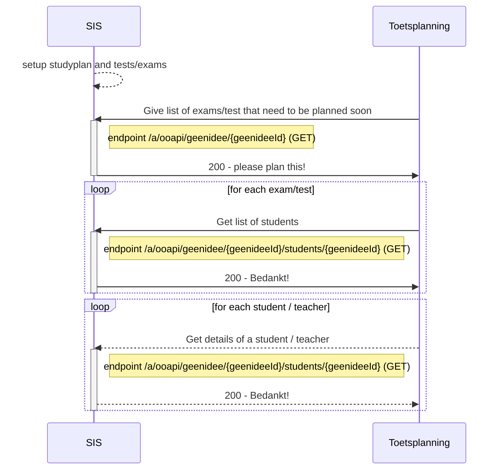

# Flow 1: Plannings information (tests and students)

# Proposal : THIS IS FOR DISCUSSION ONLY. NOT FINAL

## endpoints
Used endpoints for this flow are:
`PUT /geenidee`
`GET /geenidee/{geenideeId}`
`GET /geenidee/{geenideeId}/details`

## Flow 1.1 : Get the to be planned exams (and students)

### Sequence diagram of request Create offering (zitting)	

