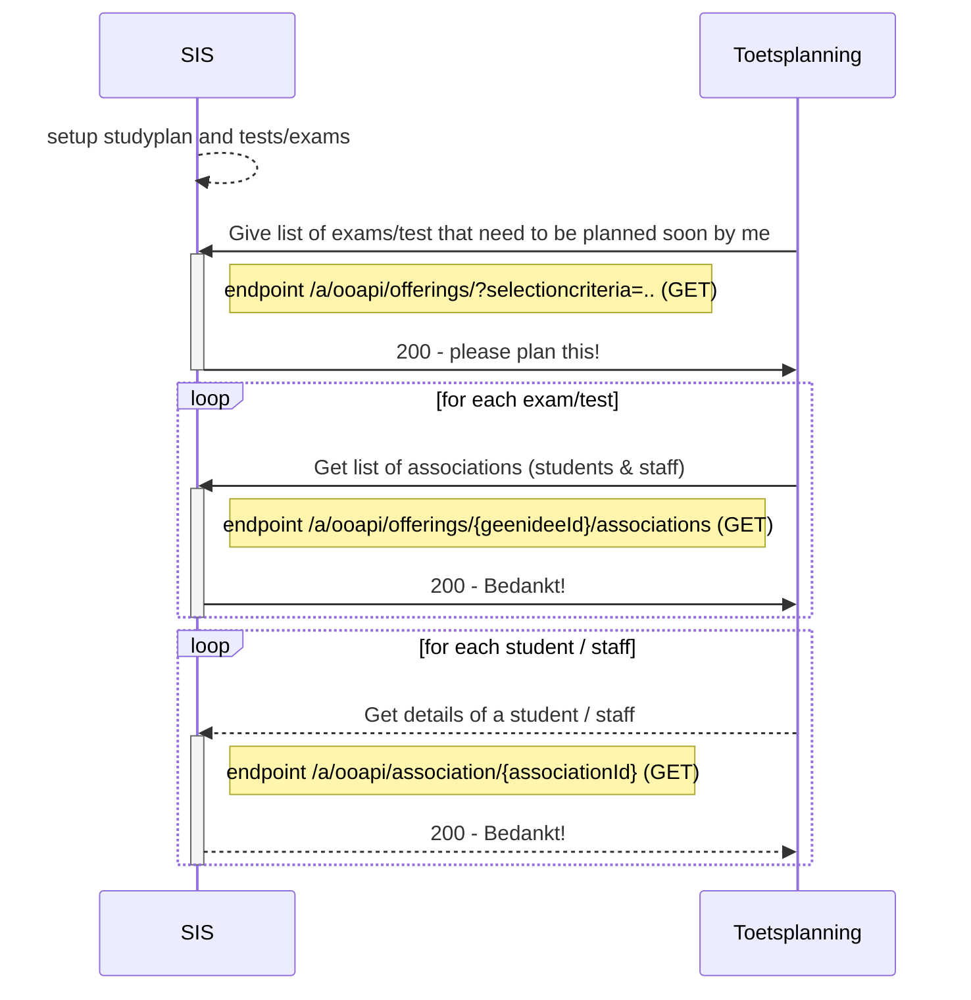
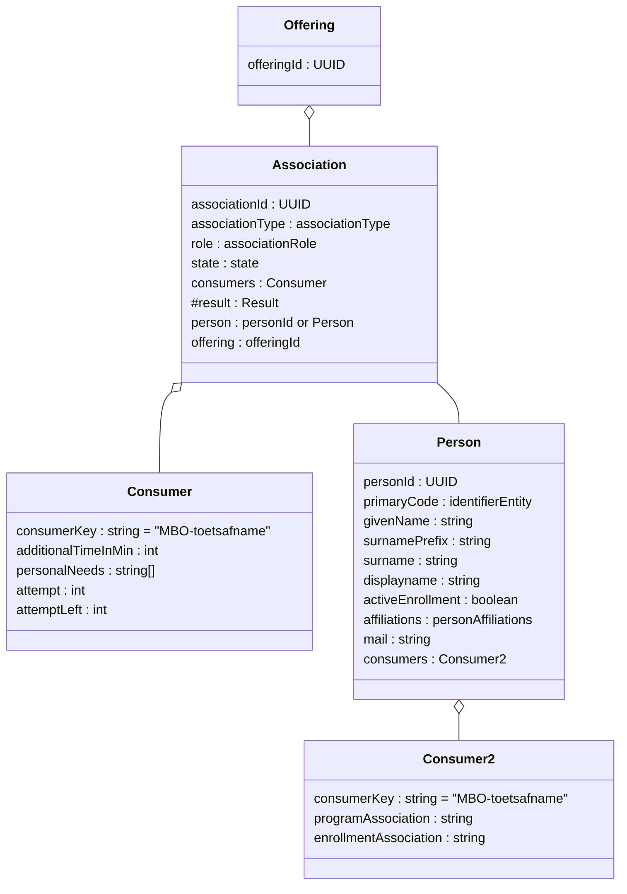

# Flow 1: Plannings information (tests and persons)

Proposal : We have several flow 1's : very structured and very ad-hoc

## flow 1a : Structured

We request all components/offerings from the SIS that need to be planned

## Flow 1b : Ad-hoc

We request a selection of students that a teacher can use to create detailed plannings, results do not go back to the SIS automaticly.

## endpoints
Used endpoints for this flow are:
`GET /ooapi/offerings?componentType=TEST&Since=..&Until=&planner=
`PUT /geenidee`
`GET /geenidee/{geenideeId}`
`GET /ooapi/association/{associationId} `

Planner kan al beperkt worden door security
Boolean IsLineItem (we verwachten ook een resultaat te loggen)
ComponentType = Test, Lecture, Consultation, SkillTraining..... Niet beperken.

# Flow 1a : Get the to be planned exams (and students)

### Sequence diagram of request Create offering (zitting)	

### Class diagram of request B. Add student to created offering (zitting)	

