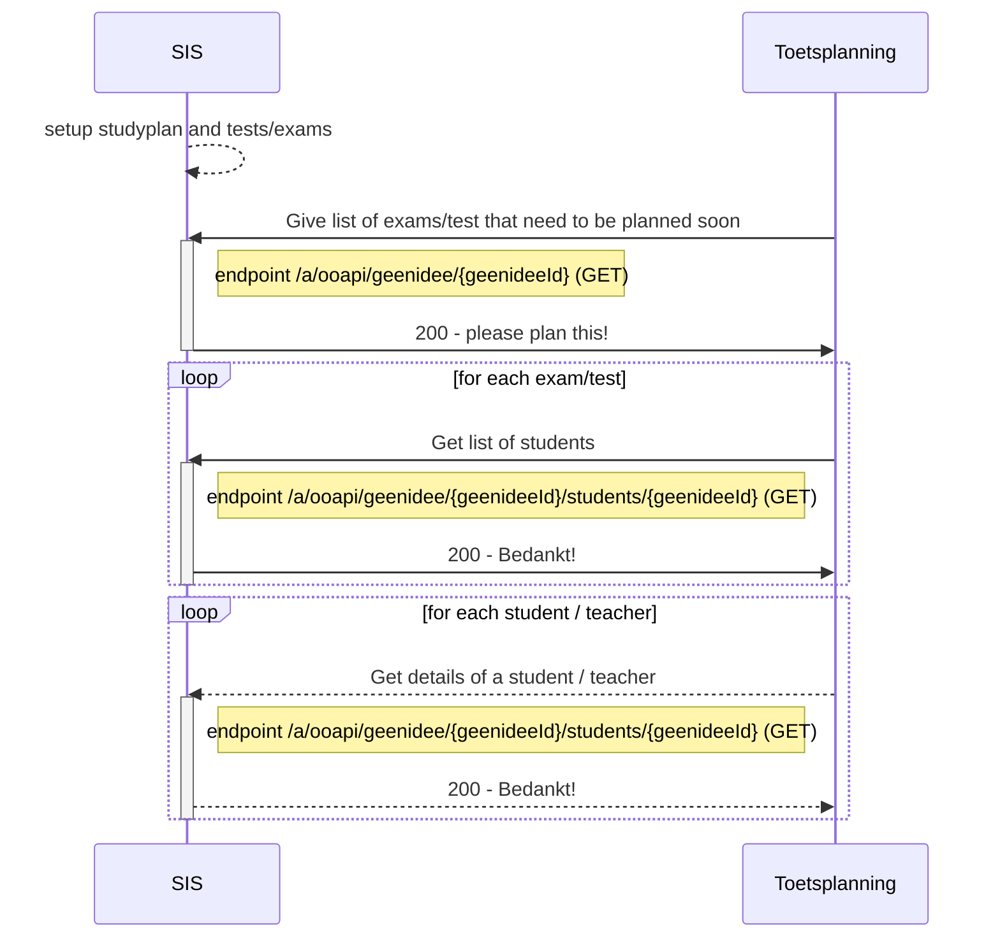

# Flow 1: Plannings information (tests and persons)

# Proposal : We have several flow 1's : very organised and very ad-hoc

## flow 1a : Structured

We request all components/offerings from the SIS that need to be checked

## Flow 1b : Ad-hoc

We request a selection of students that a teacher can use to create detailed plannings

## endpoints
Used endpoints for this flow are:
`PUT /geenidee`
`GET /geenidee/{geenideeId}`
`GET /geenidee/{geenideeId}/details`

## Flow 1a.1 : Get the to be planned exams (and students)

### Sequence diagram of request Create offering (zitting)	

