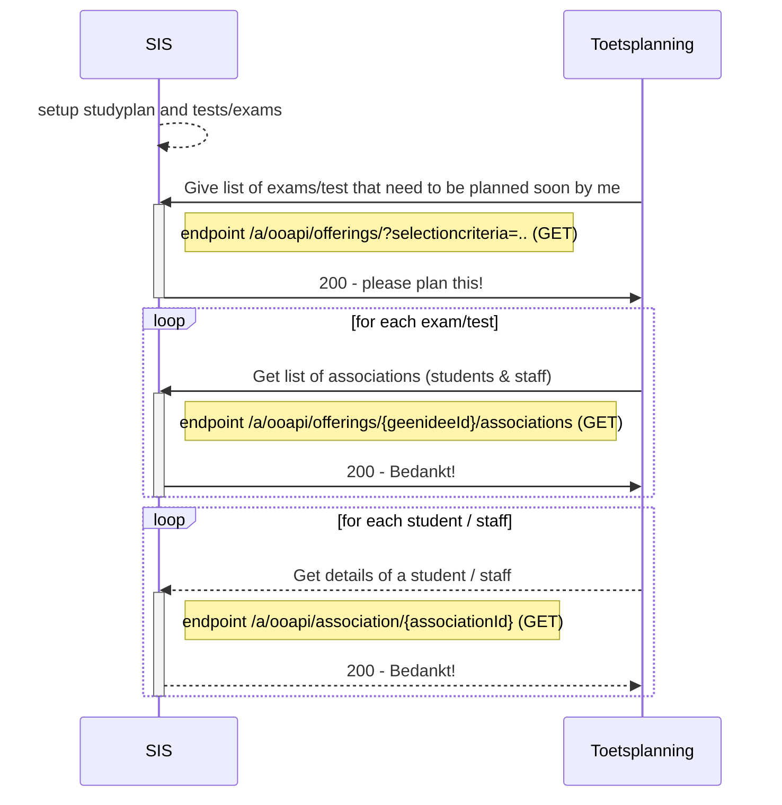
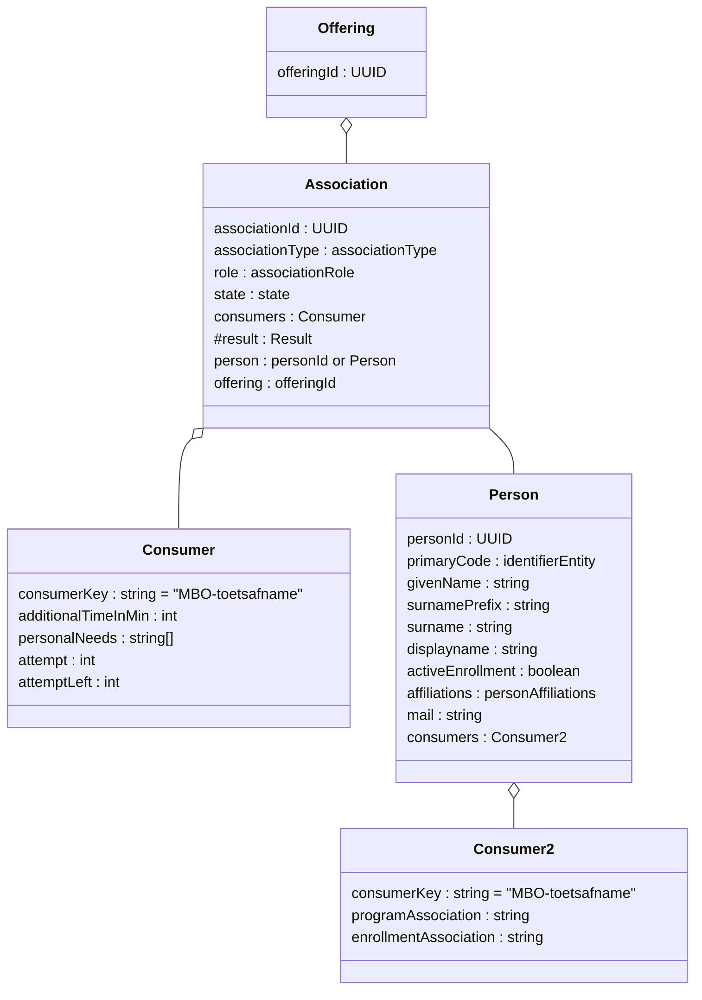
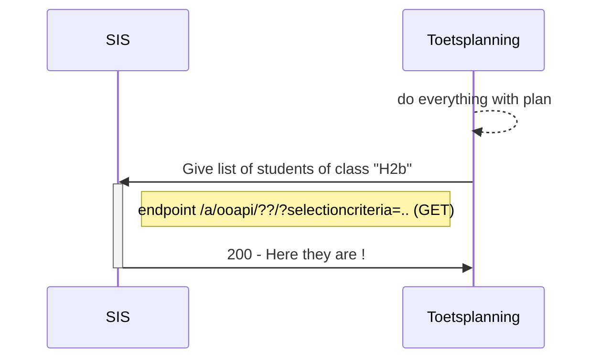
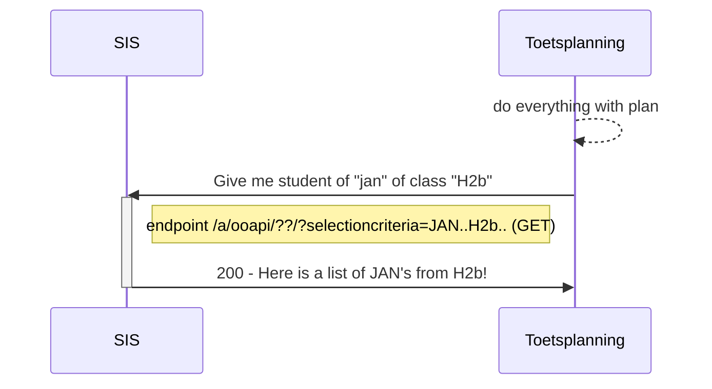

# Flow 1: Plannings information (tests and persons)

Proposal : We have several flow 1's : very structured, flexible and very ad-hoc

## flow 1a : Structured

We request all components/offerings from the SIS that need to be planned
The Student information System knows which components need to be planned and requests the planning tool to create a more detailed planning (based on specific characteristics of the associations that have been provided by the SIS) The consumer information provides sufficient information to allow for regrouping of the students for specific tests.


## Flow 1b : Flexible

We request the a group of students based on the program they are participating in this allows than for the planner to create detailed plannings, results do not go back to the SIS automaticly.

## Flow 1b : Ad-hoc

We request a selection of students that a teacher can use to create detailed plannings, results do not go back to the SIS automaticly.

## endpoints
Used endpoints for this flow are:
```
GET /ooapi/offerings?componentType=TEST&Since=..&Until=&planner=
PUT /geenidee
GET /geenidee/{geenideeId}
GET /ooapi/association/{associationId}
```
Planner tool ontvangt gegevens over de stuenten die ingepland moeten worden. Hierbij gaat het om de direct in te plannen toetsen (op basis van het component) en om de indeling van de student op een 

Planner kan al beperkt worden door security
Boolean IsLineItem (we verwachten ook een resultaat te loggen)
ComponentType = Test, Lecture, Consultation, SkillTraining..... Niet beperken.

# Flow 1a : Get the to be planned exams (and students)

### Sequence diagram of request Create offering (zitting)	


### Class diagram of request B. Add student to created offering (zitting)

### Example of request component offerings that need to be planned
```
GET /ooapi/offerings?componentType=TEST&Since=..&Until=&planner=

"Offering": {
        "offeringId": "0fdc8e82-eacf-412f-b5cb-1ba2fce589dc",
        "primaryCode": {
            "codeType": "identifier",
            "code": "Rek3F2022-2S"
        },
        "offeringType": "component",
        "name": "Rekenen 3F toetsing 2e semester 22/23",
        "resultExpected": true,
        "resultValueType": "0-100",
        "component": {
            "componentId": "59e5543d-105e-45d7-90ee-408660c35669",
            "componentType": "test",
            "primaryCode": "Rek3F",
            "name": "Toetsing rekenen op niveau 3F"
        },
        "consumers": [
            {
                "consumerKey": "MBO-NED",
                "testsToBeUsed": [
                    {
                        "testSupplier": "MBO-NED",
                        "testID": "dfc9d973-42cf-46f3-bd18-f9b50492cdb5"
                    }
                ]
            }
        ],
        "flexibleEntryPeriodStart": "2023-04-01",
        "flexibleEntryPeriodEnd": "2023-06-30",
        "organization": {
            "organizationID": "UUID",
            "primaryCode": {
                "codeType": "identifier",
                "code": "EXAMB-KANAAL"
            },
            "name": [
                {
                    "language": "nl-NL",
                    "value": "Examenbureau kanaaleiland"
                }
            ]
        }
    }

```

### Example of request associations	

GET /a/ooapi/offerings/{offeringId}/associations/

    "Association": {
        "associationId": "5a52f86b-edcd-4f7f-9ea9-c8617f6043b6",
        "associationType": "componentOfferingAssociation",
        "role": "student",
        "state": "associated",
        "consumers": [
            {
                "consumerKey": "MBO-NED",
                "personalNeeds": [    
                    "extraTime",
                    "spoken",
                    "spell-checker-on-screen"                
                ],
                "programAssociationID": "54e58f68-ceac-4845-99d5-caa721fefb88",
                "courseAssociationID": "170b5f35-20be-47bf-96ff-d262d121b76b"
            }
        ],
        "person": "500e6ac0-b5ab-4071-a207-7983ccd26f7b",
    }
```

# flow 1b : flexible

### Sequence diagram of request to get students	based on a program the person is participating in


### Example of request program offerings	
```
GET /ooapi/offerings?Type=Program&Until=&planner=

"Offering": {
    "offeringId": "5ffc6127-debe-48ce-90ae-75ea80756475",
    "primaryCode": {
        "codeType": "identifier",
        "code": "25190BOL"
    },
    "offeringType": "program",
    "name": "Netwerk- en mediabeheerder BOL (25190)",
    "consumers": [
        {
            "consumerKey": "MBO-NED"
        }
    ],
    "organization": {
        "organizationID": "38bdbeb1-12b2-48fd-84f8-653e7adfaf99",
        "primaryCode": {
            "codeType": "identifier",
            "code": "ICTE"
        },
        "name": [
            {
                "language": "nl-NL",
                "value": "ICT-academie"
            }
        ],
        "parent": {
            "organizationID": "650e1627-9f3d-4176-ab5a-e82eef0d219d",
            "primaryCode": {
                "codeType": "identifier",
                "code": "CICT"
            },
            "name": [
                {
                    "language": "nl-NL",
                    "value": "Cluster ICT en EIS"
                }
            ]
        }
    }
}
```

### Example of request associations	
```
GET /a/ooapi/associations/

"Association": {
    "associationId": "54e58f68-ceac-4845-99d5-caa721fefb88",
    "associationType": "programOfferingAssociation",
    "primaryCode": {
        "codeType": "opleidingsblad",
        "code": "1.1"
    },
    "role": "student",
    "state": "associated",
    "otherCodes": [
        {
            "codeType": "opleidingscode",
            "code": "23089"
        }
    ],
    "consumers": [
        {
            "consumerKey": "MBO-NED",
            "levelOfQualification": "4",
            "modeOfStudy": "full-time",
            "cohort": "2020", #welk OER toegepast wordt (kan de keuze voor een toetsmiddel bepalen)
            "location": "Where?", #onderwijs locatie (campus)
            "startDate": "2021-09-01", #todo wat willen we met datums
            "expectedEndDate": "2025-07-31",
            "finalEndDate": null
        }
    ],
    "person": "500e6ac0-b5ab-4071-a207-7983ccd26f7b",
    "offering": "5ffc6127-debe-48ce-90ae-75ea80756475"
}
     
```


# flow 1c : very adhoc


### Sequence diagram of request to get students	based on group



### Sequence diagram of request to get a single student


