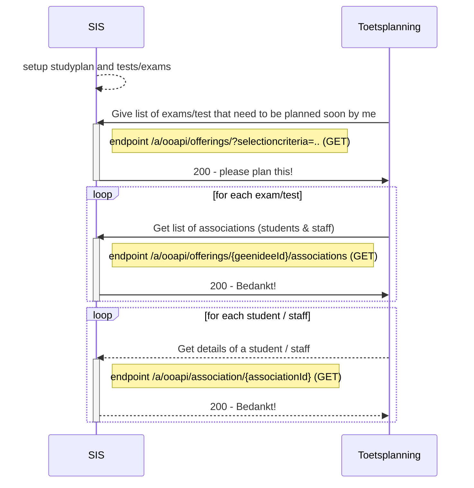
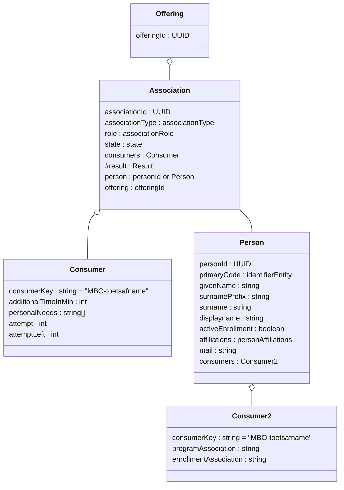
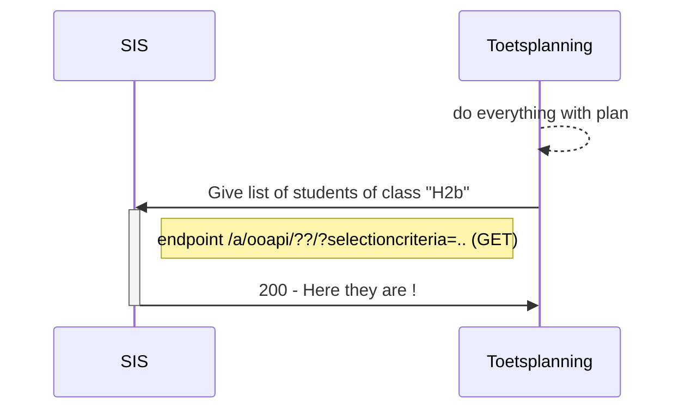
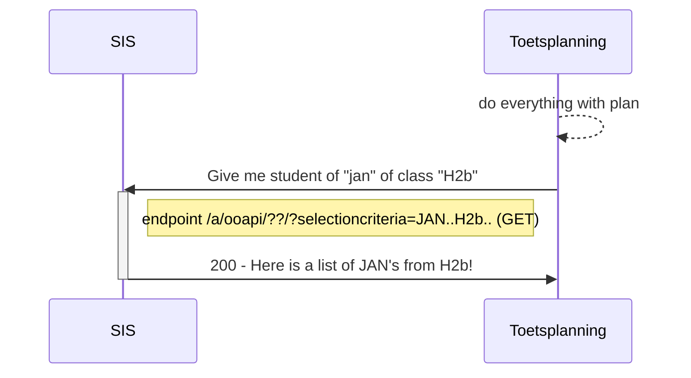

# Flow 1: Plannings information (tests and persons)

Proposal : We have several flow 1's : very structured and very ad-hoc

## flow 1a : Structured

We request all components/offerings from the SIS that need to be planned

### Example of request offerings	
```
GET /ooapi/offerings?componentType=TEST&Since=..&Until=&planner=

"Offering": {
    "offeringId": "5ffc6127-debe-48ce-90ae-75ea80756475",
    "primaryCode": {
        "codeType": "identifier",
        "code": "25190BOL"
    },
    "offeringType": "program",
    "name": "Netwerk- en mediabeheerder BOL (25190)",
    "consumers": [
        {
            "consumerKey": "MBO-NED"
        }
    ],
    "organization": {
        "organizationID": "38bdbeb1-12b2-48fd-84f8-653e7adfaf99",
        "primaryCode": {
            "codeType": "identifier",
            "code": "ICTE"
        },
        "name": [
            {
                "language": "nl-NL",
                "value": "ICT-academie"
            }
        ],
        "parent": {
        "organizationID": "650e1627-9f3d-4176-ab5a-e82eef0d219d",
        "primaryCode": {
            "codeType": "identifier",
            "code": "CICT"
        },
        "name": [
            {
                "language": "nl-NL",
                "value": "Cluster ICT en EIS"
            }
        ]
    }
}
```

### Example of request offerings	
```
GET /a/ooapi/associations/

"Association": {
    "associationId": "54e58f68-ceac-4845-99d5-caa721fefb88",
    "associationType": "programOfferingAssociation",
    "primaryCode": {
        "codeType": "opleidingsblad",
        "code": "1.1"
    },
    "role": "student",
    "state": "associated",
    "otherCodes": [
        {
            "codeType": "opleidingscode",
            "code": "23089"
        }
    ],
    "consumers": [
        {
            "consumerKey": "MBO-NED",
            "levelOfQualification": "4",
            "modeOfStudy": "full-time",
            "cohort": "2020",
            "campus": "Where?",
            "startDate": "2021-09-01",
            "expectedEndDate": "2025-07-31",
            "finalEndDate": null
        }
    ],
    "person": "500e6ac0-b5ab-4071-a207-7983ccd26f7b",
    "offering": "5ffc6127-debe-48ce-90ae-75ea80756475"
}
     
```
## Flow 1b : Ad-hoc

We request a selection of students that a teacher can use to create detailed plannings, results do not go back to the SIS automaticly.

## endpoints
Used endpoints for this flow are:
```
GET /ooapi/offerings?componentType=TEST&Since=..&Until=&planner=
PUT /geenidee
GET /geenidee/{geenideeId}
GET /ooapi/association/{associationId}
```

Planner kan al beperkt worden door security
Boolean IsLineItem (we verwachten ook een resultaat te loggen)
ComponentType = Test, Lecture, Consultation, SkillTraining..... Niet beperken.

# Flow 1a : Get the to be planned exams (and students)

### Sequence diagram of request Create offering (zitting)	


### Class diagram of request B. Add student to created offering (zitting)


# flow 1b : very adhoc


### Sequence diagram of request to get students	based on group



### Sequence diagram of request to get a single student


