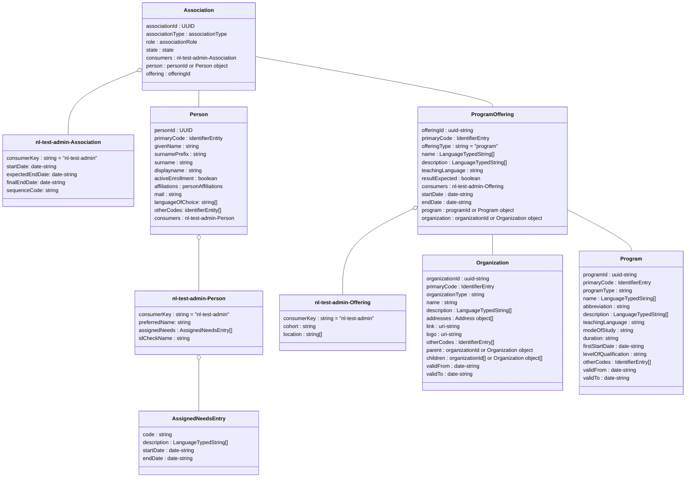

# Flow 1.1: Plannings information (tests and persons)

This flow supports the following flows / processes

- Flow 1.1a : Structured
    - Flow 1.1a.1: Get the to be planned exams (and students & staff)
    - Flow 1.1a.2: Update enrollment (for a student or staff)
    - Flow 1.1a.3: Update an offering
    - Additional SIS examples
        - Example to create an offering (planbare toets)	
        - Example of a change in end date of an offering (e.g. to close the offering) 	
        - Example adding an associations from SIS to TPS	

- Flow 1.1b : very adhoc
    - Flow 1.1b.1: request groups based on a specific name
    - Flow 1.1b.2: request members (students and staff) in a specific group
    - Flow 1.1b.3: request to get information on a single student or staff
    - Flow 1.1b.4: Request for 1 specific group	

- Flow 1.2: additional supporting information 
    - Flow 1.2a.1: rquest to get persons based on a program the person is participating in
    - Flow 1.2a.2: request to get the offering details of a specific assocation to clarify the assocation
    - Flow 1.2b.1: provision person information (PUT of information of a single student from SIS to the TPS) 
    - Flow 1.2b.2: provisioning current program associations information	


# Flow 1.1: Plannings information (tests and persons)

Flow 1 is used to provide a test planning system with information on tests to be planned and the students/candidates that have to perform those tests. Usually a Student Information System (SIS) provides this information to a Test Planning System (TPS). The TPS uses this information to plan testmoments for tests, assign the required Test Execution System (TES) and test within that TES. Students are assigned to the test moments based on the logic and workflow of the TPS. It is also possible to assign employees (or staff members) to the test to be planned (planbare toets).

We distinguish two flows that can be used to plan tests:

- Structured (SIS is in the lead on which tests have to be performed within a certain period and which students have to perform those tests)
- Ad-hoc (TPS is in the lead to create test moments)

Besides these two flows there is also a flow for additional supporting information on students and staff members and their education enrollments. This flow is optional since not all test planning and test execution software requires the additional information.

## Flow 1.1a : Structured

The SIS has information on tests s have to perform within a certain period (e.g. based on a course, or testing has to be done within a certain year or semester). The SIS has to assign each test that has to be planned by a TPS to that TPS.

A test can be created on many aggregation levels by the SIS. E.g.:
- All students that have to be tested for dutch language level 3 on listening, speaking and writing during a semester
- All three tests that belong to a specific course during a semester
- A specific test for four students doing an honours program

Depending on the aggregation level of the test the TPS has to perform only minimal planning or extensive planning.

Tests that are provided in a structured way to the TPS can also have results/scores reported back by TPS to SIS using Flow 5.

The consumer information provides sufficient information to allow for regrouping of the students to test moments. If necessary the TPS can use the API's from the Additional supporting information flow to retrieve more student context from the SIS.

### Flow 1.1a : Endpoints for this flow

- `GET /ooapi/offerings?offeringType=component&component.componentType=test&since=..&until=..`
- `GET /ooapi/offerings/{offeringId}`
- `GET /ooapi/offerings/{offeringId}/associations`
- `GET /ooapi/associations/{associationId}`

expand funcationality is also needed on the associations to get the details of the offering and / or the person in the assocation

Supplied by SIS:
- `PUT /ooapi/offerings/{offeringId}`
- `PATCH /ooapi/offerings/{offeringId}`
- `PUT /ooapi/associations/{associationId}`
- `PATCH /ooapi/associations/{associationId}` (to allow for cancellation of enrollment by the student/staff)

## Flow 1.1b : Ad-hoc

When the TPS initiates a test moment there is no structured test information available from the SIS. The SIS provides API's to retrieve student groups and group memberships as well as information on individual students/staff members.

The TPS can create test moments using this information and provide a TES with this data. However, because these test moments weren't initiated by the SIS it's not possible to transfer results/scores back to the SIS using flow 5. If required, these scores have to entered manually in the SIS.

### Flow 1.1b : Endpoints for this flow

- `GET /ooapi/groups?q=..`
- `GET /ooapi/groups/{groupId}/members`
- `GET /ooapi/persons/{personId}`
- `GET /ooapi/groups/{groupId}`
- `PUT /ooapi/groups/{groupId}`
- `PUT /ooapi/groups/{groupId}/members/{personId}`
 

## Flow 1.2 : Additional supporting information

Based on the id's on students (and staff members) and their program offering associations, provided to the planning software in flows 1a or 1b, the planning software can retrieve additional student/staff and program association information.

### Flow 1.2a: Additional supporting information: GET flows Endpoints for this flow

- `GET /ooapi/persons/{personId}`
- `GET /ooapi/associations/{associationId}?expand=offering.program`
- `GET /ooapi/associations/{associationId}?expand=offering.program,offering.organization`
- `GET /ooapi/organizations/{organizationId}?expand=parent`


### Flow 1.2b: Additional supporting information: supplied by SIS to TPS for provisioning of users and their studyplans (PUT)
- `PUT /ooapi/persons/{personId}`
- `PUT /ooapi/associations/{associationId}`
- `PATCH /ooapi/associations/{associationId}` (to allow for cancellation of enrollment by the student/staff)


# Flow 1.1a.1: Get the to be planned exams (and students & staff)

### Sequence diagram of request Create offering (rough planning or in NL grofplanning)	


# Flow 1.1a.2: Update enrollment (for a student or staff)
### Sequence diagram of request Update planned exam (for a student or staff)	


# Flow 1.1a.3: Update an offering
### Sequence diagram of request update offering (planbare toets)	


### Class diagram for flow 1.1a Add person (student or staff) to created offering (planbare toets)

### Example of request component offerings that need to be planned
The the since and until paramaters MUST be specified in in URL friendly format so:
since=2023-07-31T22:00:00.000Z becomes
since=2023-07-31T22%3A00%3A00%2E000Z     
```json
GET /ooapi/offerings?offeringType=component&component.componentType=test&since=..&until=..
{
    "pageSize": 10,
    "pageNumber": 1,
    "hasPreviousPage": false,
    "hasNextPage": true,
    "totalPages": 8,
    "items":[
        {
            "offeringId": "0fdc8e82-eacf-412f-b5cb-1ba2fce589dc",
            "primaryCode": {
                "codeType": "identifier",
                "code": "Rek3F2022-2S"
            },
            "offeringType": "component",
            "name": "Rekenen 3F toetsing 2e semester 22/23",
            "resultExpected": true,
            "resultValueType": "0-100",
            "consumers": [
                {
                    "consumerKey": "nl-test-admin",
                    "testsToBeUsed": [
                        {
                            "testProvider": "MBO-NED",
                            "componentId": "dfc9d973-42cf-46f3-bd18-f9b50492cdb5"
                        }
                    ]
                }
            ],
            "startDateTime": "2022-06-21T12:45:00.000Z",
            "endDateTime": "2022-07-23T13:45:00.000Z",
            "component": {
                "componentId": "59e5543d-105e-45d7-90ee-408660c35669",
                "componentType": "test",
                "primaryCode": "Rek3F",
                "name": "Toetsing rekenen op niveau 3F"
            },
            "organization": {
                "organizationID": "UUID",
                "primaryCode": {
                    "codeType": "identifier",
                    "code": "EXAMB-KANAAL"
                },
                "name": [
                    {
                        "language": "nl-NL",
                        "value": "Examenbureau kanaaleiland"
                    }
                ]
            }
        }
    ]
}
```

### Example of request associations	
```json
GET /ooapi/offerings/{offeringId}/associations/
{
    "pageSize": 10,
    "pageNumber": 1,
    "hasPreviousPage": false,
    "hasNextPage": true,
    "totalPages": 8,
    "items": [
        {
            "associationId": "5a52f86b-edcd-4f7f-9ea9-c8617f6043b6",
            "associationType": "componentOfferingAssociation",
            "role": "student",
            "state": "associated",
            "consumers": [
                {
                    "consumerKey": "nl-test-admin",
                    "personalNeeds": [    
                        "extraTime",
                        "spoken",
                        "spell-checker-on-screen"                
                    ],
                    "programOfferingAssociationId": "54e58f68-ceac-4845-99d5-caa721fefb88",
                    "programOfferingAssociationIds": ["54e58f68-ceac-4845-99d5-caa721fefb88","54e58f68-ceac-4845-99d5-caa721fefb90"],
                    "courseOfferingAssociationId": "170b5f35-20be-47bf-96ff-d262d121b76b"
                }
            ],
            "person": "500e6ac0-b5ab-4071-a207-7983ccd26f7b",
            "offering": "5ffc6127-debe-48ce-90ae-75ea80756475",
        }
    ]
}
```

## SIS examples
### Example to create an offering (planbare toets)	
```json
PUT /ooapi/offerings/{offeringId}

{
   "offeringId": "123e4567-e89b-12d3-a456-134564174000",
   "primaryCode": {
      "codeType": "offeringCode",
      "code": "Remindo_rekenen_MBO-3_op_woendag_middag_21-jun-22_om_13:00_in_lokaal_13"
   },
   "offeringType": "component",
   "name": [
      {
         "language": "nl-NL",
         "value": "20220621-12:45-Remindo rekenen MBO-3"
      }
   ],
   "description": [
      {
         "language": "nl-NL",
         "value": "Beschrijving van 20220621-12:45-Remindo rekenen MBO-3"
      }
   ],
   "teachingLanguage": "nld",
   "modeOfDelivery": [
      "situated"
   ],
   "resultExpected": true,
   "consumers": [
      {
	    "consumerKey": "nl-test-admin",
        "testsToBeUsed": [
            {
                "testProvider": "MBO-NED",
                "componentId": "dfc9d973-42cf-46f3-bd18-f9b50492cdb5"
            }
        ]
      }
   ],
   "startDateTime": "2022-06-21T12:45:00.000Z",
   "endDateTime": "2022-06-21T13:45:00.000Z"
   "component":"c5fca27e-ccc1-430d-9888-90e005ad6a86",
}
```

### Example of a change in end date of an offering (e.g. to close the offering) 	
```json
PATCH /ooapi/offerings/{offeringId}

{
   "offeringType": "component",
   "endDateTime": "2022-06-21T13:45:00.000Z"
}
```

### Example adding an associations from SIS to TPS	
```json
PUT /ooapi/associations/{associationId}
{
    "associationId": "5a52f86b-edcd-4f7f-9ea9-c8617f6043b6",
    "associationType": "componentOfferingAssociation",
    "role": "student",
    "state": "associated",
    "consumers": [
        {
            "consumerKey": "nl-test-admin",
            "personalNeeds": [    
                "extraTime",
                "spoken",
                "spell-checker-on-screen"                
            ],
            "programOfferingAssociationId": "54e58f68-ceac-4845-99d5-caa721fefb88",
            "programOfferingAssociationIds": ["54e58f68-ceac-4845-99d5-caa721fefb88","54e58f68-ceac-4845-99d5-caa721fefb90"],
            "courseOfferingAssociationId": "170b5f35-20be-47bf-96ff-d262d121b76b"
        }
    ],
    "person": "500e6ac0-b5ab-4071-a207-7983ccd26f7b",
    "offering": "5ffc6127-debe-48ce-90ae-75ea80756475",
}
```


### Example of changing (in this case deleting) program associations information

```json
PATCH /ooapi/associations/{associationId}
{
    "associationType": "programOfferingAssociation",
    "state": "canceled",
}
```

# Flow 1.1b : very adhoc


### Flow 1.1b.1: Sequence diagram of request groups based on a specific name


### Flow 1.1b.2: Sequence diagram of request members (students and staff) in a specific group


### Flow 1.1b.3: Sequence diagram of request to get information on a single student or staff


### Class diagram for group


### Flow 1.1b.1: Example of request groups	
```json
GET /ooapi/groups?q=..
{
    "pageSize": 10,
    "pageNumber": 1,
    "hasPreviousPage": false,
    "hasNextPage": true,
    "totalPages": 8,
    "items":[
        {
        "groupId": "123e4567-e89b-12d3-a456-426614174000",
        "primaryCode": {
            "codeType": "identifier",
            "code": "1234qwe12"
        },
        "groupType": "learning group",
        "name": [
            {
            "language": "en-GB",
            "value": "statistics students"
            }
        ],
        "description": [
            {
            "language": "en-GB",
            "value": "The group of students that follow statistics classes and related staff"
            }
        ],
        "startDate": "2020-08-17",
        "endDate": "2020-12-18",
        "personCount": 183,
        "otherCodes": [
            {
            "codeType": "identifier",
            "code": "1234qwe12"
            }
        ],
        "organization": "452c1a86-a0af-475b-b03f-724878b0f387"
        }    
    ]
}

```


### Class diagram for members 


### Flow 1.1b.2: Example of request members (students and staff members) part of a group	
```json
GET /ooapi/groups/{groupId}/members
{
    "pageSize": 10,
    "pageNumber": 1,
    "hasPreviousPage": false,
    "hasNextPage": true,
    "totalPages": 8,
    "items": [
        {
            "personId": "123e4567-e89b-12d3-a456-122564174000",
            "startDateTime": "2020-09-28T08:30:00+01:00",
            "endDateTime": "2020-09-30T20:00:00+01:00",
            "state": "active",
            "role": "student",
        }
    ]
}

```

### Flow 1.1b.3: Example of request person information	
```json
GET /ooapi/persons/{personId}
{
    "personId": "123e4567-e89b-12d3-a456-426614174000",
    "primaryCode": {
    "codeType": "identifier",
    "code": "1234qwe12"
    },
    "givenName": "Maartje",
    "surnamePrefix": "van",
    "surname": "Damme",
    "displayName": "Maartje van Damme",
    "initials": "MCW",
    "activeEnrollment": true,
    "affiliations": [
    "student"
    ],
    "mail": "vandamme.mcw@universiteitvanharderwijk.nl",
    "languageOfChoice": [
    "nl-NL"
    ],
    "otherCodes": [
    {
        "codeType": "eckid",
        "code": "00000"
    }
    ],
    "consumers": [
        {
            "consumerKey": "nl-test-admin",
            "preferredName": "Maar",
            "assignedNeeds": {
                "code": "extraTimeOnlyMath25%",
                "description": [
                    {
                        "language": "nl-NL",
                        "value": "Extra tijd van 25% bij de totale tijd van een toets waarin rekenen voorkomt"
                    }
                ],
                "startDate": "2023-10-25",
                "endDate": "2025-09-30"
            },
            "idCheckName": "van Damme, Maartje"
        }
    ]

}
```

### Flow 1.1b.4: Example of request for 1 specific group	
```json
GET /ooapi/groups/{groupId}
{
    "groupId": "123e4567-e89b-12d3-a456-426614174000",
    "primaryCode": {
        "codeType": "identifier",
        "code": "1234qwe12"
    },
    "groupType": "learning group",
    "name": [
        {
        "language": "en-GB",
        "value": "statistics students"
        }
    ],
    "description": [
        {
        "language": "en-GB",
        "value": "The group of students that follow statistics classes and related staff"
        }
    ],
    "startDate": "2020-08-17",
    "endDate": "2020-12-18",
    "personCount": 183,
    "otherCodes": [
        {
        "codeType": "identifier",
        "code": "1234qwe12"
        }
    ],
    "organization": "452c1a86-a0af-475b-b03f-724878b0f387"
}    

```


### Example adding groups and members from SIS to TPS	
An optional method is allowed to provide information from the SIS to the TPS for creating groups and updating the members of these groups.

The creation and update of a group is done through a PUT operation.

```json
PUT /ooapi/groups/{groupId}
{
    "groupId": "123e4567-e89b-12d3-a456-426614174000",
    "primaryCode": {
        "codeType": "identifier",
        "code": "1234qwe12"
    },
    "groupType": "learning group",
    "name": [
        {
        "language": "en-GB",
        "value": "statistics students"
        }
    ],
    "description": [
        {
        "language": "en-GB",
        "value": "The group of students that follow statistics classes and related staff"
        }
    ],
    "startDate": "2020-08-17",
    "endDate": "2020-12-18",
    "personCount": 183,
    "otherCodes": [
        {
        "codeType": "identifier",
        "code": "1234qwe12"
        }
    ],
    "organization": "452c1a86-a0af-475b-b03f-724878b0f387"
} 

```


Additionaly there is the option to add and update the members of a group. This is done by a PUT option containing the GroupId where membership items are to be updated. The update is done by using the personId of the person partaking in the group. There is no deletion option however the status of a person can be updated to canceled or the endDateTime can also be used to indicate the user will no longer be part of the group.


```json
PUT /ooapi/groups/{groupId}/members/{personId}
{
    "personId": "123e4567-e89b-12d3-a456-122564174000",
    "startDateTime": "2020-09-28T08:30:00+01:00",
    "endDateTime": "2020-09-30T20:00:00+01:00",
    "state": "active",
    "role": "student",
}
```

# flow 1.2: additional supporting information 

### Flow 1.2a.1: Sequence diagram of request to get persons based on a program the person is participating in


### Flow 1.2a.2: Sequence diagram of request to get the offering details of a specific assocation to clarify the assocation


### Flow 1.2b.1: Sequence diagram of provision person information (PUT of information of a single student from SIS to the TPS) 


### Flow 1.2b.2: Sequence diagram of provisioning current program associations information	


### Class diagram of programoffering in relation to its organization


### Flow 1.2a.1: Example of request program offering information
Warning: next part will change. No list of offerings will be given. 
```json
GET /ooapi/offerings/{offeringId}?expand=organization
{
    "offeringId": "5ffc6127-debe-48ce-90ae-75ea80756475",
    "primaryCode": {
	"codeType": "identifier",
	"code": "25190BOL"
    },
    "offeringType": "program",
    "name": "Netwerk- en mediabeheerder BOL (25190)",
    "consumers": [
	{
	    "consumerKey": "nl-test-admin",
        "cohort": "2022-2023",
        "location": "Campus Groningen",
    }
    ],
    "organization": {
        "organizationID": "38bdbeb1-12b2-48fd-84f8-653e7adfaf99",
        "primaryCode": {
            "codeType": "identifier",
            "code": "ICTE"
        },
        "organizationType": "department",
        "name": [
            {
            "language": "nl-NL",
            "value": "ICT-academie"
            }
        ],
        "shortname": "ICTA",
        "parent": {
            "organizationID": "650e1627-9f3d-4176-ab5a-e82eef0d219d",
            "primaryCode": {
            "codeType": "identifier",
            "code": "CICT"
            },
            "name": [
            {
                "language": "nl-NL",
                "value": "Cluster ICT en EIS"
            }
            ]
        }
    }
}
```


### Class diagram of programofferingAssociation in relation to its offering and program



### Flow 1.2a.2: Example of request associations
Warning : next lines will change. only known associations are requested, no lists with wildcards
## expand mechanism needs extra check! program is a child research needed
```json
GET /ooapi/associations/{associationId}?expand=offering.program
{
    "associationId": "54e58f68-ceac-4845-99d5-caa721fefb88",
    "associationType": "programOfferingAssociation",
    "primaryCode": {
        "codeType": "opleidingsblad",
        "code": "1.1"
    },
    "role": "student",
    "state": "associated",
    "otherCodes": [
        {
            "codeType": "opleidingscode",
            "code": "23089"
        }
    ],
    "consumers": [
        {
            "consumerKey": "nl-test-admin",
            "startDate": "2021-09-01", 
            "expectedEndDate": "2025-07-31",
            "finalEndDate": null
            "sequenceCode": "1.1"
        }
    ],
    "person": "500e6ac0-b5ab-4071-a207-7983ccd26f7b",
    "offering": 
    {
        "offeringId": "5ffc6127-debe-48ce-90ae-75ea80756475",
        "primaryCode": {
        "codeType": "identifier",
        "code": "25190BOL"
        },
        "offeringType": "program",
        "name": "Netwerk- en mediabeheerder BOL (25190)",
        "consumers": [
        {
            "consumerKey": "nl-test-admin",
            "cohort": "2022-2023",
            "location": ["Campus Eindhoven"]
        }
        ],
        "program": {
            "programId": "123e4567-e89b-12d3-a456-426614174000",
            "primaryCode": {
                "codeType": "identifier",
                "code": "C12063128"
            },
            "programType": "program",
            "name": [
                {
                "language": "nl-NL",
                "value": "Netwerk- en mediabeheerder"
                }
            ],
            "abbreviation": "N&M",
            "description": [
                {
                "language": "nl-NL",
                "value": "In deze MBO-opleiding word je opgeleid voor het officieel erkende diploma 'MBO Netwerkbeheerder, niveau 4'. Met dit diploma ben je breed opgeleid en kun je het netwerk van een organisatie beheren. Dit is hét diploma voor de professionele netwerkbeheerder op het hoogste MBO-niveau. Je legt een uitstekende basis voor een mooie carrière als netwerkbeheerder. Bovendien is dit een diploma waarmee je eventueel probleemloos kunt doorstuderen naar een HBO-opleiding"
                }
            ],
            "teachingLanguage": "nld",
            "modeOfStudy": "full-time" #moved from assocation consumer
            "levelOfQualification": "4", # from association consumer
        }
        "organization": "38bdbeb1-12b2-48fd-84f8-653e7adfaf99"
    }
}
```

### with both organization and program expanded
```json
GET /ooapi/associations/{associationId}?expand=offering.program,offering.organization
{
    "associationId": "54e58f68-ceac-4845-99d5-caa721fefb88",
    "associationType": "programOfferingAssociation",
    "primaryCode": {
        "codeType": "opleidingsblad",
        "code": "1.1"
    },
    "role": "student",
    "state": "associated",
    "otherCodes": [
        {
            "codeType": "opleidingscode",
            "code": "23089"
        }
    ],
    "consumers": [
        {
            "consumerKey": "nl-test-admin",
            "startDate": "2021-09-01", 
            "expectedEndDate": "2025-07-31",
            "finalEndDate": null
            "sequenceCode": "1.1"
        }
    ],
    "person": "500e6ac0-b5ab-4071-a207-7983ccd26f7b",
    "offering": 
    {
        "offeringId": "5ffc6127-debe-48ce-90ae-75ea80756475",
        "primaryCode": {
        "codeType": "identifier",
        "code": "25190BOL"
        },
        "offeringType": "program",
        "name": "Netwerk- en mediabeheerder BOL (25190)",
        "consumers": [
        {
            "consumerKey": "nl-test-admin",
            "cohort": "2022-2023",
            "location": ["Campus Eindhoven"]
        }
        ],
        "program": {
            "programId": "123e4567-e89b-12d3-a456-426614174000",
            "primaryCode": {
                "codeType": "identifier",
                "code": "C12063128"
            },
            "programType": "program",
            "name": [
                {
                "language": "nl-NL",
                "value": "Netwerk- en mediabeheerder"
                }
            ],
            "abbreviation": "N&M",
            "description": [
                {
                "language": "nl-NL",
                "value": "In deze MBO-opleiding word je opgeleid voor het officieel erkende diploma 'MBO Netwerkbeheerder, niveau 4'. Met dit diploma ben je breed opgeleid en kun je het netwerk van een organisatie beheren. Dit is hét diploma voor de professionele netwerkbeheerder op het hoogste MBO-niveau. Je legt een uitstekende basis voor een mooie carrière als netwerkbeheerder. Bovendien is dit een diploma waarmee je eventueel probleemloos kunt doorstuderen naar een HBO-opleiding"
                }
            ],
            "teachingLanguage": "nld",
            "modeOfStudy": "full-time" #moved from assocation consumer
            "levelOfQualification": "4", # from association consumer
        },
        "organization": {
            "organizationID": "38bdbeb1-12b2-48fd-84f8-653e7adfaf99",
            "primaryCode": {
                "codeType": "identifier",
                "code": "ICTE"
            },
            "organizationType": "department",
            "name": [
                {
                "language": "nl-NL",
                "value": "ICT-academie"
                }
            ],
            "shortname": "ICTA",
            "parent": "organizationID": "650e1627-9f3d-4176-ab5a-e82eef0d219d"
        }
    }
}
```

### get a single organization
```json
GET /ooapi/organizations/{organizationId}?expand=parent
{
    "organizationID": "38bdbeb1-12b2-48fd-84f8-653e7adfaf99",
    "primaryCode": {
        "codeType": "identifier",
        "code": "ICTE"
    },
    "organizationType": "department",
    "name": [
        {
        "language": "nl-NL",
        "value": "ICT-academie"
        }
    ],
    "shortname": "ICTA",
    "parent": {
        "organizationID": "650e1627-9f3d-4176-ab5a-e82eef0d219d",
        "primaryCode": {
        "codeType": "identifier",
        "code": "CICT"
        },
        "name": [
        {
            "language": "nl-NL",
            "value": "Cluster ICT en EIS"
        }
        ]
    }
}
```


### Remarks
- The modeOfStudy is an enumeration with enumeration values:
	- full-time : fulltime
 	- part-time : parttime
  	- dual training : duaal
  	- selfpaced : eigen tempo
 	- extraneous : extraneus student: examendeelnemer (student mag alleen aan de toetsen deelnemen / beperkt collegegeld) - new added value


### Flow 1.2b.1: Example of provisioning person information	
```json
PUT /ooapi/persons/{personId}
{
    "personId": "123e4567-e89b-12d3-a456-426614174000",
    "primaryCode": {
    "codeType": "identifier",
    "code": "1234qwe12"
    },
    "givenName": "Maartje",
    "surnamePrefix": "van",
    "surname": "Damme",
    "displayName": "Maartje van Damme",
    "initials": "MCW",
    "activeEnrollment": true,
    "affiliations": [
    "student"
    ],
    "mail": "vandamme.mcw@universiteitvanharderwijk.nl",
    "languageOfChoice": [
    "nl-NL"
    ],
    "otherCodes": [
    {
        "codeType": "eckid",
        "code": "00000"
    }
    ],
    "consumers": [
        {
            "consumerKey": "nl-test-admin",
            "preferredName": "Maar",
            "assignedNeeds": {
                "code": "extraTimeOnlyMath25%",
                "description": [
                    {
                        "language": "nl-NL",
                        "value": "Extra tijd van 25% bij de totale tijd van een toets waarin rekenen voorkomt"
                    }
                ],
                "startDate": "2023-10-25",
                "endDate": "2025-09-30"
            },
            "idCheckName": "van Damme, Maartje"
        }
    ],

}
```


### Flow 1.2b.2: Example of provisioning current program associations information

Taking into account all possible mandatory attributes and all possible expands. When less expands are provided by the sender, the sender has to provide get API's for those entities (offering, program, organization
)
```json
PUT /ooapi/associations/{associationId}
{
    "associationType": "programOfferingAssociation",
    "role": "student",
    "state": "associated",
    "consumers": [
        {
            "consumerKey": "nl-test-admin",
            "sequenceCode": "1.1",
            "startDate": "2021-09-01",
            "expectedEndDate": "2025-07-31",
            "finalEndDate": null
        }
    ],
    "person": "500e6ac0-b5ab-4071-a207-7983ccd26f7b",
    "offering": {
        "offeringId": "5ffc6127-debe-48ce-90ae-75ea80756475",
        "primaryCode": {
            "codeType": "offeringCode",
            "code": "25190BOL"
        },
        "offeringType": "program",
        "name": "Netwerk- en mediabeheerder BOL (25190)",
        "description": [
            {
                "language": "nl-NL",
                "value": "In deze MBO-opleiding word je opgeleid voor het officieel erkende diploma 'MBO Netwerkbeheerder, niveau 4'. Met dit diploma ben je breed opgeleid en kun je het netwerk van een organisatie beheren. Dit is hét diploma voor de professionele netwerkbeheerder op het hoogste MBO-niveau. Je legt een uitstekende basis voor een mooie carrière als netwerkbeheerder. Bovendien is dit een diploma waarmee je eventueel probleemloos kunt doorstuderen naar een HBO-opleiding"
            }
        ],
        "teachingLanguage": "nld",
        "resultExpected": false,
        "consumers": [
            {
                "consumerKey": "nl-test-admin",
                "locationCode": "A-12a",
                "cohort": "2021"
            }
        ],
        "startDate": "1900-01-01",
        "endDate": "2999-12-31",
        "program": {
            "programId": "123e4567-e89b-12d3-a456-426614174000",
            "primaryCode": {
                "codeType": "identifier",
                "code": "C12063128"
            },
            "programType": "program",
            "description": [
                {
                    "language": "nl-NL",
                    "value": "In deze MBO-opleiding word je opgeleid voor het officieel erkende diploma 'MBO Netwerkbeheerder, niveau 4'. Met dit diploma ben je breed opgeleid en kun je het netwerk van een organisatie beheren. Dit is hét diploma voor de professionele netwerkbeheerder op het hoogste MBO-niveau. Je legt een uitstekende basis voor een mooie carrière als netwerkbeheerder. Bovendien is dit een diploma waarmee je eventueel probleemloos kunt doorstuderen naar een HBO-opleiding"
                }
            ],
            "name": [
                {
                    "language": "nl-NL",
                    "value": "Netwerk- en mediabeheerder"
                }
            ],
            "otherCodes": [
                {
                    "codeType": "nationalEducationCode",
                    "code": "23089"
                }
            ],
            "abbreviation": "N&M",
            "teachingLanguage": "nld",
            "modeOfStudy": "full-time",
            "levelOfQualification": "4"
        },
        "organization": {
            "organizationID": "38bdbeb1-12b2-48fd-84f8-653e7adfaf99",
            "primaryCode": {
                "codeType": "identifier",
                "code": "ICTE"
            },
            "organizationType": "department",
            "name": [
                {
                    "language": "nl-NL",
                    "value": "ICT-academie"
                }
            ],
            "shortName": "ICT-academie",
            "parent": {
                "organizationID": "650e1627-9f3d-4176-ab5a-e82eef0d219d",
                "primaryCode": {
                    "codeType": "identifier",
                    "code": "CICT"
                },
                "organizationType": "institute",
                "name": [
                    {
                        "language": "nl-NL",
                        "value": "Cluster ICT en EIS"
                    }
                ],
                "shortName": "C-ICT&EIS"
            }
        }
    }
}
```

for example of PATCH see 1.1
