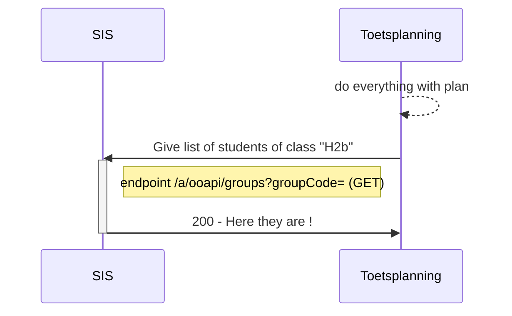

# Flow 1: Plannings information (tests and persons)

Flow 1 is used to provide a test planning system with information on tests to be planned and the students/candidates that have to perform those tests. Usually a Student Information System (SIS) provides this information to a Test Planning System (TPS). The TPS uses this information to plan testmoments for tests, assign the required Test Execution System (TES) and test within that TES. Students are assigned to the test moments based on the logic and workflow of the TPS.

We distinguish two flows that can be used to plan tests:

- Structured (SIS is in the lead on which tests have to be performed within a certain period and which students have to perform those tests)
- Ad-hoc (TPS is in the lead to create test moments)

Besides these two flows there is also a flow for additional supporting information on students and their education enrollments. This flow is optional since not all test planning and test execution software requires the additional information.

## flow 1a : Structured

The SIS has information on tests students have to perform within a certain period (e.g. based on a course, or testing has to be done within a certain year or semester). The SIS has to assign each test that has to be planned by a TPS to that TPS.

A test can be created on many aggregation levels by the SIS. E.g.:
- All students that have to be tested for dutch language level 3 on listening, speaking and writing during a semester
- All three tests that belong to a specific course during a semester
- A specific test for four students doing an honours program

Depending on the aggregation level of the test the TPS has to perform only minimal planning or extensive planning.

Tests that are provided in a structured way to the TPS can also have results/scores reported back by TPS to SIS using Flow 5.

The consumer information provides sufficient information to allow for regrouping of the students to test moments. If necessary the TPS can use the API's from the Additional supporting information flow to retrieve more student context from the SIS.

### Flow 1a : Endpoints for this flow

- GET /ooapi/offerings?componentType=TEST&from=..&until=..
- GET /ooapi/offerings/{offeringId}
- GET /ooapi/offerings/{offeringId}/associations

> Also PUT or POST variants are required

## Flow 1b : Ad-hoc

When the TPS initiates a test moment there is no structured test information available from the SIS. The SIS provides API's to retrieve student groups and group memberships as well as information on individual students.

The TPS can create test moments using this information and provide a TES with this data. However, because these test moments weren't initiated by the SIS it's not possible to transfer results/scores back to the SIS using flow 5. If required, these scores have to entered manually in the SIS.

### Flow 1b : Endpoints for this flow

- GET /ooapi/groups
- GET /ooapi/groups/{groupId}/persons
- GET /ooapi/person/{personId}

## Flow : Additional supporting information

Based on the id's on students and their program offering associations, provided to the planning software in the one of the flows 1a or 1b, the planning software can retrieve additional student and program association information.

### Additional supporting information flow : Endpoints for this flow

- GET /ooapi/person/{personId}
- GET /ooapi/associations/{associationId}/?expand=offering

# Flow 1a : Get the to be planned exams (and students)

### Sequence diagram of request Create offering (rough planning or in NL grofplanning)	


### Class diagram of request B. Add student to created offering (zitting)

### Example of request component offerings that need to be planned
```
GET /ooapi/offerings?componentType=TEST&Since=..&Until=&planner=

"Offering": {
        "offeringId": "0fdc8e82-eacf-412f-b5cb-1ba2fce589dc",
        "primaryCode": {
            "codeType": "identifier",
            "code": "Rek3F2022-2S"
        },
        "offeringType": "component",
        "name": "Rekenen 3F toetsing 2e semester 22/23",
        "resultExpected": true,
        "resultValueType": "0-100",
        "component": {
            "componentId": "59e5543d-105e-45d7-90ee-408660c35669",
            "componentType": "test",
            "primaryCode": "Rek3F",
            "name": "Toetsing rekenen op niveau 3F"
        },
        "consumers": [
            {
                "consumerKey": "MBO-NED",
                "testsToBeUsed": [
                    {
                        "testSupplier": "MBO-NED",
                        "testID": "dfc9d973-42cf-46f3-bd18-f9b50492cdb5"
                    }
                ]
            }
        ],
        "flexibleEntryPeriodStart": "2023-04-01",
        "flexibleEntryPeriodEnd": "2023-06-30",
        "organization": {
            "organizationID": "UUID",
            "primaryCode": {
                "codeType": "identifier",
                "code": "EXAMB-KANAAL"
            },
            "name": [
                {
                    "language": "nl-NL",
                    "value": "Examenbureau kanaaleiland"
                }
            ]
        }
    }

```

### Example of request associations	
```
GET /a/ooapi/offerings/{offeringId}/associations/

    "Association": {
        "associationId": "5a52f86b-edcd-4f7f-9ea9-c8617f6043b6",
        "associationType": "componentOfferingAssociation",
        "role": "student",
        "state": "associated",
        "consumers": [
            {
                "consumerKey": "MBO-NED",
                "personalNeeds": [    
                    "extraTime",
                    "spoken",
                    "spell-checker-on-screen"                
                ],
                "programAssociationID": "54e58f68-ceac-4845-99d5-caa721fefb88",
                "courseAssociationID": "170b5f35-20be-47bf-96ff-d262d121b76b"
            }
        ],
        "person": "500e6ac0-b5ab-4071-a207-7983ccd26f7b",
    }
```

# flow 1b : very adhoc


### Sequence diagram of request to get students	based on group



### Sequence diagram of request to get a single student


# flow : additional supporting information 

### Sequence diagram of request to get students	based on a program the person is participating in


### Example of request program offerings	
```
GET /ooapi/offerings?Type=Program&Until=&planner=

"Offering": {
    "offeringId": "5ffc6127-debe-48ce-90ae-75ea80756475",
    "primaryCode": {
        "codeType": "identifier",
        "code": "25190BOL"
    },
    "offeringType": "program",
    "name": "Netwerk- en mediabeheerder BOL (25190)",
    "consumers": [
        {
            "consumerKey": "MBO-NED"
        }
    ],
    "organization": {
        "organizationID": "38bdbeb1-12b2-48fd-84f8-653e7adfaf99",
        "primaryCode": {
            "codeType": "identifier",
            "code": "ICTE"
        },
        "name": [
            {
                "language": "nl-NL",
                "value": "ICT-academie"
            }
        ],
        "parent": {
            "organizationID": "650e1627-9f3d-4176-ab5a-e82eef0d219d",
            "primaryCode": {
                "codeType": "identifier",
                "code": "CICT"
            },
            "name": [
                {
                    "language": "nl-NL",
                    "value": "Cluster ICT en EIS"
                }
            ]
        }
    }
}
```

### Example of request associations	
```
GET /a/ooapi/associations/

"Association": {
    "associationId": "54e58f68-ceac-4845-99d5-caa721fefb88",
    "associationType": "programOfferingAssociation",
    "primaryCode": {
        "codeType": "opleidingsblad",
        "code": "1.1"
    },
    "role": "student",
    "state": "associated",
    "otherCodes": [
        {
            "codeType": "opleidingscode",
            "code": "23089"
        }
    ],
    "consumers": [
        {
            "consumerKey": "MBO-NED",
            "levelOfQualification": "4",
            "modeOfStudy": "full-time",
            "cohort": "2020", #welk OER toegepast wordt (kan de keuze voor een toetsmiddel bepalen)
            "location": "Where?", #onderwijs locatie (campus)
            "startDate": "2021-09-01", #todo wat willen we met datums
            "expectedEndDate": "2025-07-31",
            "finalEndDate": null
        }
    ],
    "person": "500e6ac0-b5ab-4071-a207-7983ccd26f7b",
    "offering": "5ffc6127-debe-48ce-90ae-75ea80756475"
}
     
```
