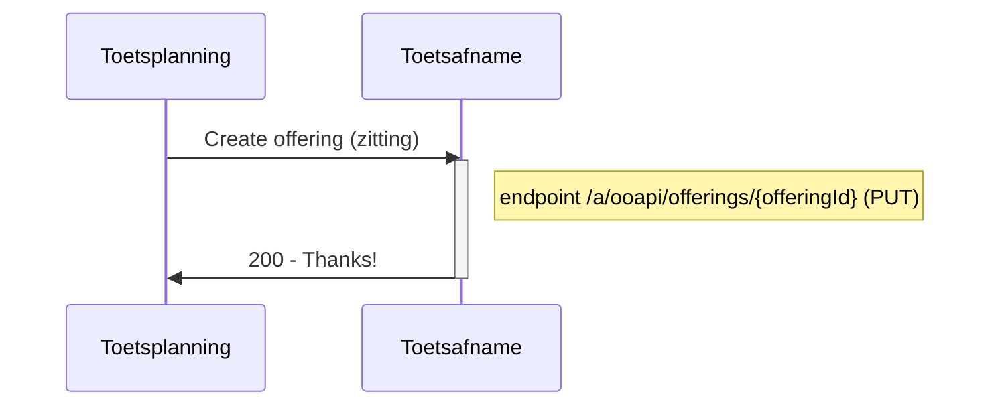
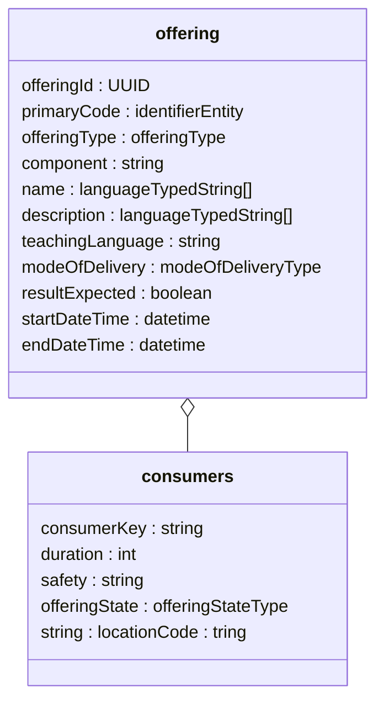
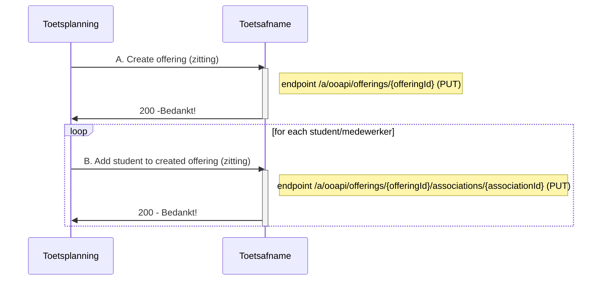
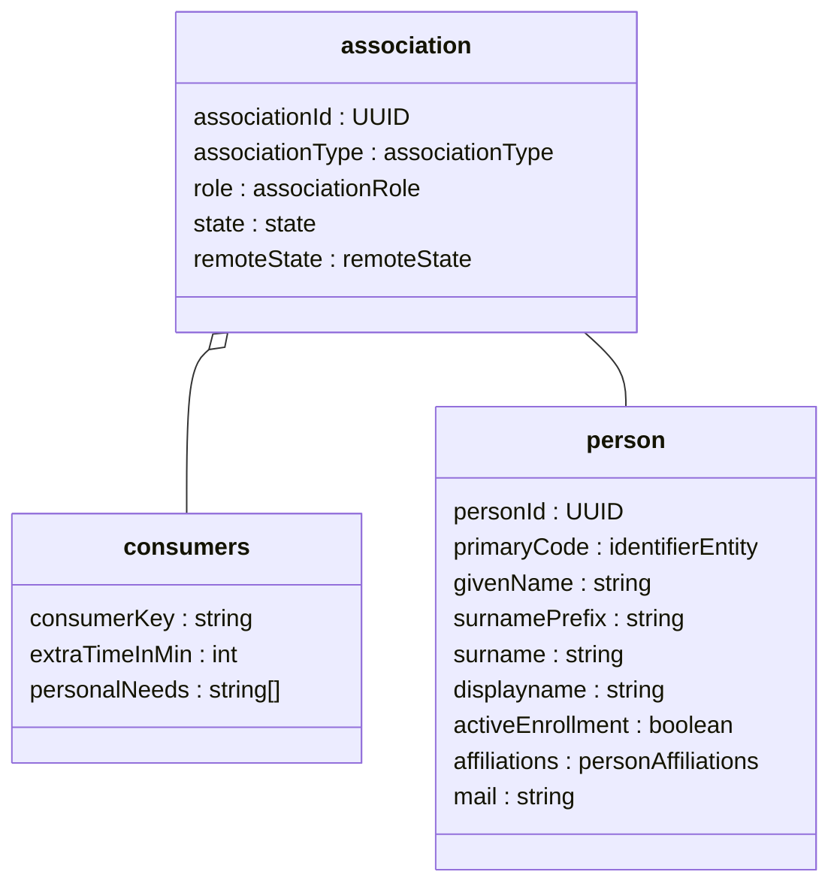
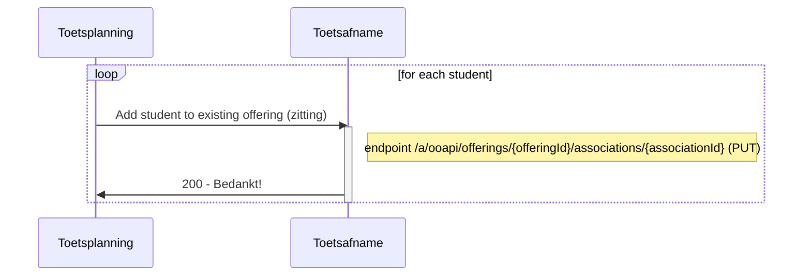
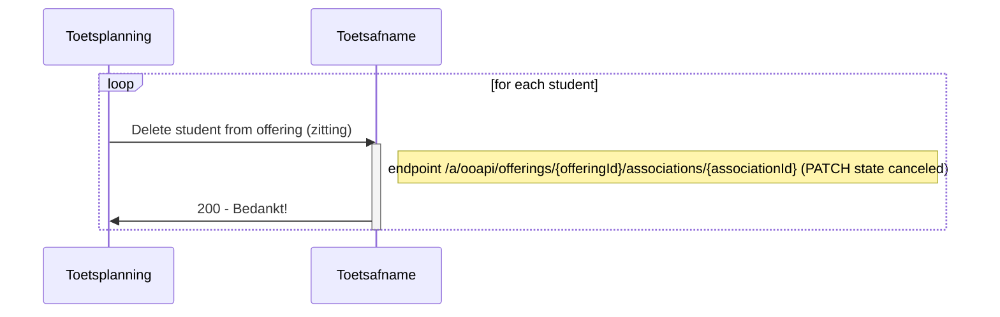
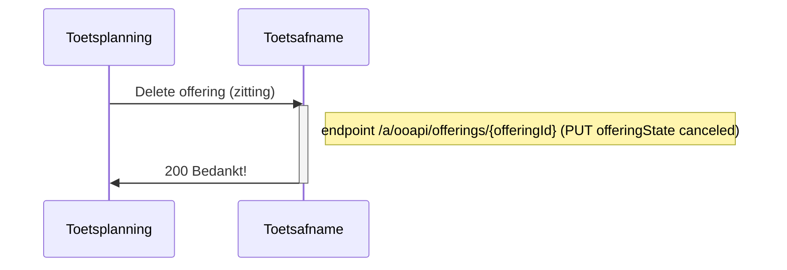
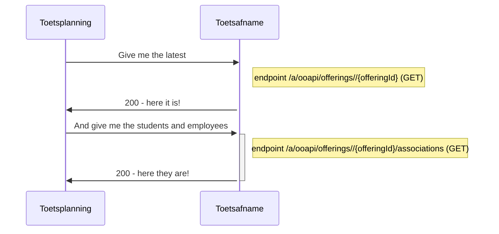

# Flow 2 : Transfer offering (zitting) to Toetsafname

Used endpoints for this flow are:
`PUT /offerings/{offeringId}`
`PUT /offerings/{offeringId}/associations/{associationId}`
`GET /offerings/{offeringId}`
`GET /offerings/{offeringId}/associations`

## Flow 2.1 : Create offering (zitting) without students



For the offering (zitting) the following entities and attributes are used:


### Remarks
- id of the offering (zitting) is created by sender (Toetsplanning).
- Toetsafname makes a PUT endpoint available.
- Object Offering has no state, so we add the state in the consumer extention. We support "active", "canceled"
- attributes: 
	- primaryCode.codeType is "identifier"? primaryCode.code doesn't have to be unqiue, must be recognised by afnameleider.
	- For LanguageTypedString : value nl-nl is valid and supported, all other values will be ignored.
	- To comply to the standard we have mandatory fields :
	 	- primarycode, name and description (not used) are mandatory (depending on Toetsafname system what to do with these data) (TO BE DECIDED)
	 	- resultExpected is mandatory (always true)
		- teachingLanguage (must be hardcoded NLD, not used)
	- modeOfDelivery : we only support :situated, online, oncampus (Situated: offline, on a specific location (could be a location in a company) Online: online on a specific location, Distance: everywhere, could also be from home )

- consumers:
	- add one of type "consumerKey": "MBO-toetsafname"
	- duration: < to be decided > (see https://github.com/NetwerkExamineringDigitalisering/NED-OOAPI/issues/4)
	- safety : array of safety measures : "Secured Computer", "Fixed Location", "Surveillance"
	- offeringState : we support "active", "canceled" (we expect this attribute to be moved to offering in the next version of the standard)
	- locationCode : string to indicate test room/space  (for recognition, we will not use the location structure from OOAPI)

### example of request Create offering (zitting)	
```
PUT /a/ooapi/offerings/{offeringId}

{
   "offeringId": "123e4567-e89b-12d3-a456-134564174000",
   "primaryCode": {
      "codeType": "offeringCode",
      "code": "Remindo_rekenen_MBO-3_op_woendag_middag_21-jun-22_om_13:00_in_lokaal_13"
   },
   "offeringType": "component",
   "name": [
      {
         "language": "nl-NL",
         "value": "20220621-12:45-Remindo rekenen MBO-3"
      }
   ],
   "description": [
      {
         "language": "nl-NL",
         "value": "Beschrijving van 20220621-12:45-Remindo rekenen MBO-3"
      }
   ],
   "teachingLanguage": "nld",
   "modeOfDelivery": [
      "situated"
   ],
   "resultExpected": true,
   "consumers": [
      {
         	"consumerKey": "MBO-toetsafname",
		"duration": 60,  #je hebt duration nodig als je flexibele periodes hebt.
		"safety": ["Fixed Location", "Surveillance"]
		"offeringState": "active",
		"locationCode":"A-22"
      }
   ],
   "startDateTime": "2022-06-21T12:45:00",
   "endDateTime": "2022-06-21T13:45:00"
   "component":"c5fca27e-ccc1-430d-9888-90e005ad6a86",
}
```


## Flow 2.2 : Create offering (zitting) with students



For the offering (zitting) the following entities and attributes are used:

### Remarks
- Association
	- supported roles: student, invigilator, coordinator, assessor (If there are multiple roles then multiple associations).
	- state : use the value "associated" from the enum.
	- remoteState : same as state, but not used. (unfortunatelly: mandatory).
	- offering (componentOffering) is sent before so no need to add all data, just the offeringId is enough.
	- testID (comopnentId) is implicit in offering, so no need to add.
- person
	- Proposed attributes: personId, primaryCode (beter omschrijven - sso), givenName, surname, surnamePrefix, mail (not mandatory filled, avg/gdpr)
	- to comply to the standard we have mandatory fields (which we wont use) : displayname (goed gevuld), activeEnrollment (true) , affiliations (guest)
	- affiliations is not the role in the offering, but the a more generic role. can be ignored for this spec or set to "guest"
	- primaryCode will be used for SSO purpose: uniquely identify a student : nlpersonrealid,eckid etc (details will follow), 
 - consumers
	- add one of type "consumerKey": "MBO-toetsafname".
	- attributes extraTimeInMin and personalNeeds are optional and used only for student role.
	- personal need should follow https://www.imsglobal.org/sites/default/files/spec/afa/3p0/information_model/imsafa3p0pnp_v1p0_InfoModel.html

### example of request A. Create offering (zitting)	
```
PUT endpoint /a/ooapi/offerings/{offeringId}

(see flow 2.1)
```

### example of request B. Add student to created offering (zitting)	
```
PUT endpoint /a/ooapi/offerings/{offeringId}/associations/{associationId}

# offeringId = "123e4567-e89b-12d3-a456-134564174000"
# associationId = "123e4567-e89b-12d3-a456-426614174000"

{
    "person": {
	"personId": "111-2222-33-4444-222",
	"primaryCode": 
	{
	    "codeType": "studentNumber",
	    "code": "1234567"
	},
	"givenName": "Maartje",
	"surnamePrefix": "van",
	"surname": "Damme",
	"displayName": "Maartje van Damme",
	"activeEnrollment": true,
	"affiliations": 
	  [
	    "student"
	  ],
	"mail": "vandamme.mcw@student.roc.nl",
	"languageOfChoice": 
          [
            "nl-NL"
          ]
    },
    "offering": "123e4567-e89b-12d3-a456-134564174000",
    "associationType": "componentOfferingAssociation",
    "role": "student",
    "state": "associated",
    "remoteState": "associated",
    "consumers": 
      [
	{
    	"consumerKey": "MBO-toetsafname",
    	"userName": "1234321@student.roc.nl",
    	"extraTimeInMin": 30,
    	"personalNeeds": 
	  [
            "extraTime",
            "spoken",
            "spell-checker-on-screen"
	  ]
	}
      ]

}
```

## Flow 2.3 : Add students to existing offering (zitting)



### example of request Add student to existing offering (zitting)	
```
PUT endpoint /a/ooapi/offerings/{offeringId}/associations/{associationId}

# offeringId = "123e4567-e89b-12d3-a456-134564174000"
# associationId = "123e4567-e89b-12d3-a456-426614174001"

{
    "person": {
	"personId": "111-2222-33-4444-333",
	"primaryCode": 
	{
	    "codeType": "studentNumber",
	    "code": "1234568"
	},
	"givenName": "Klaas",
	"surnamePrefix": "van",
	"surname": "Dijk",
	"displayName": "Klaas van Dijk",
	"activeEnrollment": true,
	"affiliations": 
	  [
	    "student"
	  ],
	"mail": "vandijk.mcw@student.roc.nl",
	"languageOfChoice": 
          [
            "nl-NL"
          ]
    },
    "offering": "123e4567-e89b-12d3-a456-134564174000",
    "associationType": "componentOfferingAssociation",
    "role": "student",
    "state": "associated",
    "remoteState": "associated",
    "consumers": 
      [
	{
    	"consumerKey": "MBO-toetsafname",
    	"userName": "1234322@student.roc.nl",
    	"extraTimeInMin": 0,
    	"personalNeeds": [ ]
	}
      ]

}
```

## Flow 2.4 : Delete students from offering (zitting)



### Remarks
- Not high priority (could be defined and used later)
- Association
	- remoteState : use the value "canceled" from the enum.

### example of request Delete student from offering (zitting)	
```
PATCH endpoint /a/ooapi/offerings/{offeringId}/associations/{associationId}

# offeringId = "123e4567-e89b-12d3-a456-134564174000"
# associationId = "123e4567-e89b-12d3-a456-426614174001"

{
    "remoteState": "canceled"
}
```


## Flow 2.5 Delete offering (zitting)


	
Open Question 1 : How to change state to canceled if there is no state attribute in Offering?

Open Question 2 : State change from canceled back to active: Will students remain active? Will associations remain?

### Remarks
- Not high priority (could be defined and used later)
- Association
	- remoteState : use the value "canceled" from the enum.

### example of request Delete offering (zitting)	
```
PATCH endpoint /a/ooapi/offerings/{offeringId}

# offeringId = "123e4567-e89b-12d3-a456-134564174000"

{
    "state": "canceled"
}
```

## Flow 2.6 Read current state of the offering (zitting)
To see/check the current state of the offering (zitting) with its associations the following endpoint can be used at Toetsafname

	

