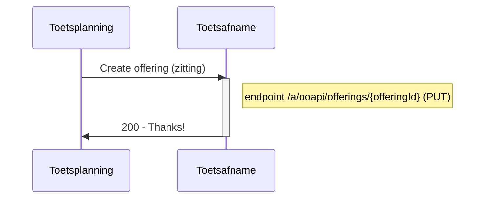
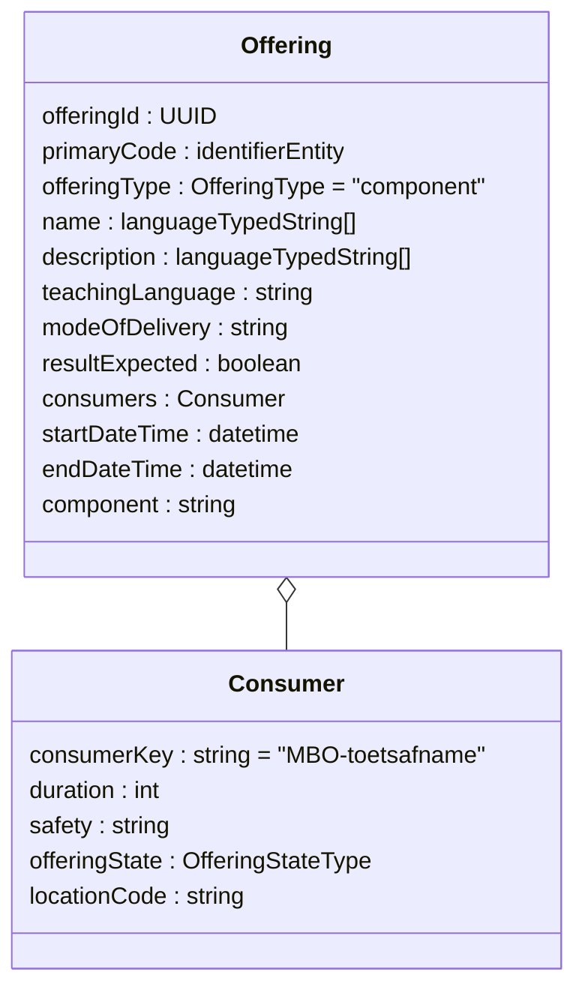
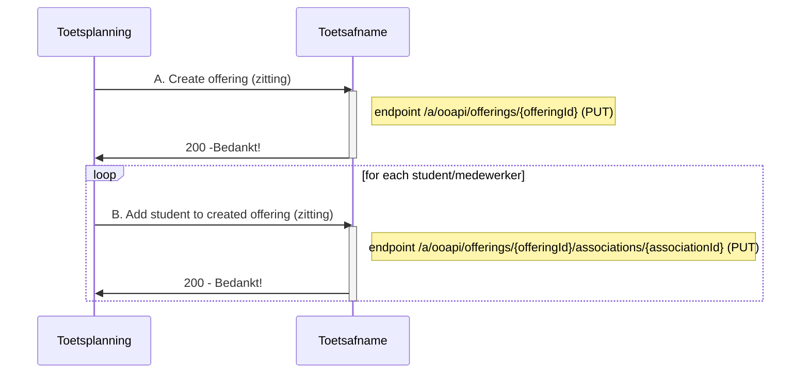
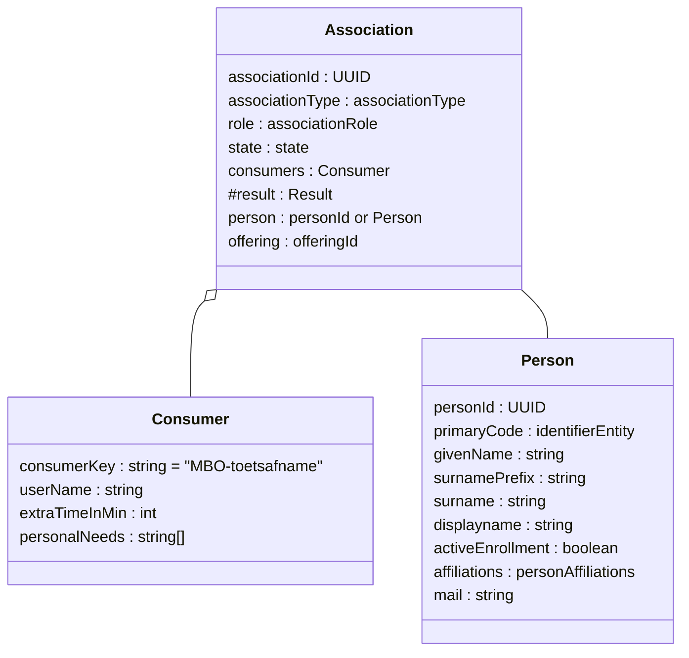
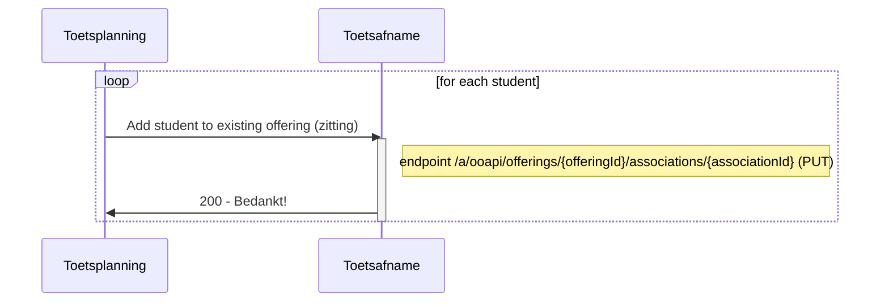
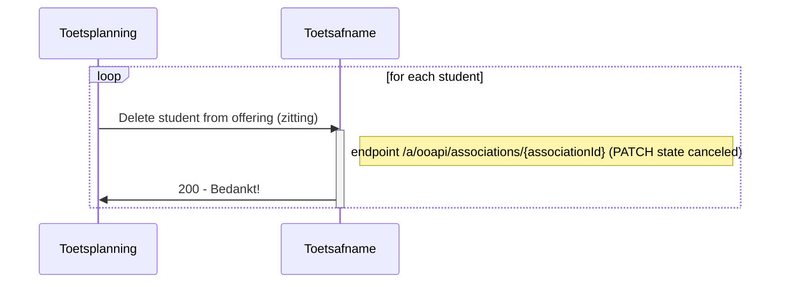
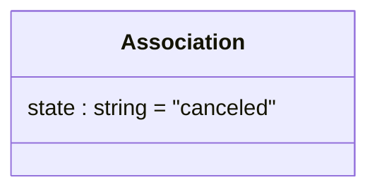
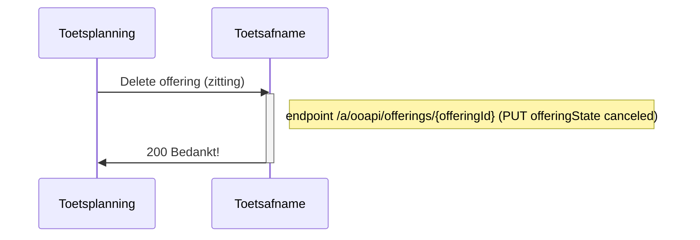
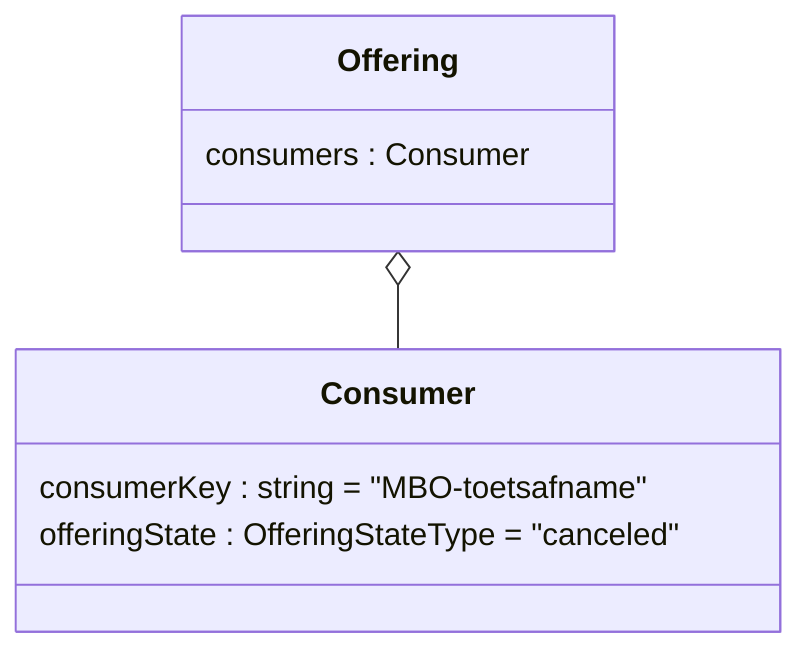
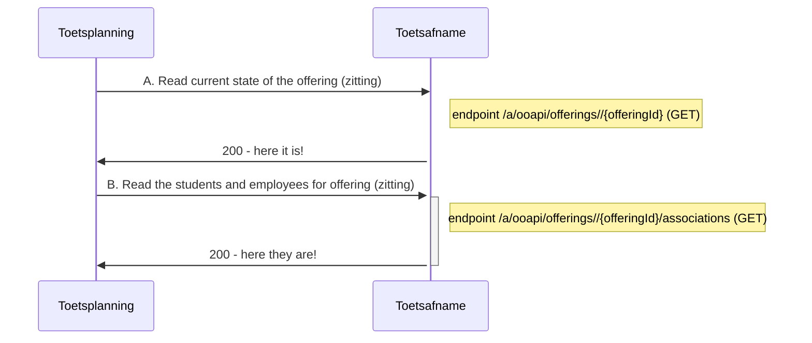

# Flow 2 : Transfer offering (zitting) to Toetsafname

Used endpoints for this flow are:
`PUT /offerings/{offeringId}`
`PUT /offerings/{offeringId}/associations/{associationId}`
`GET /offerings/{offeringId}`
`GET /offerings/{offeringId}/associations`

## Flow 2.1 : Create offering (zitting) without students

### Sequence diagram of request Create offering (zitting)	


### Class diagram of request Create offering (zitting)	
For the offering (zitting) the following entities and attributes are used:


### Example of request Create offering (zitting)	
```
PUT /a/ooapi/offerings/{offeringId}

{
   "offeringId": "123e4567-e89b-12d3-a456-134564174000",
   "primaryCode": {
      "codeType": "offeringCode",
      "code": "Remindo_rekenen_MBO-3_op_woendag_middag_21-jun-22_om_13:00_in_lokaal_13"
   },
   "offeringType": "component",
   "name": [
      {
         "language": "nl-NL",
         "value": "20220621-12:45-Remindo rekenen MBO-3"
      }
   ],
   "description": [
      {
         "language": "nl-NL",
         "value": "Beschrijving van 20220621-12:45-Remindo rekenen MBO-3"
      }
   ],
   "teachingLanguage": "nld",
   "modeOfDelivery": [
      "situated"
   ],
   "resultExpected": true,
   "consumers": [
      {
	    "consumerKey": "MBO-toetsafname",
	    "duration": PT60M,  #je hebt duration nodig als je flexibele periodes hebt 60 minutes in dit geval.
	    "safety": ["Fixed Location", "Surveillance"]
	    "offeringState": "active",
	    "locationCode":"A-22"
      }
   ],
   "startDateTime": "2022-06-21T12:45:00.000Z",
   "endDateTime": "2022-06-21T13:45:00.000Z"
   "component":"c5fca27e-ccc1-430d-9888-90e005ad6a86",
}
```

### Remarks
- id of the offering (zitting) is created by sender (Toetsplanning).
- Toetsafname makes a PUT endpoint available.
- Object Offering has no state, so we add the state in the consumer extention. We support "active", "canceled"
- For date-time elements we work with full date time including time-zone information:
YYYY-MM-DDThh:mm:ssTZD (eg 1997-07-16T19:20:30+01:00)

- attributes: 
	- primaryCode.codeType is "offeringCode"; primaryCode.code doesn't have to be unqiue, must be recognised by afnameleider.
	- For LanguageTypedString : array of groups language and value; value nl-nl for language is valid and supported, all other values will be ignored.
	- To comply to the standard we have mandatory fields :
	 	- primarycode, name and description (not used) are mandatory (depending on Toetsafname system what to do with these data) (TO BE DECIDED)
	 	- resultExpected is mandatory (always true)
		- teachingLanguage (must be hardcoded NLD, not used)
	- modeOfDelivery: we only support :situated, online, distance-learning 
		- situated (op locatie): offline, on a specific location (could be a location in a company) 
		- online: online on a specific location
		- distance-learning (afstandsleren): everywhere, could also be from home )

- consumers:
	- add one of type "consumerKey": "MBO-toetsafname"
	- duration: int for duration in minutes < to be decided > (see https://github.com/NetwerkExamineringDigitalisering/NED-OOAPI/issues/4)
	- safety : array of safety measures : "Secured Computer", "Fixed Location", "Surveillance"
	- offeringState : we support "active", "canceled" (we expect this attribute to be moved to offering in the next version of the standard)
	- locationCode : string to indicate test room/space  (for recognition, we will not use the location structure from OOAPI)

The consumer fields for duration and the various tiem indicators allow for the following scenarios:
| Scenario Nummmer | Scenario | startDateTime | entryDateTime | endDateTime  | duration | startOptions  | durationFrom | durationUntil |
|------------|----------------|--------------------|--------------------|--------------------|-----------------|-----------------|-------------------------|---------------|
| 1 | Testmomement starts at 9:00 and   ends at 10:00. Candidates can start test at any moment during test moment                 | 2022-11-15T09:00T12:45:00.000Z   |                    | 2022-11-15T10:00:00.000Z   | PT40M  (40 minutes + 10 minutes for extra time) | individualStart | individualStartDateTime | endDateTime   |
| 2 | Testmoment   starts at 9:00 and ends at 10:00. Candidates can start until 09:15                                             | 2022-11-15T09:00:00.000Z | 2022-11-15T09:15:00.000Z | 2022-11-15T10:00:00.000Z | PT40M (40 minutes + 10 minutes for extra time) | individualStart | individualStartDateTime | endDateTime   |
| 3 | Testmoment starts at 9:00 and   ends at 10:00. Candidates can start until 09:30 and can always finish their   test          | 2022-11-15T09:00:00.000Z   | 2022-11-15T09:30:00.000Z   | 2022-11-15T10:00:00.000Z   | PT40M (40   minutes + 10 minutes for extra time) | individualStart | individualStartDateTime | testDuration  |
| 4 | Testmoment starts at 9:00. Candidates can start later. Testduration from start of testmoment | 2022-11-15T09:00:00.000Z |                    | 2022-11-15T10:00:00.000Z | PT40M (40 minutes + 10 minutes for extra time) | indivdualStart  | startDateTime  | null          |
| 5 | Testmoment starts at 9:00.   Candidates can start when superviser releases testmoment. Testduration is   from releasemoment | 2022-11-15T09:00:00.000Z   |                    | 2022-11-15T10:00:00.000Z   | PT40M (40 minutes + 10 minutes for extra time) | triggeredStart  | triggeredStartDateTime  | testDuration  |
| 6 | Practice can be started by candidates until one hour before end of the practice period | 2022-11-15T08:00:00.000Z | 2022-11-15T21:00:00.000Z | 2022-11-15T22:00:00.000Z | PT40M (40 minutes + 10 minutes for extra time) | individualStart | individualStartDateTime | testDuration  |
|

## Flow 2.2 : Create offering (zitting) with students

### Sequence diagram of Create offering (zitting) with students	


### Class diagram of request A. Create offering (zitting)	

(see Class diagram in Flow 2.1)

### Example of request A. Create offering (zitting)	

(see Example in Flow 2.1)

### Class diagram of request B. Add student to created offering (zitting)	


### Example of request B. Add student to created offering (zitting)	
```
PUT endpoint /a/ooapi/offerings/{offeringId}/associations/{associationId}

# offeringId = "123e4567-e89b-12d3-a456-134564174000"
# associationId = "123e4567-e89b-12d3-a456-426614174000"

{
    "person": {
	"personId": "111-2222-33-4444-222",
	"primaryCode": 
	{
	    "codeType": "studentNumber",
	    "code": "1234567"
	},
	"givenName": "Maartje",
	"surnamePrefix": "van",
	"surname": "Damme",
	"displayName": "Maartje van Damme",
	"activeEnrollment": true,
	"affiliations": 
	  [
	    "student"
	  ],
	"mail": "vandamme.mcw@student.roc.nl",
	"languageOfChoice": 
          [
            "nl-NL"
          ]
    },
    "offering": "123e4567-e89b-12d3-a456-134564174000",
    "associationType": "componentOfferingAssociation",
    "role": "student",
    "state": "associated",
    "consumers": 
      [
	{
    	"consumerKey": "MBO-toetsafname",
    	"userName": "1234321@student.roc.nl",
    	"extraTimeInMin": 30,
    	"personalNeeds": 
	  [
            "extraTime",
            "spoken",
            "spell-checker-on-screen"
	  ]
	}
      ]

}
```

### Remarks
- Association
	- supported roles: student, invigilator, coordinator, assessor (If there are multiple roles then multiple associations).
	- state : use the value "associated" from the enum.
	- offering (componentOffering) is sent before so no need to add all data, just the offeringId is enough.
	- testID (comopnentId) is implicit in offering, so no need to add.
- person
	- Proposed attributes: personId, primaryCode (beter omschrijven - sso), givenName, surname, surnamePrefix, mail (not mandatory filled, avg/gdpr)
	- to comply to the standard we have mandatory fields (which we wont use) : displayname (goed gevuld), activeEnrollment (true) , affiliations (guest)
	- affiliations is not the role in the offering, but the a more generic role. can be ignored for this spec or set to "guest"
	- primaryCode will be used for SSO purpose: uniquely identify a student : nlpersonrealid,eckid etc (details will follow), 
 - consumers
	- add one of type "consumerKey": "MBO-toetsafname".
	- attributes extraTimeInMin and personalNeeds are optional and used only for student role.
	- personal need should follow https://www.imsglobal.org/sites/default/files/spec/afa/3p0/information_model/imsafa3p0pnp_v1p0_InfoModel.html


## Flow 2.3 : Add students to existing offering (zitting)

### Sequence diagram of request Add student to existing offering (zitting)	


### Class diagram of request Add student to existing offering (zitting)	

(see Class diagram in Flow 2.2)

### Example of request Add student to existing offering (zitting)	
```
PUT endpoint /a/ooapi/offerings/{offeringId}/associations/{associationId}

# offeringId = "123e4567-e89b-12d3-a456-134564174000"
# associationId = "123e4567-e89b-12d3-a456-426614174001"

{
    "person": {
	"personId": "111-2222-33-4444-333",
	"primaryCode": 
	{
	    "codeType": "studentNumber",
	    "code": "1234568"
	},
	"givenName": "Klaas",
	"surnamePrefix": "van",
	"surname": "Dijk",
	"displayName": "Klaas van Dijk",
	"activeEnrollment": true,
	"affiliations": 
	  [
	    "student"
	  ],
	"mail": "vandijk.mcw@student.roc.nl",
	"languageOfChoice": 
          [
            "nl-NL"
          ]
    },
    "offering": "123e4567-e89b-12d3-a456-134564174000",
    "associationType": "componentOfferingAssociation",
    "role": "student",
    "state": "associated",
    "consumers": 
      [
	{
    	"consumerKey": "MBO-toetsafname",
    	"userName": "1234322@student.roc.nl",
    	"extraTimeInMin": 0,
    	"personalNeeds": [ ]
	}
      ]

}
```

## Flow 2.4 : Delete students from offering (zitting)

### Sequence diagram of request Delete student from offering (zitting)	


### Class diagram of request Delete student from offering (zitting)	
For the deletion of a association (deelname) from the offering (zitting) the following entities and attributes are used:


### Example of request Delete student from offering (zitting)	
```
PATCH endpoint /a/ooapi/associations/{associationId}

# offeringId = "123e4567-e89b-12d3-a456-134564174000"
# associationId = "123e4567-e89b-12d3-a456-426614174001"

{
    "state": "canceled"
}
```

### Remarks
- Not high priority (could be defined and used later)
- Association
	- Attribute state : use the value "canceled" from the enum.
	- Add no values for other attributes within Association because they will be ignored.


## Flow 2.5 Delete offering (zitting)

### Sequence diagram of request Delete offering (zitting)	


### Class diagram of request Delete offering (zitting)	


### Example of request Delete offering (zitting)	
```
PATCH endpoint /a/ooapi/offerings/{offeringId}

# offeringId = "123e4567-e89b-12d3-a456-134564174000"

{
    "consumers": 
      [
	{
    	  "consumerKey": "MBO-toetsafname",
    	  "offeringState": "canceled"
	}
      ]
}
```

### Questions
- Question 1 : How to change state to canceled if there is no state attribute in Offering? For now solved by adding state attribute in consumer.
- Question 2 : State change from canceled back to active: Will students remain active? Will associations remain?

### Remarks
- Not high priority (could be defined and used later)
- Association
	- Attribute offeringState within consumers of Offering: use the value "canceled" from the enum.
	- Add no values for other attributes within Offering because they will be ignored.

## Flow 2.6 Read current state of the offering (zitting)
To see/check the current state of the offering (zitting) with its associations the following endpoint can be used at Toetsafname


### example of request A. Read current state of the offering (zitting)	
```
GET /a/ooapi/offerings/{offeringId}

{
   "offeringId": "123e4567-e89b-12d3-a456-134564174000",
   "primaryCode": {
      "codeType": "offeringCode",
      "code": "Remindo_rekenen_MBO-3_op_woendag_middag_21-jun-22_om_13:00_in_lokaal_13"
   },
   "offeringType": "component",
   "name": [
      {
         "language": "nl-NL",
         "value": "20220621-12:45-Remindo rekenen MBO-3"
      }
   ],
   "description": [
      {
         "language": "nl-NL",
         "value": "Beschrijving van 20220621-12:45-Remindo rekenen MBO-3"
      }
   ],
   "teachingLanguage": "nld",
   "modeOfDelivery": [
      "situated"
   ],
   "resultExpected": true,
   "consumers": [
      {
         	"consumerKey": "MBO-toetsafname",
		"duration": 60,  #je hebt duration nodig als je flexibele periodes hebt.
		"safety": ["Fixed Location", "Surveillance"]
		"offeringState": "active",
		"locationCode":"A-22"
      }
   ],
   "startDateTime": "2022-06-21T12:45:00",
   "endDateTime": "2022-06-21T13:45:00"
   "component":"c5fca27e-ccc1-430d-9888-90e005ad6a86",
}
```

### example of request B. Read the students and employees for offering (zitting)	
```
GET /a/ooapi/offerings/{offeringId}/associations

{
   "pageSize": 10,
   "pageNumber": 1,
   "hasPreviousPage": false,
   "hasNextPage": false,
   "totalPages": 8,
   "items": [
      {
	associationId: "123e4567-e89b-12d3-a456-426614174000"
    	"associationType": "componentOfferingAssociation",
    	"role": "student",
    	"state": "associated",
    	"consumers": 
      	[
	{
    	"consumerKey": "MBO-toetsafname",
    	"userName": "1234321@student.roc.nl",
    	"extraTimeInMin": 30,
    	"personalNeeds": 
	  [
            "extraTime",
            "spoken",
            "spell-checker-on-screen"
	  ]
	}
      	]
    	"person": {
		"personId": "111-2222-33-4444-222",
		"primaryCode": 
		{
	    		"codeType": "studentNumber",
	    		"code": "1234567"
		},
		"givenName": "Maartje",
		"surnamePrefix": "van",
		"surname": "Damme",
		"displayName": "Maartje van Damme",
		"activeEnrollment": true,
		"affiliations": 
	  	[
	    		"student"
	  	],
		"mail": "vandamme.mcw@student.roc.nl",
		"languageOfChoice": 
          	[
            		"nl-NL"
          	]
    	},
    	"offering": "123e4567-e89b-12d3-a456-134564174000",

      }
    ],
}
```

	

