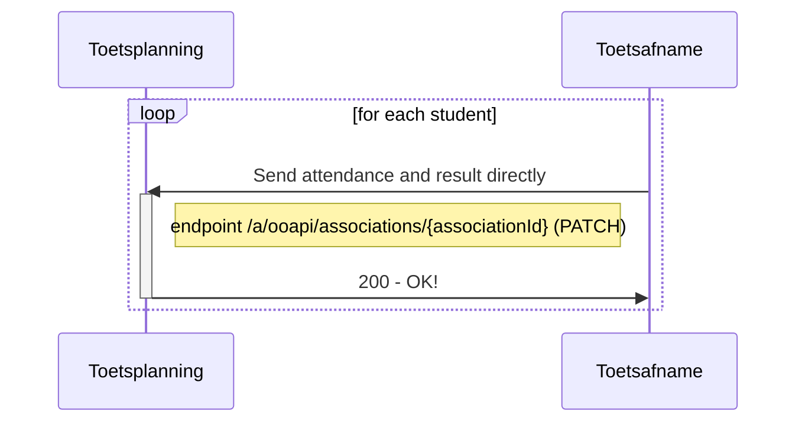
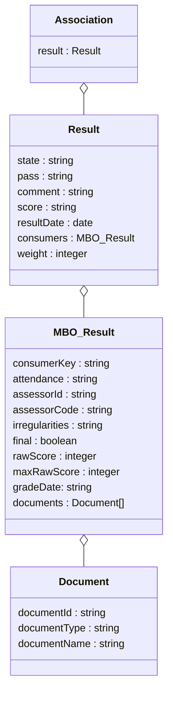
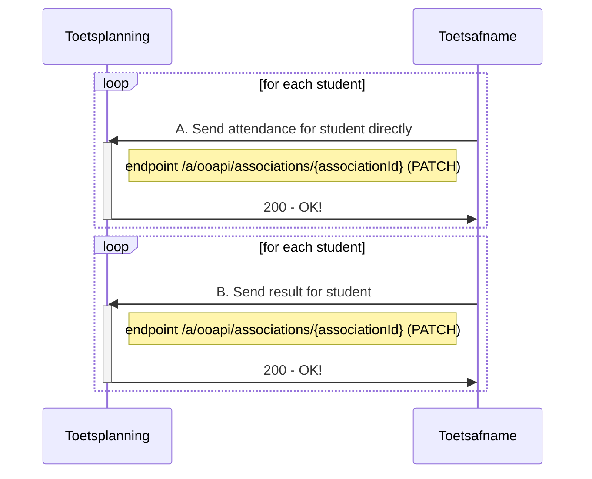
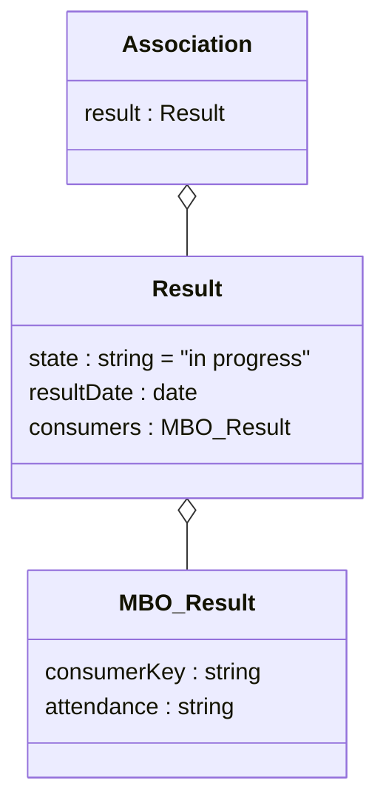
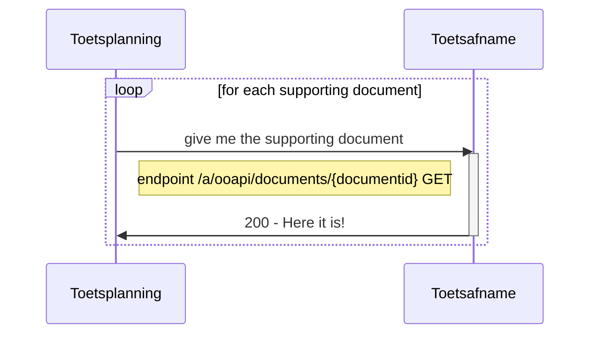
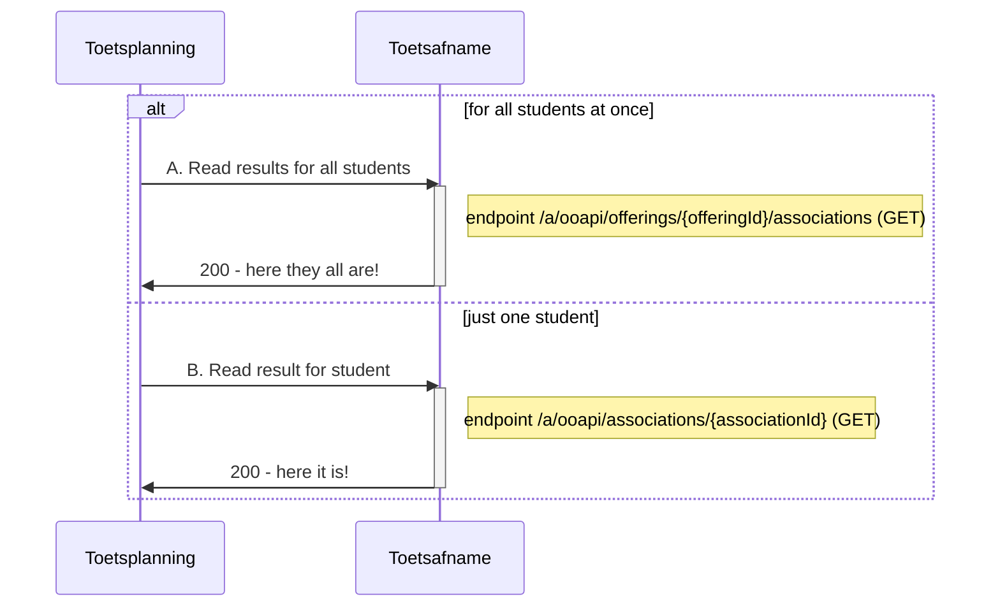

# Flow 3 : Transfer results when test is taken

After a test is taken the results for each participant are returned to the Toetsplanning application. This can be updated many times, also with partial information. for example : first attendance information, a few weeks later the results and finally the final results (as determined by the exam committee).

## Flow 3.1 : Send attendance and result directly (automated scored tests)

### Sequence diagram of request Send attendance and result directly


### Class diagram of request Send attendance and result directly


### Example of request Send attendance and result directly
```
PATCH /associations/{associationId}

{
   "result": {
      "state": "completed",
      "pass": "unknown",
      "comment": "string",
      "score": "9",
      "resultDate": "2020-09-28",
      "consumers": [
	     {
		"consumerKey": "MBO-toetsafname",
		"attendance": "present",
		"assessorId": "05035972-0619-4d0b-8a09-7bdb6eee5e6d",
		"assessorCode": "JAJE",
		"irregularities": "Jantje heeft gespiekt."
		"final": true,
		"rawScore": 65,
		"maxRawScore": 75,
		"documents": [
		 {
		   "documentId": "123454",
		   "documentType": "assessmentForm",
		   "documentName": "Assessment form for Jake Doe.pdf"
		 }
		]
	      }
      ],
      "weight": 100,
    }
}
```
Remarks:
- In the OOAPI standard the consumer is not available for result, this is candidate to be added in the next version.
- The result may be send with status "in progress", "postponed", "queued", but must be sent when status changes to "completed". The result in state "completed" can be replaced by another result (for instance when a test item is cancelled), usually also in state "completed". 

- Result attributes and values
	- weight is mandatory for ComponentResult on top of Result), but is ignored in this interface. Value is always 100.
- Consumer attributes and values
	- attendence: indication of presence during the test (mandatory). Possible values are notPresent (niet aanwezig), notStarted (aanwezig maar niet gestart), notFinished (aanwezig en gestart maar niet afgerond/ingeleverd) en present (aanwezig en afgerond/ingeleverd)"
	- assessorId en assessorCode: is the identity resp. code of the assessor (both optional).
	- irregularities: textual information about the student test, such as irregularities: <to be added>
	- final : indicates that the result has been finalised by the exam committee. Can be done in Toetsplanning (or even DR), so most Toetsafname applications will send false. (optional, default false).
	- rawScore and maxRawScore are the gained scorepoints and maximum scorepoints for the student. These numbers will be used to calculate the resultvalue in attribute score. 
	- documents: data group for document specification (optional, multiple times). Document transfer is always via documents OOAPI endpoint because of security issues (TODO: Explain why). All next attributes are mandatory for each document:
		- documentId: unique identifier for the document to be used in the document request.
		- documentTypes: identifies the kind of document; supported values: "assessmentForm" (beoordelingformulier), "assessmentFormWithAnswers" (answers with assessment notes), "assessmentModel" (beoordelingsmodel/-voorschrift), "other" (any document not suitable for the other values). 
		- documentName: name for the document that is specified by Toetsafname.

## Flow 3.2 : Send attendance first, send result later

### Sequence diagram of request A. Send attendance for student directly


### Class diagram of request A. Send attendance for student directly


### Example of request A. Send attendance for student directly
```
PATCH /associations/{associationId}

{
   "result": {
      "state": "in progress",
      "resultDate": "2020-09-27",
      "consumers": [
	     {
		"consumerKey": "MBO-toetsafname",
		"attendance": "present",
	     }
      ]
    }
}
```

### Class diagram of request B. Send result for student
(see Class diagram in Flow 3.1)

### Example of request B. Send result for student
```
PATCH /associations/{associationId}

{
   "result": {
      "state": "completed",
      "pass": "unknown",
      "comment": "string",
      "score": "9",
      "resultDate": "2020-09-28",
      "consumers": [
	     {
          "consumerKey": "MBO-toetsafname",
          "attendance": "present",
          "assessorId": "05035972-0619-4d0b-8a09-7bdb6eee5e6d",
          "assessorCode": "JAJE",
          "irregularities": "Jantje heeft gespiekt."
          "final": true,
          "rawScore": 65,
          "maxRawScore": 75,
          "documents": [
          {
            "documentId": "123454",
            "documentType": "assessmentForm",
            "documentName": "Assessment form for Jake Doe.pdf"
          }
          ]
	      }
      ],
    }
}
``` 

## Flow 3.3 : Retrieve supporting result documents
when a result message contains a document reference the file can be downloaded


	
## Flow 3.4 Read current state of the attendance and results
To see/check the current state of the offering with its associations the following endpoint can be used


### example of response A. Read results for all students
```
GET /offerings/{offeringId}/associations

{
  "pageSize": 10,
  "pageNumber": 1,
  "hasPreviousPage": false,
  "hasNextPage": true,
  "totalPages": 8,
  "items": [
  {
    "associationId": "123e4567-e89b-12d3-a456-426614174000",
    "associationType": "componentOfferingAssociation",
    "role": "student",
    "state": "associated",
    "remoteState": "associated",
    "consumers": [
    {
      "consumerKey": "MBO-toetsafname",
      "startUpURL": "https://myComponent.nl?test",
      "additionalTimeInMin": 30,
      "personalNeeds": 
	[
            "extraTime",
            "spoken",
            "spell-checker-on-screen"
        ]
    }
    ],
    "result": {
      "state": "completed",
      "pass": "unknown",
      "comment": "string",
      "score": "9",
      "resultDate": "2020-09-28",
      "weight": 100,
      "consumers": [
	{
	  "consumerKey": "MBO-toetsafname",
	  "attendance": "present",
	  "assessorId": "05035972-0619-4d0b-8a09-7bdb6eee5e6d",
	  "assessorCode": "JAJE",
	  "irregularities": "Jantje heeft gespiekt."
	  "final": true,
	  "rawScore": 65,
	  "maxRawScore": 75,
	  "documents": [
	  {
	    "documentId": "123454",
	    "documentType": "assessmentForm",
	    "documentName": "Assessment form for Jake Doe.pdf"
	  }
        ]
      }
    }
    "person": 
    {
      "personId": "111-2222-33-4444-222",
      "primaryCode": 
      {
        "codeType": "studentNumber",
        "code": "1234567"
      },
      "givenName": "Maartje",
      "preferredName": "Maar",
      "surnamePrefix": "van",
      "surname": "Damme",
      "displayName": "Maartje van Damme",
      "activeEnrollment": true,
      "affiliations": [
        "student"
      ],
      "mail": "vandamme.mcw@student.roc.nl",
      "languageOfChoice": ["nl-NL"],
      "otherCodes": [
      {
        "codeType": "accountId",
        "code": "s1234567@student.roc.nl"
      },
      {
         "codeType": "eckid",
         "code": "https://roc.nl/8078d3...28bc85"
      }
      ]
    },
    "offering": "123e4567-e89b-12d3-a456-134564174000"
  }
  ]
}
``` 

### example of response B. Read result for student
```
GET /associations/{associationId}

{
    "associationId": "123e4567-e89b-12d3-a456-426614174000",
    "associationType": "componentOfferingAssociation",
    "role": "student",
    "state": "associated",
    "remoteState": "associated",
    "consumers": [
    {
      "consumerKey": "MBO-toetsafname",
      "startUpURL": "https://myComponent.nl?test",
      "extraTimeInMin": 30,
      "personalNeeds": 
	[
            "extraTime",
            "spoken",
            "spell-checker-on-screen"
        ]
    }
    ],
    "result": {
      "state": "completed",
      "pass": "unknown",
      "comment": "string",
      "score": "9",
      "resultDate": "2020-09-28",
      "weight": 100,
      "consumers": [
	{
	  "consumerKey": "MBO-toetsafname",
	  "attendance": "present",
	  "assessorId": "05035972-0619-4d0b-8a09-7bdb6eee5e6d",
	  "assessorCode": "JAJE",
	  "irregularities": "Jantje heeft gespiekt."
	  "final": true,
	  "rawScore": 65,
	  "maxRawScore": 75,
	  "documents": [
	  {
	    "documentId": "123454",
	    "documentType": "assessmentForm",
	    "documentName": "Assessment form for Jake Doe.pdf"
	  }
        ]
      }
    }
    "person": 
    {
      "personId": "111-2222-33-4444-222",
      "primaryCode": 
      {
        "codeType": "studentNumber",
        "code": "1234567"
      },
      "givenName": "Maartje",
      "preferredName": "Maar",
      "surnamePrefix": "van",
      "surname": "Damme",
      "displayName": "Maartje van Damme",
      "activeEnrollment": true,
      "affiliations": [
        "student"
      ],
      "mail": "vandamme.mcw@student.roc.nl",
      "languageOfChoice": ["nl-NL"],
      "otherCodes": [
      {
        "codeType": "accountId",
        "code": "s1234567@student.roc.nl"
      },
      {
         "codeType": "eckid",
         "code": "https://roc.nl/8078d3...28bc85"
      }
      ]
    },
    "offering": "123e4567-e89b-12d3-a456-134564174000"
}
``` 

