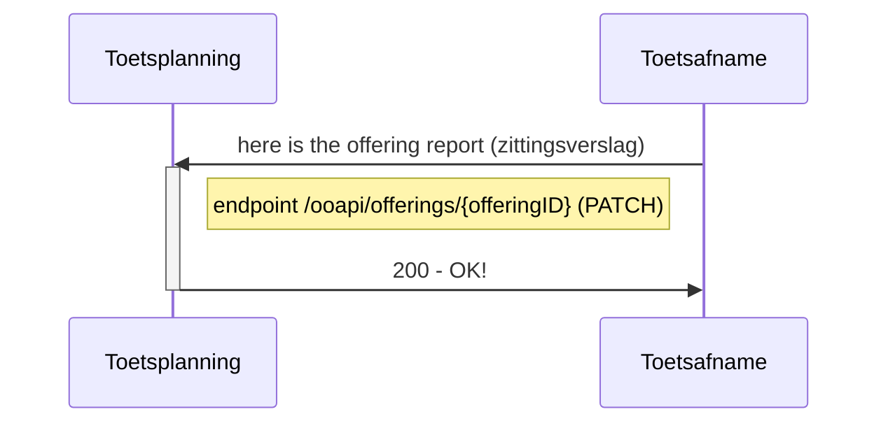
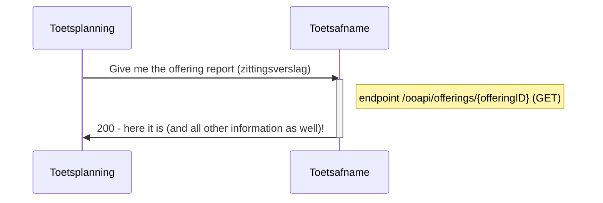

# Flow 4 : Transfer offering report (zittingsverslag) when test is taken

After the test has finished the offering report (zittingsverslag) including irregularities is sent to Toetsplanning.
This contains structured data as uploaded documents, e.g. session report (processverbaal), AAR with signatures, etc.

## Flow 4.1 : Send attendance and offering report directly (automated scored tests)


   
### example of result message 
```json

#PATCH /offerings/{offeringID}

{
   "offeringType": "component",
   "consumers": [
      {
        "consumerKey": "nl-test-admin",
        "irregularities": "There was a lot of noise from the construction site nearby.",
        "documents": [
          {
            "documentId": "454566464665355545",
            "documentType": "sessionReport",
            "documentName": "Session report on Session tbd.pdf",
          }
        ]
      }
   ]
}
```
Remarks:
- documentTypes: supported : "sessionReport", "attendanceReport", "assessmentModel", "other"

- Consumer attributes and values
	- irregularities: textual information about the test, such as irregularities: <to be added>
	- documents: data group for document specification (optional, multiple times). See flow 3; supported values for documentType here: "sessionReport" (written description of events occured during the test, procesverbaal), "attendanceReport" (filled presence form with signatures), "assessmentModel" (beoordelingsmodel/-voorschrift), "other" (any document not suitable for the other values). 


## Flow 4.2 Read current state of zittingsverslag
To see the current state of the offering the following endpoint can be used


