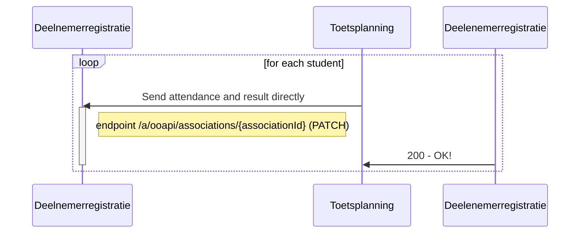
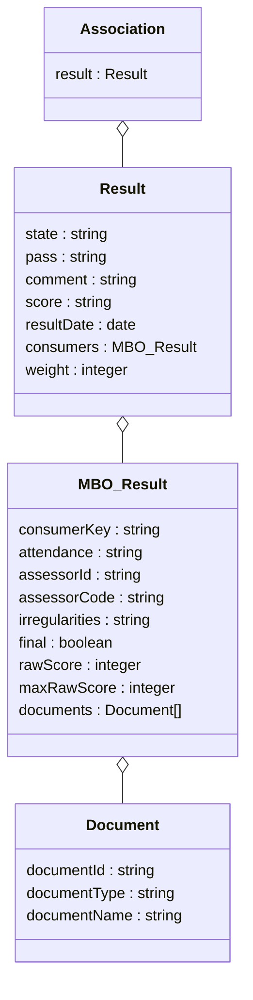

# Flow 5: Result information (students)

# Proposal : THIS IS FOR DISCUSSION ONLY. NOT FINAL

## Flow 5.1 : Return attendance and results

### Sequence diagram of request Send attendance and result directly

### Class diagram of request Send attendance and result directly

Welke toets scenarios willen we hier kunnen ondervangen. 
We sturen de informatie die ontvangen is vanuit het examensysteem terug richting het KRD.
De vraag is wat is de plek waar je het resultaat op terug wilt schrijven.

Je hebt hiervoor een haak nodig die in het SIS bestaat. Er zou een endpoint voorhanden moeten zijn binnen het SIS waar het KRD naartoe kan schrijven. 

Wat weet het planningssysteem? Het resultaat, de association, de offering waar de association opgedaan is, het component (ID) waar de offering van is afgeleid en de student

Wat heeft het SIS de student, de component 

* poging vergeven opnemen in results
* poging nummer 
* testdate en resultdate openemen in de flow terug? 
* Definities voor de verschillende date's bepalen
* label voor detailplanning uit flow 2en 3  openemen in flow 5
* zien we een verschil tussen toetsplanning en toetsafname voor het consumer object van de associations

