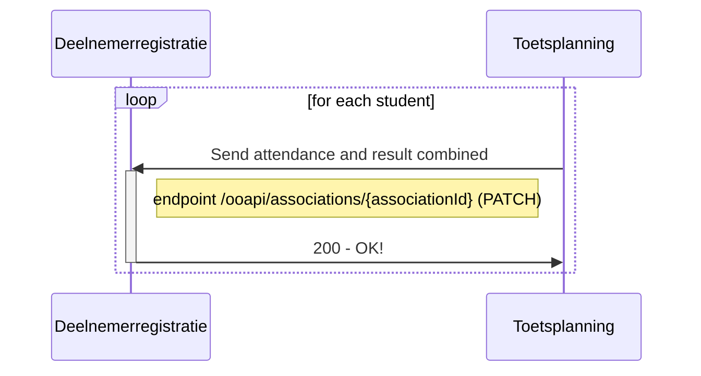
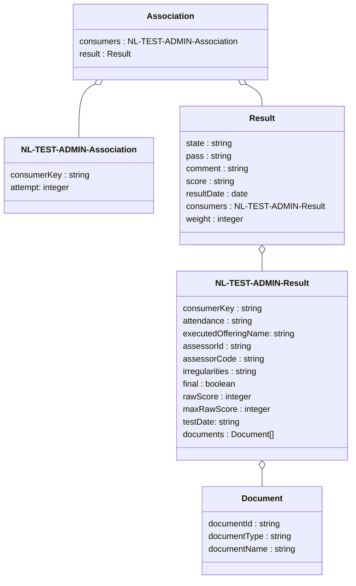

# Flow 5: Result information (students)

This flow can only be used for componentOfferingAssociations originating from flow 1 where the Deelnemerregistratie has indicated that it expects results by setting the attribute "resultsExpected" to true. Only in these situations results can be unambiguously related to a componentOfferingAssociation within the Deelnemerregistratie.

## Flow 5.1 : Return attendance and results combined

After Toetsplanning has received the result from Toetsafname and done some additional processing like checking whether there is still an active componentOfferingAssociation for the test and the score to be provided to the Deelnemerregistratie fits into the resultValueType provided by the Deelnemerregistratie, the result is sent back to the Deelnemerregistratie using this flow.

### Sequence diagram of request Send attendance and result combined

### Class diagram of request Send attendance and result directly

TO DO:

Vanuit de openstaande vragen in deze flow moet bij resultaten terug naar de deelnemerregistratie nog het volgende uitgewerkt worden:
- attempt/poging
- poging vergeven indicator
- daadwerkelijk toetsmoment als label om in ieder geval naam/code beschikbaar the hebben.

Important attributes:

- associationId: ID for the componentOfferingAssociation that has been provided by the Deelnemerregistratie
- resultDate: Date on which the candidate has performed the test/handed in the documents.
- testDate: Date on which the assessment has taken place/has been finalized.
- attempt: sequence number of the attempt. There are two scenario's:
    - Deelnemerregistratie creates an association per attempt
    - Deelnemerregistratie creates an association per test an indicates how many attempts are allowed. In this  scenario the Toetsplanning has to indicate per result for which attempt this result is.

