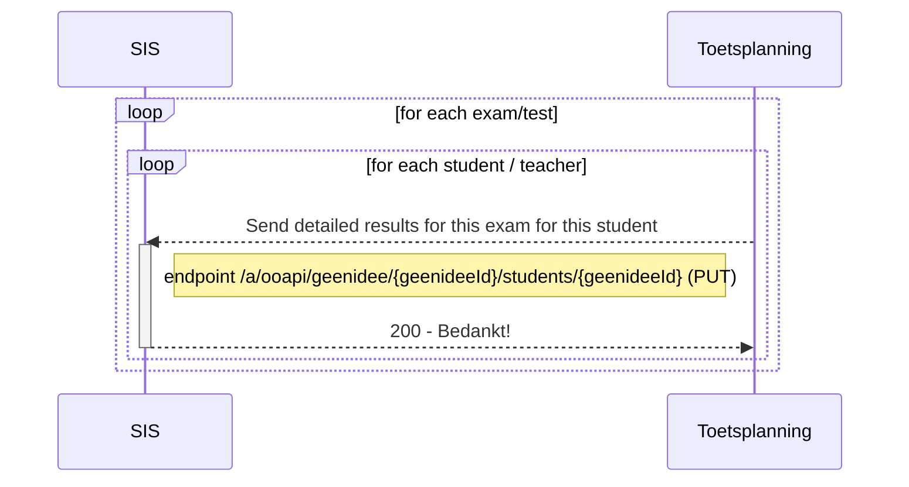

# Flow 5: Result information (students)

# Proposal : THIS IS FOR DISCUSSION ONLY. NOT FINAL

## Flow 5.1 : Return attendance and results

### Sequence diagram 

```mermaid
sequenceDiagram
    participant SIS
    participant Toetsplanning

    loop for each exam/test
        loop for each student / teacher
          Toetsplanning-->>SIS: Send detailed results for this exam for this student
          activate SIS
          Note right of SIS: endpoint /a/ooapi/geenidee/{geenideeId}/students/{geenideeId} (PUT)
          SIS-->>Toetsplanning: 200 - Bedankt!
          deactivate SIS
        end
    end


```
