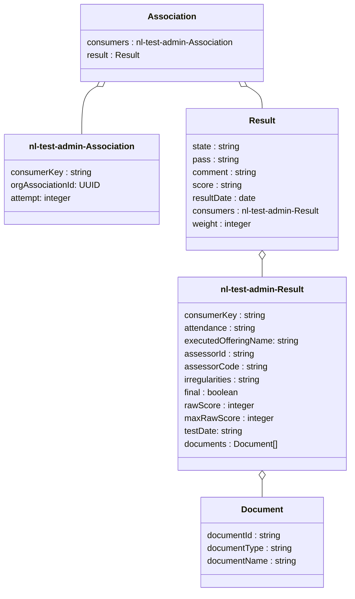
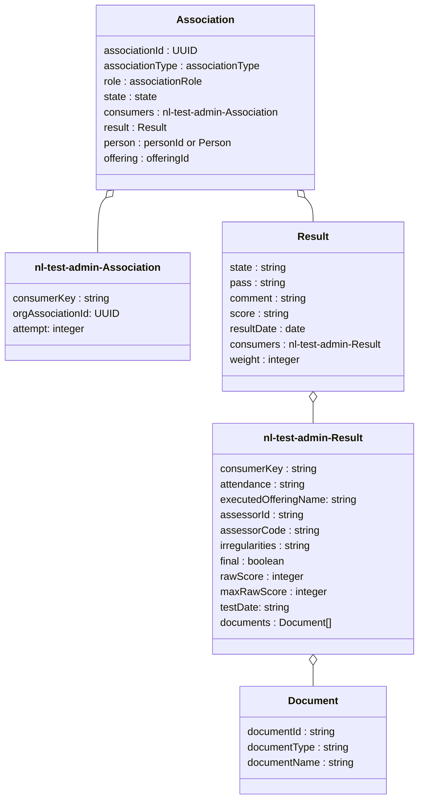

# Flow 5: Result information (students)

This flow can only be used for test enrollment (ComponentOfferingAssociation) originating from flow 1 where the Deelnemerregistratie has indicated that it expects results by setting the attribute "resultsExpected" to true. Only in these situations results can be unambiguously related to a test enrollment (ComponentOfferingAssociation) within the Deelnemerregistratie.

After Toetsplanning has received the result from Toetsafname and done some additional processing, like checking whether there is still an active ComponentOfferingAssociation for the test and the score to be provided to the Deelnemerregistratie fits into the resultValueType provided by the Deelnemerregistratie, the result is sent back to the Deelnemerregistratie using this flow.

We distinguish two types of result information flows to Deelnemerregistratie: 
- Result as the one and only **Result for a test** for the test enrollment in flow 1
- Result as a **Result from a Test Attempt** the attempt MUST have a relation with the original ComponentTypeAssociation originating from the test enrollment in flow 1. The TestplanningSystem MUST keep track of the attempts and the relation with the original association.

This Flow supports the following processes:
- Flow 5.1 : Test result
- Flow 5.2 : Attempt result 

## Flow 5.1 : Test result 
Toetsplanning sends the tes tresult information to Deelnemerregistratie. Toetsplanning indicates for which test enrollment (ComponentOfferingAssociation) this result information is.

TPS uses the next operation en endpoint for sending the test result, that is test attendance information or test score, to Deelnemerregistratie:
- `PATCH /ooapi/associations/{associationId}`

### Sequence diagram of request Send test result


### Class diagram of request Send result


### Example of Send test attendance information for student tot Student Information System
```
PATCH /associations/{associationId}

{
    "consumers": [
    {
      "consumerKey": "nl-test-admin",
      "orgAssociationId": "5a52f86b-edcd-4f7f-9ea9-c8617f6043b6"
      "attempt": 2
    }
    ],
    "result": {
      "state": "in progress",
      "resultDate": "2020-09-28",
      "consumers": [
	     {
          "consumerKey": "nl-test-admin",
          "attendance": "present",
          "assessorId": "05035972-0619-4d0b-8a09-7bdb6eee5e6d",
          "assessorCode": "JAJE",
          "irregularities": "Jantje heeft gespiekt."
          "testDate": "2020-09-29",
          "documents": [
          {
            "documentId": "123454",
            "documentType": "assessmentForm",
            "documentName": "Assessment form for Jake Doe.pdf"
          }
          ]
	      }
      ],
    },
}
``` 

### Example of Send test score for student tot Student Information System
```
PATCH /associations/{associationId}

{
    "consumers": [
    {
      "consumerKey": "nl-test-admin",
      "orgAssociationId": "5a52f86b-edcd-4f7f-9ea9-c8617f6043b6"
      "attempt": 2
    }
    ],
    "result": {
      "state": "completed",
      "pass": "unknown",
      "comment": "string",
      "score": "9",
      "resultDate": "2020-09-28",
      "consumers": [
	     {
          "consumerKey": "nl-test-admin",
          "attendance": "present",
          "assessorId": "05035972-0619-4d0b-8a09-7bdb6eee5e6d",
          "assessorCode": "JAJE",
          "irregularities": "Jantje heeft gespiekt."
          "final": true,
          "rawScore": 65,
          "maxRawScore": 75,
          "testDate": "2020-09-29",
          "documents": [
          {
            "documentId": "123454",
            "documentType": "assessmentForm",
            "documentName": "Assessment form for Jake Doe.pdf"
          }
          ]
	      }
      ],
    },
}
``` 

## Flow 5.2 : Attempt result 
In this flow a new test attempt by the student (ComponentOfferingAssociation) is sent to Deelnemerregistratie, this test opportunity is related to the test enrollment (ComponentOfferingAssociation) in flow 1. Therefore, Toetsplanning creates an association per attempt and indicates per result for which attempt this result is.

TPS uses the next operation en endpoint for sending the test attempt result, that is attempt attendance information or attempt score, to Deelnemerregistratie:
- `PUT /ooapi/associations/{associationId}`

### Sequence diagram of request Send test attempt result


### Class diagram of request Send attempt result


### Example of Send attempt result for student tot Student Information System
```
PUT /associations/{associationId}

{
    "associationId": "5a52f86b-edcd-4f7f-9ea9-c8617f6043b6",
    "associationType": "componentOfferingAssociation",
    "role": "student",
    "state": "associated",
    "consumers": [
    {
      "consumerKey": "nl-test-admin",
      "orgAssociationId": "5a52f86b-edcd-4f7f-9ea9-c8617f6043b6"
      "attempt": 2
    }
    ],
    "result": {
      "state": "completed",
      "pass": "unknown",
      "comment": "string",
      "score": "9",
      "resultDate": "2020-09-28",
      "consumers": [
	     {
          "consumerKey": "nl-test-admin",
          "attendance": "present",
          "assessorId": "05035972-0619-4d0b-8a09-7bdb6eee5e6d",
          "assessorCode": "JAJE",
          "irregularities": "Jantje heeft gespiekt."
          "final": true,
          "rawScore": 65,
          "maxRawScore": 75,
          "documents": [
          {
            "documentId": "123454",
            "documentType": "assessmentForm",
            "documentName": "Assessment form for Jake Doe.pdf"
          }
          ]
	      }
      ],
    },
    "person": "500e6ac0-b5ab-4071-a207-7983ccd26f7b",
    "offering": "5ffc6127-debe-48ce-90ae-75ea80756475",
}
``` 
The difference in this attempt result between attendance information or attempt score is the same as in the previous test result flow (Flow 5.1): the attendance information lacks the score information like attributes score (in Result) and final, rawScore and maxRawScore (in Result.consumers).


Important attributes:

- orgAssociationId: ID for the ComponentOfferingAssociation that has been provided by the Deelnemerregistratie
- resultDate: Date on which the candidate has performed the test/handed in the documents.
- testDate: Date on which the assessment has taken place/has been finalized.

