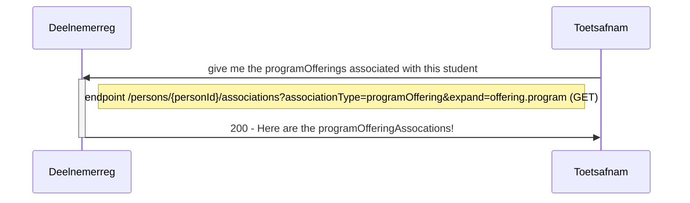
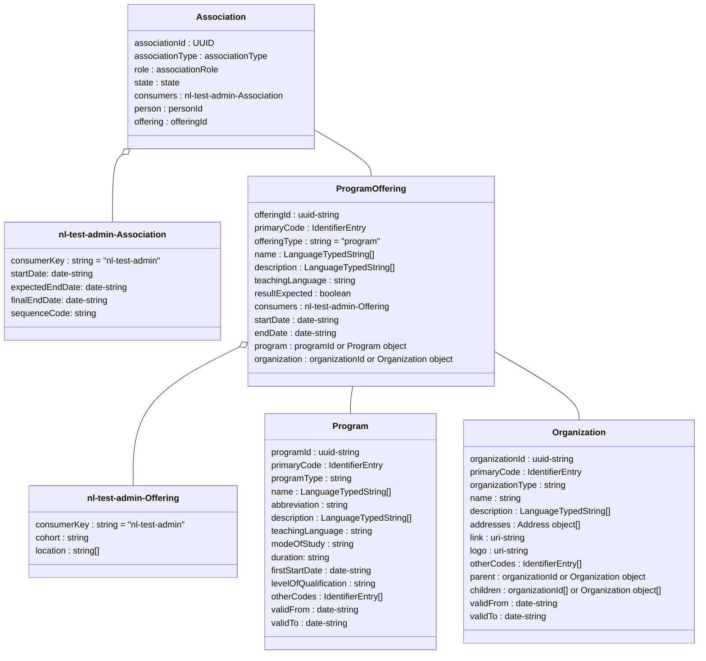

# Flow 6
Flow 6 is created for analysis purposes, to ensure proper grading and analysis of results per organization / per program characteristic.

This Flow supports the following processes:
- Flow 6.1 : Request information about the program and organization where the students is currently enrolled

GET /persons/{personId}/associations?associationType=programOffering&expand=offering.program,offering.organization

## Flow 6.1 : Request information about the program and organization where the students is currently enrolled

### Sequence diagram of Request enrollments for program offering of a student



### Class diagram of programofferingAssociation in relation to its offering and program for a student with a specific UUID




### Example of request (URL) and response (Array) for programOfferingAssociations: 
```json
GET /ooapi/persons/{personId}/associations?associationType=programOffering&expand=offering.program,offering.organization

{
    "pageSize": 10,
    "pageNumber": 1,
    "hasPreviousPage": false,
    "hasNextPage": true,
    "totalPages": 8,
    "items":[
        {
            "associationId" : "b1dcc8ee-4848-48c5-975f-0496a4744889",
            "associationType" : "programOfferingAssociation",
            "role" : "student",
            "state" : "associated",
            "consumers" : [],
            "person" : "870957e1-3377-4ef2-abcb-55f7a0a8093d",
            "offering" : {
                "offeringId" : "1e6c6dff-e1d1-4c79-85ab-da99c5121f98",
                "primaryCode" : {
                    "codeType" : "offeringCode",
                    "code" : "02284O-202-0230"
                },
                "offeringType" : "program",
                "name" : [
                    {
                        "language" : "nl-NL",
                        "value" : "Pedagogisch medw kinderopvang(BOL-vt) - Verl_Viss - 2023/2024"
                    }
                ],
                "description" : [
                    {
                        "language" : "nl-NL",
                        "value" : ""
                    }
                ],
                "teachingLanguage" : "nld",
                "resultExpected" : "false",
                "startDate" : "2023-08-01",
                "endDate" : "2099-12-31",
                "consumers" : [
                    {
                        "consumerKey" : "nl-test-admin",
                        "cohort" : "2023",
                        "locationCode" : "202"
                    }
                ],
                "program" : {
                    "programId" : "47c2dba2-c99c-46c7-8009-f1388c99431e",
                    "primaryCode" : {
                    "codeType" : "programCode",
                    "code" : "02284O"
                    },
                    "programType" : "program",
                    "name" : [
                        {
                            "language" : "nl-NL",
                            "value" : "Pedagogisch medw kinderopvang (BOL-vt)"
                        }
                    ],
                    "abbreviation" : "Pedagogisc (BOL-vt)",
                    "description" : [
                        {
                            "language" : "nl-NL",
                            "value" : "Pedagogisch medw kinderopvang (BOL-vt)"
                        }
                    ],
                    "teachingLanguage" : "nld",
                    "modeOfStudy" : "full-time",
                    "firstStartDate" : "2020-08-01",
                    "levelOfQualification" : "3",
                    "validFrom" : "2020-08-01",
                    "validTo" : "",
                    "otherCodes" : [
                        {
                            "codeType" : "nationalEducationCode",
                            "code" : "25696"
                        }
                    ]
                },
                "organization" : {
                    "organizationId" : "c931044f-45e9-4409-a165-edeb3c2bd019",
                    "primaryCode" : {
                        "codeType" : "acadOrgCode",
                        "code" : "0000218"
                    },
                    "organizationType" : "school",
                    "name" : [
                        {
                            "language" : "nl-NL",
                            "value" : "Gezondheidszorg & Welzijn"
                        }
                    ],
                    "shortName" : "S_GEW",
                    "description" : [
                        {
                            "language" : "nl-NL",
                            "value" : "Gezondheidszorg & Welzijn"
                        }
                    ]
                }
            }
        },
        {2nd enrollment/association ... etc. etc. etc.
        }
    ]
}