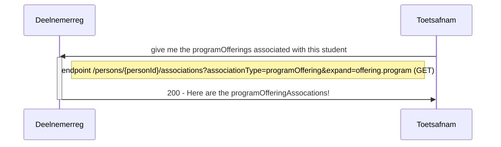
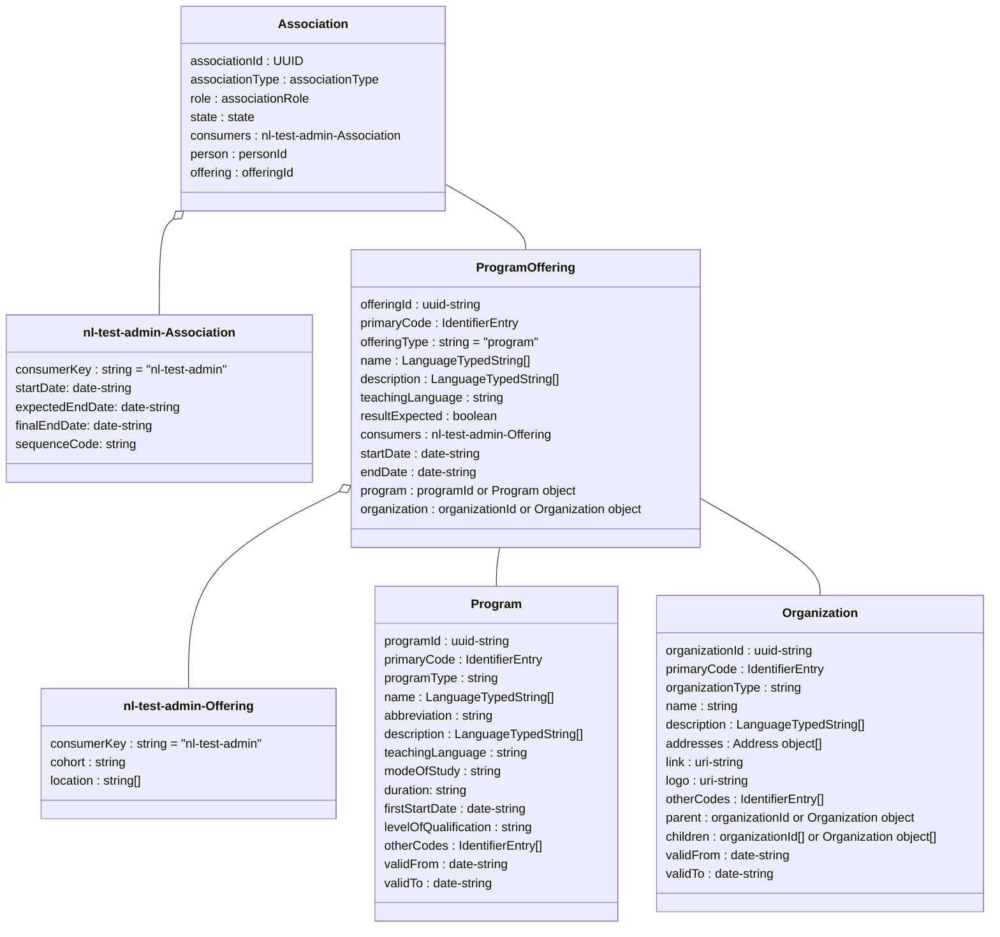

# Flow 6
Flow 6 is created for analysis purposes, to ensure proper grading and analysis of results per organization / per program characteristic.

Toets Afname (TA) requires information about the programs in which students are enrolled. This information can help with analyses of exam quality and field analyses/grade analyses. Important details about these program enrollments include: crebo number, education type (BOL/BBL), cohort, and location.

The information in Analysis regarding these program enrollments of a student is available in DR/SIS and is compiled upon request, then sent to the test provider in Test Administration (TA) and transferred through Information Flow 6: Analysis.

The data provider for the information objects in 6. Analysis is the system with the Participant Registration functionality. The data consumers are the systems with the Test Administration functionality. The information in 6. Analysis flows from DR/SIS to TA.

In the transfer of 6. Analysis from DR/SIS to TA, TA initiates the request (as soon as more student context is needed for analysis).

Before the data exchange can take place, DR/SIS and TA *must* already be technically connected, including base URL, authentication, etc.. To determine the version of the exchange, the Service Metadata Endpoint can be used. 

This Flow supports the following processes:
- Flow 6.1 : Request information about the program and organization where the students is currently enrolled

`GET /persons/{personId}/associations?associationType=programOffering&expand=offering.program,offering.organization`

## Flow 6.1 : Request information about the program and organization where the students is currently enrolled

### Sequence diagram of Request enrollments for program offering of a student


When calling `GET /persons/{personId}/associations` to retrieve enrollments/participations (objects of type Association), only objects of type Program Enrollment (ProgramOfferingAssociation) are allowed in Information Flow 6; objects of type Course Enrollment (CourseOfferingAssociation) and Test Enrollment (ComponentOfferingAssociation) are excluded.

Additionally, there is no possibility to include complete student information (in the Person object) in the response message; this student information *MUST* be retrieved through the regular Information Flow 2.

### Class diagram of programofferingAssociation in relation to its offering and program for a student with a specific UUID




### Example of request (URL) and response (Array) for programOfferingAssociations: 
```json
GET /ooapi/persons/{personId}/associations?associationType=programOffering&expand=offering.program,offering.organization

{
    "pageSize": 10,
    "pageNumber": 1,
    "hasPreviousPage": false,
    "hasNextPage": true,
    "totalPages": 8,
    "items":[
        {
            "associationId" : "b1dcc8ee-4848-48c5-975f-0496a4744889",
            "associationType" : "programOfferingAssociation",
            "role" : "student",
            "state" : "associated",
            "consumers" : [],
            "person" : "870957e1-3377-4ef2-abcb-55f7a0a8093d",
            "offering" : {
                "offeringId" : "1e6c6dff-e1d1-4c79-85ab-da99c5121f98",
                "primaryCode" : {
                    "codeType" : "offeringCode",
                    "code" : "02284O-202-0230"
                },
                "offeringType" : "program",
                "name" : [
                    {
                        "language" : "nl-NL",
                        "value" : "Pedagogisch medw kinderopvang(BOL-vt) - Verl_Viss - 2023/2024"
                    }
                ],
                "description" : [
                    {
                        "language" : "nl-NL",
                        "value" : ""
                    }
                ],
                "teachingLanguage" : "nld",
                "resultExpected" : "false",
                "startDate" : "2023-08-01",
                "endDate" : "2099-12-31",
                "consumers" : [
                    {
                        "consumerKey" : "nl-test-admin",
                        "cohort" : "2023",
                        "locationCode" : "202"
                    }
                ],
                "program" : {
                    "programId" : "47c2dba2-c99c-46c7-8009-f1388c99431e",
                    "primaryCode" : {
                    "codeType" : "programCode",
                    "code" : "02284O"
                    },
                    "programType" : "program",
                    "name" : [
                        {
                            "language" : "nl-NL",
                            "value" : "Pedagogisch medw kinderopvang (BOL-vt)"
                        }
                    ],
                    "abbreviation" : "Pedagogisc (BOL-vt)",
                    "description" : [
                        {
                            "language" : "nl-NL",
                            "value" : "Pedagogisch medw kinderopvang (BOL-vt)"
                        }
                    ],
                    "teachingLanguage" : "nld",
                    "modeOfStudy" : "full-time",
                    "firstStartDate" : "2020-08-01",
                    "levelOfQualification" : "3",
                    "validFrom" : "2020-08-01",
                    "validTo" : "",
                    "otherCodes" : [
                        {
                            "codeType" : "nationalEducationCode",
                            "code" : "25696"
                        }
                    ]
                },
                "organization" : {
                    "organizationId" : "c931044f-45e9-4409-a165-edeb3c2bd019",
                    "primaryCode" : {
                        "codeType" : "acadOrgCode",
                        "code" : "0000218"
                    },
                    "organizationType" : "school",
                    "name" : [
                        {
                            "language" : "nl-NL",
                            "value" : "Gezondheidszorg & Welzijn"
                        }
                    ],
                    "shortName" : "S_GEW",
                    "description" : [
                        {
                            "language" : "nl-NL",
                            "value" : "Gezondheidszorg & Welzijn"
                        }
                    ]
                }
            }
        },
        {2nd enrollment/association ... etc. etc. etc.
        }
    ]
```

In this request, the results can be expanded to include the complete information (rather than just the IDs) of the information objects within the Program Enrollment. To achieve this, the query parameter expand must be used. This allows retrieving the necessary information within the Program Enrollment, including:
	- Information about the Program (ProgramOffering in offering)
	- Information about the Curriculum (Program in offering.program) and/or
	- Information about the Organization (Organization in offering.organization)

The required information can be found in the ProgramOfferingAssociation object at the following locations:
	- Crebo: offering.program.otherCodes.code (if codeType="nationalEducationCode")
	- Education Type: offering.program.modeOfStudy with values “full-time” (BOL) or “part-time” (BBL)
	- Cohort: offering.consumer.cohort
	- Location: offering.consumer.locationCode

Additional information available within an enrollment for analysis includes:
	- Program Name (offering.name)
	- Curriculum Name (offering.program.name)
	- MBO Qualification Level (offering.program.levelOfQualification)