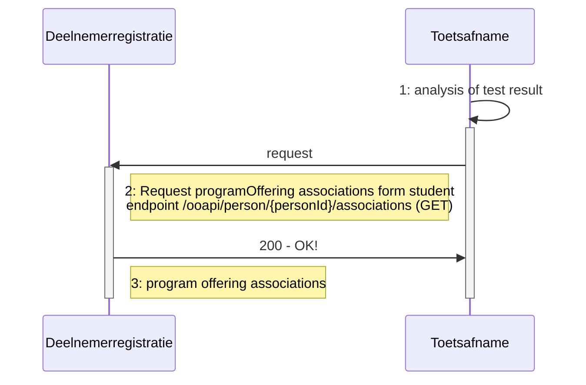

# Flow 6: Analysis information

The Analysis information flow (flow 6) concerns the information objects Programme Enrolments.
This information flow may optionally be supported by DR/SIS and TA, but is not mandatory within these exchanges. Note: this exchange only works when both DR/SIS and TA support it!

For the process "Assessing the test administration", Test Administration (TA) needs information about the programmes in which students are enrolled. This information can assist in analyses of exam quality and field analyses/grade analyses. Key information about these Programme Enrolments includes: crebo (national education code), education type (full-time/part-time), cohort and location.

The information in Analysis about a student's Programme Enrolments is available in DR/SIS and is assembled there on request and sent to the test provider in Test Administration, transferred via information flow 6. Analysis.

The data provider of the information objects in 6. Analysis is the system with the Participant Registration functionality. The data consumers are the systems with the Test Administration functionality. The information in 6. Analysis flows from DR/SIS to TA.

In the transfer of 6. Analysis from DR/SIS to TA, TA takes the initiative (whenever more student context is needed for analysis purposes).

Before the data exchange can take place, DR/SIS and TA are already technically connected with respect to base URL, authentication, etc. To determine the version of the exchange, the Service metadata endpoint can be used (see Table 5.0.A).

**3.6.1 Information objects in 6. Analysis**

The following figure shows the information objects within the Analysis information flow, with the name of the corresponding OOAPI object shown in parentheses.

*Figure 3.6.2: Information objects in Analysis*

Analysis contains the information about the enrolments of a specific student that the educational institution makes available to the test provider of the receiving system with Test Administration functionality. Each Programme Enrolment (ProgramOfferingAssociation) also includes information about the relevant Programme (including the Programme of Study) and Organisation.

**3.6.2 Interactions for 6. Analysis**

The general transaction pattern is "Pull", so that data is retrieved from DR/SIS. This information flow contains the interaction "Retrieve student programme enrolments".

*Interaction "Retrieve student programme enrolments"*

Test Administration requests the Analysis from Participant Registration (SIS). The interaction is as follows:

### Sequence diagram of request Send test result

```mermaid
sequenceDiagram
    participant Deelnemerregistratie
    participant Toetsafname
    Toetsafname->>Toetsafname: 1: analysis of test result
    activate Toetsafname
    Toetsafname->>Deelnemerregistratie: request 
    activate Deelnemerregistratie
    Note right of Deelnemerregistratie: 2: Request programOffering associations form student <br/> endpoint /ooapi/person/{personId}/associations (GET)
    Deelnemerregistratie->>Toetsafname: 200 - OK!
    Note right of Deelnemerregistratie: 3: program offering associations
    deactivate Deelnemerregistratie
    deactivate Toetsafname
```

This transfer of the Analysis is a snapshot delivery, i.e. each time all data is transferred according to the current state. This interaction is therefore repeatable at any time.

To determine whether a delivery represents a change from a previous delivery, Test Administration must compare the data. The identifier of the programme enrolment is leading here: if the id of the enrolment matches the id of a previous delivery, it concerns the same enrolment. An enrolment may be withdrawn/cancelled by setting its status to "canceled", or closed/ended by setting its status to "finished".

*OOAPI operation and endpoint*

The operation and endpoint within OOAPI for the interaction "Retrieve student programme enrolments" are:

`GET /persons/{personId}/associations`

The response message "3: Programme Enrolments" contains, upon a successful call, a list of Programme Enrolments (ProgramOfferingAssociation objects) for the relevant student.

When calling `GET /persons/{personId}/associations` to retrieve enrolments/participations (Association objects) in this information flow 6, only objects of type Programme Enrolment (ProgramOfferingAssociation) are permitted; objects of type Course Enrolment (CourseOfferingAssociation) and Test Enrolment (ComponentOfferingAssociation) are excluded. Furthermore, there is no option here to include complete student information (in the Person object) in the response message; this student information must be requested via the regular information flow 2.

In this request, the results can be expanded to receive the complete information (rather than just IDs) of the information objects within the programme enrolment. For this, the `expand` query parameter must be used. This allows the following information to be obtained with the Programme Enrolment:

- Info about the Programme (ProgramOffering object in offering)
- Info about the Programme of Study (Program object in offering.program) and/or
- Info about the Organisation (Organization object in offering.organization)

The required information can be found in the ProgramOfferingAssociation object at the following locations:

- Crebo: `offering.program.otherCodes.code` (where codeType="nationalEducationCode")
- Education type: `offering.program.modeOfStudy` with value "full-time" (BOL/full-time vocational) or "part-time" (BBL/work-based learning)
- Cohort: `offering.consumer.cohort`
- Location: `offering.consumer.locationCode`

Additional information available within an enrolment for analysis purposes: Name of the programme (`offering.name`), Name of the programme of study (`offering.program.name`), MBO level of the programme of study/qualification (`offering.program.levelOfQualification`).

Important attributes:

- orgAssociationId: ID for the ComponentOfferingAssociation that has been provided by the Deelnemerregistratie
- resultDate: Date on which the candidate has performed the test/handed in the documents.
- testDate: Date on which the assessment has taken place/has been finalized.

