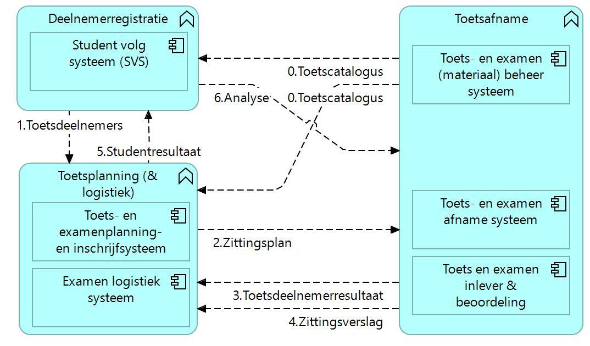
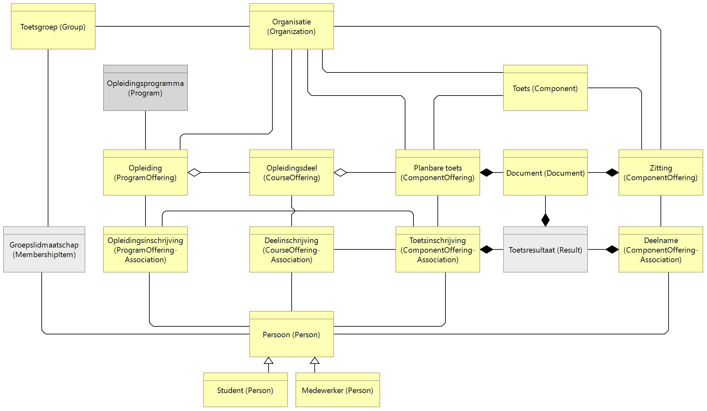

# Technical reference documentation

## Key technical principles

The NED implementation is based on these technical principles. 
* Based on OOAPI
* direct communication between all parties, no central hub
* minimal data exposure of student information
* no vendor lock-in
* use proven standards for authorization and authentication (OAUTH2)

## Architecture

A simple overview of the exchanges between the three functionalities is as follows, where data objects are depicted in the flows:

Each functionality is related to one of more MORA reference components:

## APIs

Each Party in the NED Ecosystem provides and consumes APIs according to their roles. The table outlines these APIs.

| API Definition | Service Provider | Services Consuming | Remarks |
|---|---|---|---|
| [flow 0 : Test catalogue ](flow0.md) | Toetsafname | SIS & Toetsplanning |  |
| [flow 1 : Test participants](flow1.md) | SIS | Toetsplanning |  |
| [flow 2 : Test offerings and enrollments](flow2.md) | Toetsplanning | Toetsafname |  |
| [flow 3 : Test results](flow3.md) | Toetsafname | Toetsplanning |  |
| [flow 4 : Test offering report](flow4.md) | Toetsafname | Toetsplanning |  |
| [flow 5 : Student results to SIS](flow5.md) | Toetsplanning | SIS |  |
| [flow 6 : Analysis](flow6.md) | SIS | Toetsafname |  |

## Other relevant standards

TODO: Describe all relevant standards for parties that want to join the ecosystem.
- [OOAPI v5](https://open-education-api.github.io/specification/v5/docs.html) 
- OAUTH2
- We are currently investigating the use of [edukoppeling](https://www.edustandaard.nl/app/uploads/2023/07/2023-07-24-Edukoppeling-Secure-API-OAuth-Client-Credentials-profielen-v0.8.pdf) a question here is do we HAVE to useedu_org_id? Do we really want to alllow for all 4 levels of Data Classification or are we only using 2?
- the [connection to MORA](./connection_MORA.md) has also been made in this project.  

## Information model

The information model used within the OKE ecosystem and the translation to OOAPI, with focus on component, offering, association and person.

## Generic interaction specs

In the definitiob of the data objects are all data within the object at the delivery (POST and PUT) of the distribution (GET) mandatory or recommended/optional as denoted in the specification document. Other data that could be used will be ignored at reception.

At the delivery of a change (PATCH) all unchanged data may be missing. The deletion of a singular data field (must be optional) can be done by delivering the value null (this value null is allowed for PATCH), also when the element is not nullable (nullable=false). The deletion of a plural data element (must be optional) in an array, can be done by delivery of an empty array; an empty array is allowed even when the element is defined as non-empty (minItems=1).

